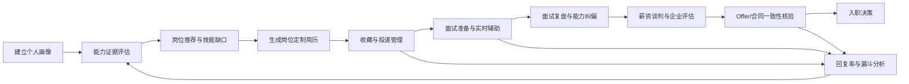
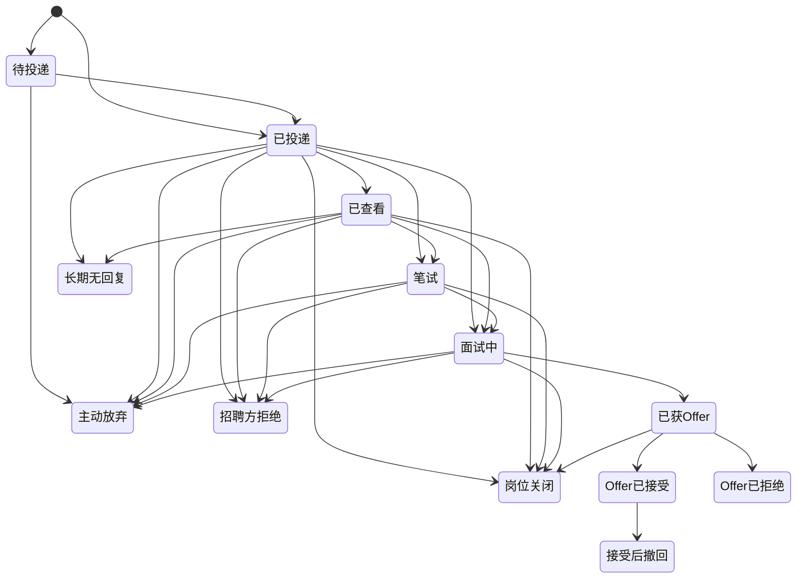

# JobProof AI 求职证据官 - 产品需求文档（PRD）

> 文档版本：v0.9（在 v0.8 文件上原位修订）
>
> 文档日期：2026-08-18
>
> 文档状态：P1 需求阶段范围收敛草案；P3.5 第一至第四轮及冻结前补包已确认。整份 P0A 业务契约已于 2026-08-18 冻结，可按 S0→S5 执行后端闭环。冻结后默认后端真实闭环先于前端；正式 Mock 优先不是默认路径。第 5、6 轮及 P0B/P1/P2 仍不得提前实现。
>
> 协同文档：技术选型方案 v0.5；系统架构设计文档 v0.9；P3.5 业务逻辑确认记录 v0.7
>
> 产品定位：面向大学生、应届生和求职经验不足人群的证据驱动型求职决策与招聘风险 Agent

## 1. 文档说明

本文档根据项目设想、产品截图和两个开源参考项目整理，目标是把分散的功能想法收敛为可评审、可分期、可继续设计的产品需求。

本文档完成了以下工作：

- 明确产品解决的问题、目标用户、核心价值和范围边界。
- 将简历、岗位推荐、投递管理、面试辅助、薪资谈判、企业调查、Offer/合同审核串成完整求职闭环。
- 建立候选业务对象、用户操作、初步 CRUD、权限、状态和模块交互草案。
- 对“AI 自动代聊”“面试官欺诈判断”“大数据评分”“平台逆向接口”等高风险设想增加必要的产品约束。
- 总结 Smart Resume 与 boss-cli 的可借鉴能力、许可证情况和不可直接照搬的实现方式。

P0A 业务契约已于 2026-08-18 冻结。v0.9 回写第四轮面试/复盘/通知及冻结前补包；其中标记为第 5、6 轮或 P0B/P1/P2「待确认」的内容仍不得直接作为实现假设。冻结后默认后端真实闭环先于前端；正式 Mock 优先不是默认路径。

### 1.0 冻结落档（2026-08-18）

用户于 2026-08-18 下旨：放权、勿再询问、自行判断最优并直接执行。此旨视为对整份 P0A 业务契约的亲口冻结。冻结日期：2026-08-18。确认记录升为 v0.7。可按 S0→S5 执行后端闭环；正式 Mock 优先不是默认路径。第 5、6 轮及 P0B/P1/P2 仍不得提前实现。

### 1.1 v0.9 修订说明

- 回写第四轮面试轮次、基础复盘、最小通知，见第 9.11、9.16、13.12 节；细则以确认记录 v0.7 第 11、13 节为准。
- 回写冻结前补包：邮箱登录、画像字段、证据类型、导出删除最小集，见第 9.1、9.2、9.15 节。
- v0.8 及更早的简历投递、匹配规则和工作台边界继续有效。

### 1.1.0 v0.8 修订说明

- 回写 P3.5 第三轮已确认的简历、简历版本和投递规则，见第 9.5、9.6、12、13.1、13.4、25 章；细则以确认记录 v0.7 第 7、10 节为准。
- 补齐投递状态图中的岗位关闭、跨阶段前进和 `接受后撤回`。
- v0.7 及更早的范围收敛、匹配规则和工作台边界继续有效。

### 1.1.1 v0.7 修订说明

- 保留 v0.1-v0.6 历史版本，不覆盖既有评审记录。
- 与技术选型 v0.5、架构当时版本对齐：文档分工、P3.5 确认粒度、P0A 工作台数据边界、匹配已确认/待确认规则、状态名称和需求追踪阶段。
- 补齐 JD 解析任务、岗位版本、匹配任务和匹配报告的状态草案，避免任务状态与报告状态混用。
- 给易被误读为 P0A 的功能章节补阶段标签；修正 MATCH-FR-001、FEEDBACK-FR-001 和用户故事阶段映射。
- 明确第 6 章是全产品候选用户，P0A 首发用户以第 25.1 节已确认范围为准。
- v0.6 已完成的范围收敛、P0A/P0B 分期和工作台方向继续有效。

### 1.2 文档协同与冲突处理

三份开发文档分工如下，出现同一事实写法不同时按此表处理，不得各写各的：

| 主题 | 以谁为准 |
| --- | --- |
| 产品目标、用户、非目标、需求编号、分期验收 | 本文档（PRD） |
| 技术栈、供应商隔离、不推荐技术 | 技术选型方案 |
| 模块边界、事件、数据与安全架构 | 系统架构设计文档 |
| 产品状态中文名与主状态链 | 本文档；架构只做技术映射，不另起简称 |
| 已确认业务规则 | PRD 第 25 章与架构第 24 章交叉核对后的统一表述；单独确认记录补齐后回写三份 |

协同不变量：

- P0A 已于 2026-08-18 冻结。已确认项约束 P0A 实现；第 5、6 轮及 P0B/P1/P2 仍未冻结，不得提前实现。冻结后默认后端真实闭环先于前端；正式 Mock 优先不是默认路径。
- P0A 工作台只定义允许读取的业务对象；卡片、排序和快捷操作不冻结。
- 技术选型中的“P2”指交付流程的技术选型门，产品分期继续使用 P0A/P0B/P1/P2。

## 2. 项目概述

### 2.1 项目名称

中文名：JobProof AI 求职证据官

英文名：JobProof AI

### 2.2 一句话介绍

JobProof AI 通过“岗位要求 - 个人证据 - 招聘承诺 - Offer/合同”四方核验，帮助求职者发现适合自己的岗位、证明真实能力、提高面试表现、管理投递过程并识别招聘风险。

### 2.3 产品不是什么

JobProof AI 不只是简历生成器，也不只是面试话术工具。它的核心是：

1. 帮助用户判断“我适合什么岗位”。
2. 帮助用户证明“我为什么适合”。
3. 帮助用户判断“这个岗位和企业是否可信、是否值得去”。
4. 帮助用户记录“求职过程哪里做得好、哪里失败、下一次如何改进”。

## 3. 问题陈述

### 3.1 用户面临的问题

大学生和初入职场用户普遍缺少完整求职方法，主要问题包括：

- 不清楚自身学历、技能、项目、兴趣可以匹配哪些岗位。
- 招聘要求复杂，无法判断自己与岗位的真实匹配度。
- 简历描述缺少项目证据，容易出现空泛包装或无法在面试中自证。
- 不知道面试官问题背后的意图，也不知道如何组织高质量回答。
- 无法系统判断薪资是否合理、工资构成是否存在隐藏问题。
- 难以核验招聘信息、聊天承诺、Offer 和劳动合同是否一致。
- 对社保、试用期、竞业限制、加班、奖金和解除条件缺少基本知识。
- 投递数量增加后，容易忘记岗位、HR、简历版本、笔试和面试时间。
- 面试结束后缺少结构化复盘，重复犯同样的错误。
- 无法判断哪类岗位回复率高、哪版简历有效、自己卡在哪个环节。
- 培训贷、收费内推、扣证件、虚假高薪、异地培训等招聘风险仍然存在。

### 3.2 现有工具的缺口

市场上的简历工具、招聘平台、面试题库和企业查询工具通常彼此割裂：

- 简历工具不知道用户真实投递和面试结果。
- 招聘平台不帮助用户建立可验证的能力证据。
- 面试工具没有长期记录用户的弱项和岗位反馈。
- 企业查询工具提供原始数据，但不结合岗位、薪资、聊天承诺进行解释。
- 合同审核工具不一定知道用户之前收到的 JD、聊天承诺和 Offer 内容。

JobProof AI 的机会在于连接这些数据，形成持续学习的求职闭环。

## 4. 产品方向选择

### 4.1 方向 A：AI 简历工具增强版

核心：简历生成、模板、评分、优化、翻译和 PDF 导出。

优点：范围清晰、开发快、用户教育成本低。

缺点：同质化明显，无法覆盖投递、面试、风险和 Offer 决策。

适用：作为早期获客入口，不适合作为长期产品终局。

### 4.2 方向 B：实时面试与薪资谈判助手

核心：实时转写、问题识别、三条回答建议、薪资谈判和企业风险提示。

优点：差异化强，用户即时价值高。

缺点：涉及录音同意、响应时延、AI 幻觉、平台协议、代发责任和面试公平性，技术与合规风险较高。

适用：作为中后期高级能力，不建议在缺少用户画像、简历证据和岗位数据时单独开发。

### 4.3 方向 C：证据驱动的求职操作系统（推荐）

核心：以“个人能力证据库 + 岗位证据库 + 求职 CRM”为底座，逐步增加简历、面试、企业风控、谈判和合同审核。

优点：能够形成数据闭环和长期壁垒；实时面试建议也会因为已有简历、JD、企业信息和历史弱项而更准确。

缺点：产品范围较大，需要严格分期，不能一次性开发全部能力。

推荐理由：该方向最符合“求职证据官”的定位，也能将用户提出的全部功能串成一个持续学习系统。

## 5. 产品目标与非目标

### 5.1 产品目标

1. 帮助用户在 20 分钟内建立首版求职画像和岗位方向。
2. 为每个推荐岗位给出匹配分、证据、缺口、风险和下一步行动。
3. 让每条关键简历描述都能追溯到项目、成果或材料证据。
4. 让用户清楚记录每次投递使用的简历版本、岗位状态和关键时间。
5. 为面试问题提供基于用户真实经历的回答建议，而不是通用套话。
6. 将岗位信息、企业信息、聊天承诺、Offer 与合同进行一致性核验。
7. 持续识别用户经常答不好的问题、低回复岗位和高回复岗位。
8. 输出可解释的风险提示，不使用无证据的“骗子”“欺诈者”等定性标签。

### 5.2 业务成功指标

指标按阶段看，不得把后续阶段指标当成 P0A 上线门禁：

- P0A：新用户求职画像完成率；首次单岗位匹配报告完成率；简历版本与投递记录绑定率；投递后状态更新率；基础复盘确认率。
- P0B：推荐岗位被收藏或投递的转化率；个人漏斗与简历版本回复率是否可被识别；弱项在后续训练中的改善率。
- P1：Offer/合同一致性检查使用率和高风险问题确认率。
- 全阶段观察：30 天和 90 天求职管理留存率。

### 5.3 非目标

- 不承诺用户一定获得面试或 Offer。
- 不替代律师、人力资源专家或政府部门给出最终法律结论。
- 不以学历、性别、年龄、地域等敏感属性直接决定用户能力或岗位价值。
- 不基于面试官少量个人信息给出“欺诈概率”或人格判断。
- 不在用户不知情的情况下录音、抓取聊天或自动发送消息。
- 不在没有平台授权的情况下把逆向 API、Cookie 提取或反风控机制作为正式产品基础。
- 不生成用户无法证明的工作经历、项目成果、证书或数据。

## 6. 目标用户与角色

### 6.1 核心用户

以下是全产品候选用户，不是 P0A 首发验收范围。P0A 只面向大学生、应届毕业生及毕业三年内早期职业用户；社招特有规则、转行专属路径和涨薪谈判不进入首发验收，见第 25.1 节。

1. 在校大学生：没有正式求职经验，需要岗位方向、技能规划和简历支持。
2. 应届毕业生：正在集中投递，需要求职 CRM、面试准备和 Offer 判断。
3. 工作 1-3 年的初级职场人：需要转岗、涨薪谈判、能力证明和合同审查。
4. 跨专业或转行用户：需要识别可迁移能力、岗位缺口和学习路线。

### 6.2 辅助角色

- 求职者本人：拥有和管理自己的全部数据。
- 职业导师/辅导员：在用户授权后查看指定报告并提供反馈。
- 授权专业人士：在用户授权后查看指定 Offer、合同或风险报告，提供独立意见；默认只读且不代表平台结论。
- 平台运营/管理员：管理模板、岗位技能模型、风险规则、内容来源和投诉。
- 合规/审核人员：处理高风险内容、数据删除、误判申诉和规则审计。
- 平台超级管理员/安全管理员：管理角色授权、账号安全和高风险后台操作；默认不能查看用户原始私密材料。

### 6.3 权限原则

- 默认只有求职者本人可以访问简历、对话、录音、Offer 和合同。
- 导师只能访问用户明确分享的对象和时间范围。
- 管理员不得默认查看用户原始私密材料；必要访问应记录审计日志。
- 第三方 AI 或企业数据接口只接收完成任务所需的最小数据。
- 后台操作采用职责分离：规则提交、审核、发布和审计不得默认由同一账号完成。

## 7. 核心产品闭环

## 8. 产品模块总览

| 模块 | 核心价值 | 建议优先级 |
| --- | --- | --- |
| 求职画像 | 了解学历、技能、项目、兴趣和职业偏好 | P0A |
| 能力证据库 | 用项目、成果和材料证明能力 | P0A |
| 岗位推荐 | 多岗位推荐、评分、排序、标签和缺口 | P0B；P0A 只评估用户导入的 JD |
| JD 解析与岗位风险 | 提取技能、薪资、地点、隐含要求和异常信号 | P0A 解析，P0B 风险增强 |
| AI 简历工作台 | 模板、生成、编辑、版本、评分、导出 | P0A |
| 求职 CRM | 收藏、投递、笔试、面试、Offer、拒绝管理 | P0A 投递主链，P0B 收藏与统计增强 |
| 面试准备 | 面经导航、题库、岗位技能、模拟面试 | P0B |
| 面试复盘 | 导入对话，分析回答、纠错和训练计划 | P0A 基础复盘，P0B 训练增强 |
| 企业价值与风险 | 企业核验、工资构成、风险证据和进入价值 | P1 |
| 薪资谈判助手 | 预期薪资、总包换算、谈判策略和退出规则 | P1 |
| Offer/合同审核 | 逐项核对、异常条款提示和证据链 | P1 |
| 实时面试 Copilot | 实时转写、意图分析、三条建议和一键采用 | P1 试点 |
| 自动代聊/规则化跳过 | 不逐条确认时按用户规则发送或结束沟通 | P2，需平台许可、专项授权和审计 |
| 求职反馈闭环 | 回复率、阶段转化、弱项和岗位类型分析 | P0B 个人统计，P1 数据增强 |
| 数据与授权中心 | 授权、分享、导出、删除和访问审计 | P0A 基线能力 |
| 通知中心 | 站内通知、任务进度、提醒、失败原因和已读状态 | P0A 最小能力，P0B 渠道增强；是否允许重试由具体任务契约决定 |
| 运营与合规后台 | 模板、技能模型、风险规则、学习资源、申诉工单和审计 | P0A 仅保留安全审计底座，P0B 提供可视化后台 |

### 8.1 版本边界与依赖关系

| 能力 | P0A 首发 MVP | P0B 完整闭环 | P1/P2 扩展 | 依赖和限制 |
| --- | --- | --- | --- | --- |
| 岗位与匹配 | 用户主动导入 JD，获得结构化结果、证据匹配和技能缺口 | 多岗位推荐、收藏、排序和标签增强 | P2 官方平台同步 | P0A 不依赖招聘平台抓取 |
| 岗位风险 | 只提示关键字段缺失，不形成综合风险报告 | 基于 JD、聊天文本和用户输入提供基础证据化风险 | P1 接入企业数据补充主体、经营和司法风险 | 数据不足不得输出低风险 |
| 面试 | 手动记录时间和轮次，导入文本记录并生成待确认复盘 | 准备包、题库、资源导航和训练任务 | P1 授权实时语音和三条建议 | P0A/P0B 均不自动外发 |
| 反馈闭环 | 记录投递、面试和复盘事实 | 展示个人阶段漏斗、简历版本和弱项统计 | P2 在明确同意后评估匿名行业基准 | 样本不足只展示记录 |
| 企业与薪资 | 不进入 | 不进入 | P1 正式企业接口、薪资拆解和谈判记录 | 付费查询需预算和展示许可 |
| 材料与合同 | 只保留用户主动导入 JD 的原文 | 不进入 | P1 管理 Offer/合同版本并做差异核对 | 不提供法律结论 |
| 自动化沟通 | 不进入 | 不进入 | P2 才评估不逐条确认的自动代聊或规则化跳过 | 不使用 Cookie、逆向 API 或反风控方案 |

### 8.2 前台、用户工作台与管理后台职责

根据 JobProof AI 自身业务职责，产品划分为以下区域。这里描述的是业务边界，不等同于最终页面数量。

| 产品区域 | 主要使用者 | 主要职责 | 关键操作 | 主要边界 |
| --- | --- | --- | --- | --- |
| 产品介绍与公开资源 | 访客、求职者 | 说明产品价值、展示公开求职资源和服务边界 | 查看、搜索、跳转注册 | 不展示用户私密数据，不承诺求职结果 |
| 用户工作台 | 求职者本人 | 汇总画像、岗位、投递、面试、Offer、待办和反馈 | 查看、创建、编辑、归档、确认高风险操作 | 只能访问本人或明确授权的数据 |
| AI 工作区 | 求职者本人 | 承载画像访谈、简历生成、岗位分析、面试建议和复盘 | 生成、校正、确认、复制、导出 | AI 结果必须标注来源、版本和不确定性 |
| 通知中心 | 求职者、被授权协作者 | 展示任务进度、状态变化、提醒、失败和授权事件 | 查看、标记已读、重试允许的任务 | 邮件、短信等外部通知需单独授权和失败反馈 |
| 运营管理后台 | 运营管理员 | 维护模板、技能、学习资源和业务内容 | 新增、编辑、下架、归档、搜索、筛选、批量发布 | 发布前必须经过版本和权限校验 |
| 合规与审核后台 | 合规人员、安全管理员 | 处理申诉、删除请求、敏感访问和规则发布审计 | 查看脱敏信息、复核、升级、关闭工单 | 默认不能浏览全部原始简历、对话、合同 |
| 平台安全后台 | 超级管理员 | 管理角色、会话、封禁和高风险配置 | 授权、撤销、封禁、解禁、查看安全日志 | 所有高风险操作必须二次确认并留痕 |

### 8.3 P0A 首发首页定位

P0A 的首发首页定义为“登录后的求职工作台”，用于让用户快速继续当前求职任务，而不是以宣传文案为主的营销落地页。这里仅确认业务职责，不冻结页面布局、组件或视觉样式。

P0A 工作台只允许读取以下对象，作为数据边界而不是已冻结的卡片方案：求职画像完成度、能力证据完成度、最近导入的 JD、当前单岗位匹配结果、当前简历版本、当前投递进度、即将进行的面试、待完成的面试复盘、AI/异步任务状态和当前待办。是否展示为卡片、如何排序、提供哪些快捷操作，必须在 P3.5 页面-业务操作映射确认后决定。

P0A 首页不得默认出现企业付费查询、薪资谈判、合同审核、实时语音、自动发送或自动跳过入口。公开产品介绍页只保留品牌说明、服务边界和登录入口，不作为 P0A 核心验收范围。

## 9. 详细功能需求

### 9.1 求职画像与多轮访谈

#### 9.1.1 用户目标

用户通过多轮对话快速梳理自身信息，不需要一次填写冗长表单。

#### 9.1.2 定义与作用

求职画像是系统对“用户当前想找什么工作、具备什么基础、有哪些现实限制”的结构化记录。它不是一份简历，也不是 AI 对用户贴出的能力标签，更不是一次生成后永久不变的结论。

求职画像在 P0A 主要承担以下作用：

1. 明确当前求职方向，决定单岗位匹配采用哪一组用户目标和限制条件。
2. 为 JD 匹配提供学历、技能、经历、城市、工作方式和限制条件等已确认事实。
3. 区分“用户明确不接受”“用户暂未填写”和“用户可以考虑”，避免把未知误判为不匹配。
4. 连接能力证据，让系统知道哪些技能和经历只是用户自述，哪些已有项目、作品或成果支持。
5. 为后续简历定制、投递记录和面试复盘提供一致的个人上下文，减少用户重复填写。
6. 在用户修改求职方向或关键事实后，通知匹配模块旧报告可能过期，但不覆盖历史报告。

求职画像只保存与求职决策有关的信息。兴趣爱好只能用于发现职业偏好和可迁移能力，不能直接作为能力结论；学校、年龄、性别、地域等信息不得被用于无依据地判断个人能力或岗位价值。

#### 9.1.3 信息范围

P0A 字段分层见确认记录 v0.7 第 12.2 节：

- 匹配前必填：当前求职方向。
- 建议补、缺失保持未知：最高学历、毕业时间、专业、目标城市、工作方式、现实限制（不接受的城市、出差、夜班、销售、加班、行业，可明确“无限制”）。
- 可后补：技能名称（熟练度可选）、工作或实习年限、兴趣（不算能力）、薪资预期底线/目标/理想及月薪或年包口径、自我介绍。薪资预期不进匹配计分。
- 项目和实习的可核验材料记在证据库，不在画像里另做一套事实。
- P0A 不采集、不用于匹配：性别、年龄、民族、婚育、政治面貌、身份证号、家庭住址。
- 完整度：有求职方向即可匹配（至少 30%）；建议项每填一项约 +8%；技能或年限可补到 100%。不得把缺失补成默认事实。

#### 9.1.4 需求规则

- 支持跳过不愿回答的问题。
- 对敏感信息说明用途，不能强制收集身份证号、家庭住址等非必要信息。
- 每轮只追问少量缺失信息，并显示画像完成度。
- AI 必须区分“用户自述”“已提供证据”“系统推断”。
- AI 归纳出的技能或经历先作为候选，只有用户确认或更正确认后才能成为正式画像事实。
- P0A 采用渐进填写；进入正式匹配前必须确认当前求职方向，其他画像字段可以按任务需要继续补充。
- 用户可以随时修改、删除或导出画像。

#### 9.1.5 验收标准

- 用户完成最少信息后即可明确当前求职方向；这是画像层方向提示，不是 P0B 的多岗位推荐、排序或收藏。
- 每个画像字段都显示来源和更新时间。
- 系统不得把缺失信息自动补成事实。
- 被用户拒绝的 AI 候选不得进入正式匹配或简历生成。
- 画像变化后，旧匹配任务保持原执行状态，受影响的旧报告标记为可能过期并保留历史版本。

### 9.2 能力评估与证据库

#### 9.2.1 评估原则

不采用单一“AI 猜能力”方式。P0A 证据类型：项目经历、实习/工作成果、作品/链接、证书、课程/竞赛奖项、文字自述。情景测评和导师书面反馈不进 P0A。

P0A 使用：用户确认的结构化描述 + 可上传或可链接的工作样本。被有效冻结版本引用后，正文、类型和核心成果不可改，只能改备注或归档；改正文须复制为新证据。

#### 9.2.2 评分输出

- 证据强度：强（可核验材料）、中（用户确认的项目/实习描述）、弱（仅自述）。无材料自述 = 待补证，不写“能力不足”。匹配计分对应 100/70/40，见确认记录 v0.7 第 4 节。
- 技能熟练度可选，不挡匹配。
- 结论置信度随未知项增加而降低。
- 建议行动只提示补证或补描述，不自动阻止投递。

#### 9.2.3 禁止规则

- 不得把学校层次直接等同于实际能力。
- 不得把模型主观评价包装成标准化测评结论。
- 未经专业验证的测评不能使用“权威认证”“职业资格评估”等表述。

### 9.3 单岗位匹配、岗位推荐和技能缺口

#### 9.3.1 输入

P0A 单岗位匹配输入：

- 用户已确认的当前求职方向、画像事实和限制条件。
- 允许用于正式匹配的能力证据。
- 用户导入、校正并确认后的单个岗位版本。
- 当前生效的匹配规则版本。

P0B 多岗位推荐和排序才可以在业务契约确认后增加多个岗位、收藏、投递、回复和面试结果等输入；这些数据不得提前进入 P0A 单岗位匹配。

#### 9.3.2 输出

P0A 单岗位匹配报告至少包含：

- 总匹配分和置信度。
- 分项维度和公开权重：硬性门槛 30、技能与证据 35、经历相关 25、限制符合 10。用户未设限制时，限制符合维不参与加权，按 30:35:25 重分。
- 主要加分项、主要扣分项、缺失项和未知项。
- 硬性要求、普通要求和加分项的满足情况。
- 对应能力证据、AI/规则判断依据和输入版本。
- 建议补充资料、补证、学习或向招聘方确认的事项。

P0B 可以在单岗位报告基础上增加多岗位推荐、排序、特点标签和基础招聘风险提示，但其输入、权重、标签和排序规则需要在 P0B 启动前单独确认。

#### 9.3.3 排序规则

P0A 采用“证据门槛 + 规则分”的可解释单岗位匹配。细则以《P3.5 业务逻辑确认记录》v0.5 第 4 节为准。

已确认的规则约束：

- 分项和权重：硬性门槛 30、技能与证据 35、经历相关 25、限制符合 10。等级为 `高度匹配`、`部分匹配`、`缺口明显`、`无法判断`。
- 1 个已确认硬性缺口最高 `部分匹配`；2 个及以上最高 `缺口明显`。硬性技能整体计 1 个缺口。未知不当成缺口。
- 未知项不打 0 分、不算符合，只对已判断项计分并降低置信度。空限制不参与加权。
- 无硬性缺口时：总分 ≥ 80 为 `高度匹配`，60–79 为 `部分匹配`，低于 60 为 `缺口明显`。有缺口时与限等取更低者。
- 证据强弱：强 100、中 70、弱 40。自述无证据标“待补证”，不写成能力不足。
- 不得自动放弃岗位、阻止查看完整报告或自动创建/取消投递。
- 缺失数据必须显示为未知或无法判断，不得把未知当作符合，也不得默认等同于能力不足。
- 正式匹配只使用已确认画像事实、允许使用的能力证据、已确认岗位版本和匹配规则版本。
- P0A/P0B 不使用个人敏感属性作为评分因素，也不使用少量历史结果推导确定性结论。
- P0A 不使用历史回复率、多岗位排序、企业风险或薪资信息计算单岗位匹配分；这些能力需在后续阶段单独确认。
- 硬性缺口不能触发自动放弃岗位、阻止查看完整报告或自动创建/取消投递。

系统必须显示总分、分项维度、主要加分项、主要扣分项、缺失项、对应证据、AI/规则判断依据、置信信息和未知项，不能只显示一个黑盒百分比。

### 9.4 JD 解析与招聘风险识别

P0A 只承担 JD 文本解析、人工校正、必要字段确认和关键字段缺失提示，不生成综合招聘风险报告。基础招聘风险增强属于 P0B，企业主体和外部数据核验属于 P1。

#### 9.4.1 支持输入

- P0A：用户主动粘贴的职位文本。
- P0B 候选：职位截图、OCR 和招聘页面 URL，具体范围需在 P0B 启动前确认。
- 后续独立候选：浏览器扩展在用户主动操作后读取当前页面；不进入 P0A，且必须重新确认平台权限和网络边界。

#### 9.4.2 提取字段

P0A 正式匹配前必须由用户确认：

- 岗位名称。
- 主要职责。
- 硬性技能。
- 经验要求。
- 学历要求。
- 地点。
- 工作方式。

JD 文本明确提供公司名称、加分技能、薪资、福利、出差或工作时间等信息时，可以作为解析候选展示并等待用户校正；文本未提供时保持未知，不得由 AI 补造。

招聘主体、发布平台、联系人认证、企业外部信息、综合风险信号和跨材料矛盾核验属于 P0B/P1 扩展，不作为 P0A 正式匹配的必填输入。

#### 9.4.3 风险判断方式（P0B 草案，不进入 P0A）

P0A 只提示关键字段缺失，不生成综合招聘风险报告。以下风险判断属于 P0B 及后续阶段。

产品不直接输出“面试官欺诈概率”，而输出“本次招聘机会风险等级”，并附证据。

风险信号包括：

- 联系人身份、公司主体、招聘职位之间不一致。
- 薪资显著高于同地区同岗位，但职责和门槛异常模糊。
- 要求付费培训、押金、保证金、体检费、服装费或购买产品。
- 要求提供银行卡密码、验证码、屏幕共享或其他无关敏感信息。
- 要求扣押身份证、毕业证或其他证件原件。
- 在签约前要求异地封闭培训、贷款或高额违约责任。
- 岗位描述、聊天承诺、Offer 和合同存在重大差异。
- 企业处于经营异常、严重违法、失信、密集诉讼或主体注销状态。
- 过度催促、拒绝提供书面信息或回避工资构成问题。

输出内容：风险等级、证据列表、信息来源、置信度、建议核验问题和建议动作。

#### 9.4.4 风险分级规则草案（P0B）

风险等级只表示当前招聘机会的信息风险，不表示联系人或企业已经违法。建议按以下规则输出：

| 等级 | 触发条件草案 | 用户动作 |
| --- | --- | --- |
| 低风险 | 已核验主体，关键字段完整，未命中高危信号 | 正常准备并持续核对 |
| 中风险 | 存在一项重要信息缺失、主体匹配置信度不足或多个一般信号 | 先向招聘方书面核验，暂缓高成本投入 |
| 高风险 | 命中收费/押金/扣证件/贷款培训/敏感信息索取等高危信号，或 Offer 与合同存在重大未解释差异 | 暂停付款、提交材料或接受，必要时寻求专业帮助 |
| 无法判断 | 数据不足、来源过期、企业主体无法匹配或解析失败 | 不输出低风险结论，提示补充材料 |

每条风险证据必须记录来源、采集时间、有效期、规则版本和用户是否提出异议。用户可以标记“已解释、错误、过期或需要复核”，系统不得静默覆盖历史报告。

### 9.5 AI 简历工作台

P0A 已确认规则见确认记录 v0.7 第 7、10 节。采用流程管控型：主档可编辑，冻结版本不可变，AI 只出候选。

#### 9.5.1 P0A 已确认能力

- 本人创建、复制、归档和恢复简历主档。创建方式：空白、从模板、从已有简历文本导入。
- 结构化编辑教育、经历、项目、技能、证书和自我介绍。
- AI 改写、压缩、扩写、纠错只产生候选；用户确认或删除后，主档才能从 `待确认` 回到 `草稿` 或进入 `可投递`。
- 根据已确认 JD 异步生成定制版本；成功后进入 `待用户确认`，不得直接冻结。
- 版本对比；从 `已冻结` 或 `已绑定投递` 版本导出 PDF。
- 创建投递时绑定一个冻结版本，该版本转为 `已绑定投递`。

P0A 不提供主档物理删除按钮；彻底删除走数据权利。翻译、简历评分、关键词建议和 A4 预览的交互细节不阻塞第三轮契约，正式页面方案须等冻结后由前端方案确认。

#### 9.5.2 证据优先规则

- 进入 `可投递` 和冻结前：没有未确认的 AI 事实；每条关键成果要么已关联允许使用的能力证据，要么用户逐条确认“暂无证据仍要冻结”。
- AI 生成内容必须标出“来自用户材料”“合理改写”“需要用户确认”。
- 不得虚构公司、时间、项目、角色、成果数字、证书或技术使用经历。
- 数字成果没有来源时，应改成定性描述或标待补证。
- 对应聘岗位的关键词优化不能改变经历事实。
- 有效冻结版本引用的证据不能直接删除，只能归档。

#### 9.5.3 职业模板

P0A 先提供：软件开发、测试、数据分析、产品。其余职业模板不阻塞 P0A。

每类模板应定义：推荐模块顺序、核心证据类型、常用能力词、禁止空话和岗位特定检查项。

### 9.6 求职 CRM 与投递管理

P0A 只交付投递主链：准备投递或记录已投递、绑定冻结简历版本和已确认岗位版本、手动维护阶段。收藏、漏斗视图、完整提醒中心、批量改状态和批量导入属于 P0B。匹配报告不是创建投递的前置条件。

#### 9.6.1 核心能力

- P0B：收藏岗位并去重。P0A 不实现收藏。
- P0A：用户“准备投递”创建 `待投递`，或“记录已投递”创建 `已投递`。必须绑定本人的 `已冻结`/`已绑定投递` 简历版本，以及 `CONFIRMED` 岗位版本。
- P0A：可记录渠道、投递时间和备注。公司名默认取自已确认 JD，用户可改备注名，不因此改岗位快照。招聘联系人、聊天附件不是 P0A 必填。
- P0A：按第 13.1 节合法流转管理笔试、面试、Offer、拒绝、放弃和接受后撤回。面试轮次的时间、结果和材料由面试对象承载，投递 CRM 只关联，不拥有轮次状态。进入 `面试中` 不强制创建轮次。
- P0B：日历展示笔试、面试、跟进和 Offer 截止时间；P0A 可手动记录关键时间。
- P0B：提醒用户补充状态或跟进 HR；P0A 只保留最小站内任务反馈。
- P0A：保存用户导入 JD 的岗位快照，避免原文丢失。
- P1：保存关键聊天承诺和附件。
- P0A：列表或简单看板；P0B：完整看板、日历和漏斗视图。
- P0B：筛选、排序、标签、批量归档和导出。

#### 9.6.2 投递阶段

岗位收藏和投递记录是两个独立对象。收藏不进入 P0A；收藏也不会自动创建投递。匹配失败、取消或 `无法判断` 都不得自动创建投递。

- 收藏状态（P0B）：`已收藏 -> 已归档`，归档后可以恢复。
- 投递主状态：`待投递 -> 已投递 -> 已查看 -> 笔试 -> 面试中 -> 已获Offer -> Offer已接受 / Offer已拒绝`。
- 终止状态：`主动放弃`、`招聘方拒绝`、`岗位关闭`、`长期无回复`、`接受后撤回`。不设独立“结束”。

允许前进和允许更正见第 13.1 节。`Offer已接受` 不能退回，只能走 `接受后撤回`，不得并入 `主动放弃`。

面试轮次类型、状态和字段见第 13.12 节。轮次结果不改投递状态。

#### 9.6.3 关键约束

- 每次状态变化必须记录操作者、时间、来源、前状态和后状态。
- 系统不得根据聊天或外部平台自动改正式状态。
- 并发用版本号校验，冲突时拒绝覆盖，保留双方内容让用户选择。
- 常规整理使用归档，不提供直接物理删除按钮。归档不解除已绑定简历版本。
- 用户发起彻底删除时，进入数据删除流程，并在确认前展示关联的面试、复盘和简历版本绑定影响。

### 9.7 面试准备与知识导航（P0B）

本节能力属于 P0B，不进入 P0A 验收。

#### 9.7.1 面试准备包

系统根据岗位、JD、公司、简历和证据库生成：

- 可能追问的简历问题。
- 岗位基础知识和技能清单。
- 高频技术题、业务题、行为题和反问问题。
- 与用户项目证据相关的深挖问题。
- 公司业务、产品、行业和近期公开信息摘要。
- 薪资构成、试用期、社保和工作方式的确认问题。
- 面经和学习资源导航。

#### 9.7.2 资源质量规则

- 标明资源来源、发布日期、适用岗位和是否需要付费。
- 官方文档、可信社区内容和用户经验分层展示。
- 过往经验只能作为参考，不能保证面试题一致。

### 9.8 实时面试 Copilot（P1 试点）

本节不是 P0A/P0B 能力。文中“MVP 不支持无人值守自动面试”只约束 P1 试点，不得理解成 P0A 已包含 Copilot。

#### 9.8.1 使用前提

- 用户主动开启会话。
- 涉及录音、语音转写或采集他人对话时，必须提示用户遵守当地法律并取得必要同意。
- 默认模式为“建议模式”，由用户自行回答或复制发送。
- P1 可提供“用户确认发送”：用户逐条检查目标和内容后主动提交；这不属于自动代聊。
- P2 的“自动代聊”指不逐条确认的外部发送，默认关闭且不属于 P1 能力。

#### 9.8.2 实时处理流程

1. 接收文字对话或经授权的语音转写。
2. 识别说话人、问题类型、面试意图和当前上下文。
3. 结合 JD、公司、简历、证据库、薪资预期和历史弱项生成建议。
4. 返回三条候选回答。
5. 用户选择、编辑、复制、发送或忽略。
6. 保存最终采用内容和后续反馈，用于复盘。

#### 9.8.3 三条候选回答

默认提供不同策略，而不是同义改写：

- 稳健回答：事实清楚、风险低、适合正式场景。
- 亮点回答：突出成果、动机和岗位匹配。
- 追问回答：当信息不足或存在风险时，先向面试官澄清。

每条建议显示：建议文本、使用理由、依赖证据、可能风险和置信度。

#### 9.8.4 性能目标

- 文字消息出现后三条首屏建议目标为 3 秒内返回。
- 语音场景采用流式转写和增量生成，目标是不打断正常对话。
- 网络或模型异常时，不得自动发送未确认内容。

#### 9.8.5 外部发送与自动代聊边界

- MVP 不支持无人值守自动面试。
- 不允许模型冒充用户承诺不存在的技能、经历、到岗时间或薪资条件。
- 涉及薪资确认、Offer 接受、拒绝、个人敏感信息和合同承诺时必须由用户最终确认。
- 平台没有官方发送接口或明确许可时，只提供复制建议，不调用外部发送。
- 用户确认发送属于 P1 试点；不逐条确认的自动代聊属于 P2，两者必须使用不同权限、开关、状态和审计类型。

#### 9.8.6 “一键对话”和“跳过面试官”的定义

- P1 的“一键对话”仅表示用户在候选建议中选择后，编辑并复制，或通过已获官方授权的发送接口提交；两种方式必须在界面上明确区分。
- 复制到第三方平台输入框不等同于发送成功；系统只有获得明确回调后才能记录为“已发送”。
- P1 不支持系统代替用户决定跳过联系人。用户可以选择“暂不回复”“结束当前沟通”或“主动放弃投递”，每种操作都需要展示影响并确认。
- P2 若支持规则化自动跳过，只能作用于用户自己设定的筛选规则，不能基于联系人个人属性或未经核验的欺诈结论执行。
- 所有发送、跳过和结束沟通操作记录目标、内容/规则、授权、时间和结果，并支持审计。

### 9.9 薪资预期与谈判助手（P1）

本节属于 P1。P0A 画像可以记录薪资预期数字，但不提供谈判话术、总包换算或自动退出。

#### 9.9.1 用户预设

- 最低可接受薪资。
- 目标薪资。
- 理想薪资。
- 月薪/年薪口径、薪数、奖金、提成、补贴和股权偏好。
- 可接受试用期折扣。
- 可接受的加班、通勤、出差和福利交换条件。
- 低于底线时的处理方式：继续了解、反向报价、礼貌拒绝或跳过。

#### 9.9.2 谈判能力

- 将月薪、薪数、奖金和补贴换算为预计总现金包。
- 区分固定工资、浮动奖金、提成、补贴和不确定收入。
- 根据用户证据、岗位行情、企业情况和当前阶段生成谈判策略。
- 提供三种谈判话术：温和探询、证据报价、边界退出。
- 记录每次报价、还价、承诺和最终结果。
- 对低于底线的机会给出退出提醒，但默认由用户确认是否结束。

#### 9.9.3 必问工资构成

- 税前还是税后。
- 基本工资、岗位工资、绩效工资的金额和比例。
- 年终奖或奖金是否保证，计算规则和发放条件。
- 试用期工资和试用期长度。
- 五险一金缴纳地、基数和比例。
- 加班制度、调休和加班费。
- 提成、补贴、股权、期权及其兑现条件。
- 发薪日、考勤扣款、薪资调整和转正条件。

### 9.10 企业价值与风险评估（P1）

本节依赖正式企业数据接口，不进入 P0A/P0B。P0B 只做基于 JD 和用户材料的基础证据化风险。

#### 9.10.1 数据来源

- 用户提供的公司名称、职位和聊天信息。
- 企业官网、招聘页和公开披露信息。
- 企查查开放平台等正式授权的企业信息接口。
- 用户提供的 Offer、合同和薪资构成。
- 合法授权的岗位薪资数据和用户匿名反馈。

#### 9.10.2 企查查接入建议

企查查开放平台公开提供企业工商信息、工商详情、企业模糊搜索和综合风险排查等能力。正式接入需完成企业认证、采购接口并遵守其协议与数据展示限制。

建议首批使用：

- 企业模糊搜索：解决简称、品牌名与工商主体匹配问题。
- 企业工商信息/详情：核验主体、状态、成立时间、人员和变更记录。
- 综合风险排查：辅助识别经营异常、司法风险、失信、负面舆情等。

#### 9.10.3 价值评估维度

- 主体真实性与经营状态。
- 行业、产品、商业模式和发展阶段。
- 团队和岗位与公司业务的相关性。
- 岗位职责清晰度和技能成长空间。
- 薪资竞争力与兑现确定性。
- 稳定性、经营风险和合规风险。
- 用户职业目标匹配度。
- 通勤、工作强度、管理方式和文化偏好。

输出应为“值得深入了解、谨慎核验、暂不建议”及其理由，不做绝对投资式评级。

### 9.11 面试复盘与经验反刍

P0A 只做基础复盘。训练任务、模拟面试和准备包回灌属于 P0B。录音和转写属于 P1。细则见确认记录 v0.7 第 11 节。

#### 9.11.1 输入

- 用户手动发起。必须属于一条投递，可空关联一轮次。
- P0A：手写问答或粘贴文本。
- P0A：只读引用该投递绑定的简历版本和已确认岗位版本。
- P0A 不采集录音，不自动转写。

#### 9.11.2 输出

- AI 只出候选：问题清单、回答问题、改进建议。不得添加虚假经历。
- 每条建议为 `待确认` / `已确认` / `已拒绝`。只有已确认项写入“已确认改进项/弱项”。
- 复盘不得改投递状态、轮次状态或正式技能等级。

#### 9.11.3 反馈闭环

- 用户点“完成本次复盘”后报告进入 `已确认`；未处理建议不写入。
- 已确认报告不覆盖改写，要补只能开新复盘。
- 被拒绝的建议不得进入画像、匹配或简历。
- P0B 才用已确认弱项抽取训练题。

### 9.12 Offer 与合同审核（P1）

本节属于 P1，不进入 P0A/P0B。

#### 9.12.1 支持材料

- JD 和岗位快照。
- HR/面试聊天承诺。
- 口头承诺的用户记录。
- Offer 文件。
- 劳动合同、保密协议、竞业限制协议和员工手册关键条款。

#### 9.12.2 对比维度

- 用人单位主体是否一致。
- 岗位名称、职责、部门和汇报对象。
- 工作地点、出差、派驻和远程方式。
- 合同期限、入职时间和试用期。
- 固定工资、绩效、奖金、提成、补贴和发薪日。
- 五险一金和福利。
- 工时、休息、加班、调休和考勤。
- 保密、知识产权和竞业限制。
- 培训服务期、违约金和赔偿责任。
- 解除、辞退、调岗、降薪和合同变更。
- 空白条款、附件缺失和引用文件。

#### 9.12.3 输出

- 一致项、差异项、缺失项和高风险项。
- 每个问题对应的原文位置和来源。
- 建议向 HR 追问的具体问题。
- 需要法律专业人士进一步确认的条款。
- 用户确认后的最终检查清单。

#### 9.12.4 边界

- 产品提供信息整理和风险提示，不替代正式法律意见。
- 涉及竞业限制、重大违约金、培训贷、主体不一致或空白合同等高风险情况，应提示咨询劳动监察、工会、法律援助或律师。
- AI 不得自动代表用户接受 Offer、签署合同或承诺法律义务。

### 9.13 求职反馈与数据分析

P0A 只记录投递、面试和复盘事实，不输出统计结论。P0B 展示个人漏斗、简历版本效果和高频弱项；P1 才评估样本量增强或匿名行业基准。

系统持续记录：

- 哪个简历版本投递了哪个岗位。
- 岗位是否被查看、是否收到回复。
- 卡在简历筛选、笔试、一面、二面还是终面。
- 面试被问了什么。
- 哪些问题经常答不好。
- 哪类岗位、城市、行业和公司规模回复率最高。
- 哪种简历版本、投递渠道和投递时间效果更好。
- 哪些技能缺口经常导致拒绝或低评分。

分析结果应区分“相关性”和“因果性”，避免用少量样本得出确定结论。

### 9.14 需求编号与阶段验收映射

以下编号用于后续架构、页面 Mock、接口和测试追踪。P0A 需求必须在首发阶段闭环；P0B/P1/P2 需求需单独标注交付阶段，不得混入 P0A 交付承诺。

| 编号 | 需求 | 优先级 | 阶段验收标准 |
| --- | --- | --- | --- |
| ACCOUNT-FR-001 | 用户注册、登录、注销并管理基础账号安全 | P0A | 用户只能访问自己的默认私密数据；注销进入可追踪的数据删除流程 |
| PROFILE-FR-001 | 用户通过多轮访谈建立画像，并区分自述、证据和推断 | P0A | 至少完成学历、技能、偏好、限制四类信息；缺失字段不被补成事实 |
| EVIDENCE-FR-001 | 用户创建证据并关联技能、项目和简历描述 | P0A | 每条关键简历成果可查看证据来源或显示待补证 |
| JOB-FR-001 | 导入 JD 并生成结构化岗位和匹配报告 | P0A | 支持文本输入；截图/OCR 可进入 P0B；失败保留原因并允许人工校正，重试规则待具体任务契约确认 |
| COLLECTION-FR-001 | 用户收藏、标记、取消收藏或归档岗位 | P0B | 收藏操作不创建或改变投递；重复收藏能够识别并合并 |
| MATCH-FR-001 | P0A 对单个已确认 JD 做可解释匹配；P0B 再对多个岗位评分、排序和标签 | P0A 单岗位匹配，P0B 多岗位排序 | P0A 展示导入 JD 的加分项、扣分项、缺失项和置信度；P0B 增加多岗位排序 |
| RESUME-FR-001 | 生成、编辑、比较并导出岗位定制简历版本 | P0A | AI 不生成无证据经历；投递后版本不可原地覆盖 |
| CRM-FR-001 | 管理投递、笔试、面试、Offer、拒绝和跟进 | P0A | 投递从待投递或已投递开始；状态变更可追溯；投递绑定简历版本 |
| INTERVIEW-FR-001 | 管理一次投递下的面试流程、轮次、时间和结果 | P0A | 支持手动记录面试轮次；每轮可以关联提醒和复盘 |
| PREP-FR-001 | 根据岗位和简历生成准备包和资源导航 | P0B | 输出问题、技能清单、反问和来源链接；资源标注来源和时间 |
| REVIEW-FR-001 | 导入面试记录并生成复盘和改进任务 | P0A 基础复盘，P0B 训练任务 | 用户确认后才写入正式弱项 |
| RISK-FR-001 | 基于 JD 和用户提供材料输出证据化招聘风险 | P0B | 命中高危信号时给出证据和动作；数据不足显示无法判断 |
| SALARY-FR-001 | 记录底线、目标、报价并换算总包 | P1 | 明确税前税后、薪数、奖金和试用期；低于底线只提醒不自动退出 |
| COMPANY-FR-001 | 通过正式企业接口核验主体并生成企业报告 | P1 | 保存主体、来源、查询时间；接口失败不生成低风险结论 |
| MATERIAL-FR-001 | 管理 JD、Offer、合同和协议等原始求职材料及版本 | P1 | 每份材料记录来源、类型、版本、解析状态和原文；更新不覆盖历史版本 |
| CONTRACT-FR-001 | 对比 JD、聊天、Offer 和合同并定位差异 | P1 | 每个差异能定位原文和来源；明确不是法律意见 |
| COPILOT-FR-001 | 实时生成三种策略的回答建议 | P1 试点 | 建议显示依据、风险和置信度；无授权或异常时不采集、不发送 |
| FEEDBACK-FR-001 | 统计岗位、简历版本和阶段结果 | P0B 个人统计，P1 数据增强 | 样本不足显示样本数，不将相关性表述为因果性 |
| DATA-FR-001 | 支持授权、导出、删除和审计 | P0A | 用户可查看授权范围、撤销授权、发起删除并看到处理进度 |
| NOTIFY-FR-001 | 统一展示任务进度、业务提醒、授权变化和失败结果 | P0A 最小站内反馈，P0B 完整中心 | P0A 至少可查看任务完成/失败和关键提醒；同一业务事件不重复通知 |
| OPS-FR-001 | 管理模板、技能模型、风险规则、合同检查项和学习资源 | P0B 最小后台，P1 扩展 | 配置先保存为草稿，审核发布后才影响用户结果；历史报告保留原版本 |
| AUDIT-FR-001 | 处理申诉、删除请求、敏感访问和高风险后台操作 | P0A 安全审计底座，P0B 工单后台，P1 扩展 | P0A 保留必要审计记录；可视化工单和复核流程进入 P0B |

每条需求进入 P3.5 后，还需补充操作者、前置条件、字段校验、状态变化、模块影响、异常反馈、回滚策略和并发规则。

### 9.15 账号与数据权利

账号和数据权利是 P0A 基础能力，所有个人画像、简历、投递记录、对话、Offer 和审核报告默认仅对用户本人可见。

- **账号操作**：P0A 用邮箱 + 密码注册登录，支持邮箱验证码重置密码。支持退出当前会话；改密后全部会话失效。注销不立即物理删除，进入数据删除编排。手机号、第三方登录、MFA 不进 P0A。
- **授权操作**：用户可以查看授权对象、授权范围、用途、有效期和最近使用时间；撤销授权后，相关外部读取、共享和自动化任务停止或进入待处理状态。
- **数据导出**：本人可导出账号、画像正式事实、证据元数据与本人文件、简历主档与冻结版本、投递时间线、面试轮次、已确认复盘。导出为异步任务，下载限时。不得包含他人数据、运营内部审计和供应商原始日志。
- **数据删除**：常规整理用归档。对象级或账号级彻底删除走数据权利，提交前展示关联影响、不可逆说明和法定例外入口。法定年限不在 P0A 锁死，例外走“部分受限”和工单。
- **共享与专业协作**：向他人共享必须由用户明确选择对象、范围和有效期；默认只读、限时、可撤销。导师默认不进入 P0A 编辑。
- **已确认边界**：P0A 登录方式、导出去重范围和删除编排见确认记录 v0.7 第 12 节。实名校验、数据跨境和法定年限仍不固化。

**验收要求**：未授权用户不能读取个人数据；撤销授权后不能继续产生新的外部读取或发送动作；导出、删除、共享和撤销均能看到处理进度或失败原因。

### 9.16 通知、运营与合规管理

#### 9.16.1 通知中心

- P0A 只用站内通知，类型：任务完成、任务失败、面试提醒（轮次 `已安排` 且有时间）、数据导出/删除进度、安全与数据权利通知。Offer 截止提醒不进 P0A。
- 完整通知中心、邮件、短信、日历订阅和完整偏好属 P0B。
- 站内状态：`待发送 -> 已送达 -> 已读`，另有 `发送失败`、`已过期`、`已归档`。站内写入成功即 `已送达`。
- 每条通知记录业务事件 ID、接收人、类型、关联对象、创建时间、送达/已读和失败原因。同一事件 ID + 类型 + 接收人去重。
- 通知失败不回滚业务，也不重复触发投递、外发、Offer 接受或删除。
- 用户可单条或批量已读。安全、授权和数据权利通知不得被完全关闭。
- 面试时间变更则更新或作废旧提醒。无时间不建确定提醒。时区默认 `Asia/Shanghai`。

#### 9.16.2 运营管理后台

- **模板与技能模型**：新增、查看、编辑、复制、提交审核、发布、停用和归档；发布新版本不覆盖旧版本及其历史报告。
- **风险规则与合同检查项**：运营人员可以创建草稿和提交审核，合规人员负责审核和发布；规则变更必须记录适用地区、依据、版本和生效时间。
- **学习资源**：支持按岗位、技能、来源、更新时间和有效状态搜索、筛选、排序、批量下架；失效链接不能继续作为推荐依据。
- **用户与账号安全**：只展示运营必需的脱敏账号信息；封禁、解禁、角色授予和会话撤销由安全管理员执行并记录原因，不能以后台权限绕过用户数据授权。
- **运营统计**：展示任务成功率、失败任务、通知送达率、待处理工单、规则命中量和用户异议量；统计默认使用聚合数据，不提供任意查看私密原文的入口。

#### 9.16.3 合规工单与审核

- 工单来源包括用户申诉、风险报告异议、数据删除部分失败、敏感访问申请、供应商异常和安全事件。
- 工单必须记录来源、级别、关联对象、处理人、处理意见、证据、状态、时间线和最终结果。
- 需要查看原始对话、录音、Offer 或合同时，处理人必须提交访问原因并经过授权；查看范围和时间写入审计日志。
- 规则审核、角色授权、批量下架、封禁账号和访问原始私密材料属于高风险后台操作，必须二次确认；是否要求双人复核在 P3.5 确认。
- 工单关闭后仍保留处理记录；用户可见工单应显示结果和必要说明，但不得暴露内部安全策略或其他用户信息。

#### 9.16.4 管理端验收要求

- 未发布的规则和模板不能影响用户结果。
- 被停用规则不再用于新任务，历史结果仍能追溯到原规则版本。
- 无权限管理员不能通过搜索、导出或接口读取用户私密原文。
- 通知发送失败、工单处理失败和规则发布冲突均有明确状态、失败原因，以及具体契约允许的后续处理或回退路径。
- 所有角色变更、敏感访问、规则发布、用户封禁和批量操作均生成不可由业务管理员修改的审计事件。

## 10. 用户故事

1. 作为大学生，我希望通过多轮对话梳理学历、技能、项目和兴趣，从而知道自己可以尝试哪些岗位。
2. 作为转行用户，我希望系统识别可迁移能力，从而不必从零描述自己。
3. 作为求职者，我希望看到多个岗位方向的评分、排序和标签，从而比较不同选择。
4. 作为求职者，我希望知道推荐分数由哪些证据组成，从而判断建议是否可信。
5. 作为求职者，我希望看到岗位要求中缺失的技能，从而安排学习计划。
6. 作为求职者，我希望上传 JD 截图并自动提取关键信息，从而减少手动录入。
7. 作为求职者，我希望系统保存职位快照，从而在职位下架后仍能准备面试。
8. 作为求职者，我希望系统识别薪资模糊和收费培训等风险，从而避免受骗。
9. 作为求职者，我希望企业主体与招聘主体得到核验，从而确认真实雇主。
10. 作为求职者，我希望建立项目证据库，从而让简历内容能够在面试中自证。
11. 作为求职者，我希望使用职业模板生成简历，从而符合目标岗位阅读习惯。
12. 作为求职者，我希望 AI 只改写真实经历，从而避免简历造假。
13. 作为求职者，我希望为不同岗位创建不同简历版本，从而提高匹配度。
14. 作为求职者，我希望比较简历版本差异，从而知道改动了什么。
15. 作为求职者，我希望导出 ATS 友好的 PDF，从而减少解析失败。
16. 作为求职者，我希望记录每次投递使用的简历版本，从而分析回复率。
17. 作为求职者，我希望用看板管理收藏、已投递、笔试、面试、Offer 和拒绝，从而不遗漏进度。
18. 作为求职者，我希望收到面试和 Offer 截止提醒，从而不错过关键时间。
19. 作为求职者，我希望记录 HR 和沟通承诺，从而在 Offer 和合同阶段核对。
20. 作为求职者，我希望根据 JD、简历和公司信息生成面试准备包，从而有针对性地练习。
21. 作为求职者，我希望获得可靠的面经和学习链接，从而快速了解岗位考察内容。
22. 作为求职者，我希望实时看到三条不同策略的回答建议，从而选择适合当前场景的表达。
23. 作为求职者，我希望每条建议显示依据和风险，从而避免盲目照读。
24. 作为求职者，我希望在网络异常时系统停止自动发送，从而避免错误回复。
25. 作为求职者，我希望设置薪资底线、目标和理想值，从而获得一致的谈判建议。
26. 作为求职者，我希望把月薪、薪数、奖金和补贴换算为总包，从而比较 Offer。
27. 作为求职者，我希望低于底线时获得反向报价或退出话术，从而保护自己的边界。
28. 作为求职者，我希望系统提醒我询问工资构成，从而发现不确定收入。
29. 作为求职者，我希望结合企业工商和风险信息判断是否值得进入，从而降低决策风险。
30. 作为求职者，我希望导入面试对话并获得复盘，从而发现回答问题。
31. 作为求职者，我希望系统记住经常答不好的问题，从而进行针对性训练。
32. 作为求职者，我希望复盘建议反向更新简历，从而减少下一次被追问的漏洞。
33. 作为求职者，我希望将 Offer 与聊天承诺逐项对比，从而发现承诺变化。
34. 作为求职者，我希望将合同与 Offer 逐项对比，从而发现薪资、地点、试用期等差异。
35. 作为求职者，我希望高风险合同条款被定位到原文，从而可以向 HR 或专业人士咨询。
36. 作为求职者，我希望查看不同岗位类型的回复率，从而调整投递方向。
37. 作为求职者，我希望知道自己通常卡在哪个招聘阶段，从而改进对应能力。
38. 作为导师，我希望在用户授权后查看指定报告，从而提供更有针对性的辅导。
39. 作为管理员，我希望维护岗位技能模型和风险规则，从而保证系统持续更新。
40. 作为合规人员，我希望查看 AI 建议和自动操作日志，从而处理误判和投诉。
41. 作为安全管理员，我希望管理后台角色、账号状态和敏感会话，从而在不默认查看用户原文的前提下处理安全问题。

### 10.1 用户故事追踪映射

| 用户故事范围 | 主要需求编号 | 阶段 |
| --- | --- | --- |
| 1-2、4-5 | PROFILE-FR-001、EVIDENCE-FR-001、MATCH-FR-001 | P0A |
| 3 | MATCH-FR-001 | P0B 多岗位比较 |
| 6 | JOB-FR-001 | P0A 文本导入；截图/OCR 为 P0B |
| 7 | JOB-FR-001 | P0A 保留导入 JD 快照 |
| 8 | RISK-FR-001 | P0B |
| 9 | COMPANY-FR-001 | P1 |
| 10-15 | EVIDENCE-FR-001、RESUME-FR-001 | P0A |
| 16 | CRM-FR-001、FEEDBACK-FR-001 | P0A 记录绑定；P0B 分析回复率 |
| 17 | CRM-FR-001、COLLECTION-FR-001 | P0A 投递主链；收藏看板为 P0B |
| 18 | NOTIFY-FR-001 | P0A 最小站内反馈；完整提醒为 P0B |
| 19 | MATERIAL-FR-001 | P1 |
| 20-21 | PREP-FR-001 | P0B |
| 22-24 | COPILOT-FR-001 | P1 试点 |
| 25-29 | SALARY-FR-001、COMPANY-FR-001 | P1 |
| 30-32 | REVIEW-FR-001、EVIDENCE-FR-001 | P0A 基础复盘；P0B 训练任务 |
| 33-35 | MATERIAL-FR-001、CONTRACT-FR-001 | P1 |
| 36-37 | FEEDBACK-FR-001 | P0B 个人统计；P1 数据增强 |
| 38 | DATA-FR-001 | P0A/P1 |
| 39 | OPS-FR-001、NOTIFY-FR-001 | P0A/P0B/P1 |
| 40 | AUDIT-FR-001 | P0A/P0B/P1 |
| 41 | ACCOUNT-FR-001、AUDIT-FR-001 | P0A |

进入 P3.5 时，每条用户故事需要进一步拆成单一业务操作，并关联前置条件、状态变化、权限、异常、验收用例和 Mock 场景。

## 11. 候选业务对象

| 业务对象 | 说明 | 关键关系 |
| --- | --- | --- |
| 用户 | 求职者账号及基础设置 | 拥有全部个人数据 |
| 求职画像 | 学历、偏好、限制和薪资预期 | 属于用户 |
| 技能 | 标准化技能与用户技能记录 | 关联证据、岗位要求 |
| 能力证据 | 项目、作品、成果、证书和反馈 | 关联简历描述、技能 |
| 岗位 | 用户导入或系统解析的职位快照 | 属于公司，可被收藏或用于投递 |
| 岗位收藏 | 用户对岗位的收藏关系和个人标签 | 关联用户与岗位，不等同于投递 |
| 公司 | 品牌、工商主体和企业信息 | 拥有岗位、风险报告 |
| 招聘联系人 | HR/面试官的业务联系记录 | 关联公司、岗位、对话 |
| 简历 | 用户的一份简历主档 | 拥有多个版本 |
| 简历版本 | 某次投递使用的不可变快照 | 关联岗位和投递 |
| 投递 | 一次具体求职机会 | 关联岗位、简历、联系人 |
| 面试流程 | 一次投递下的完整面试过程 | 关联投递，拥有多个面试轮次 |
| 面试轮次 | HR 初筛、一面、二面、终面或自定义轮次 | 关联时间、对话、结果和复盘 |
| 对话 | 招聘聊天、面试转写或手工记录 | 关联建议和承诺 |
| AI 建议 | 三条候选回答及采用结果 | 关联对话片段 |
| 薪资方案 | 用户预期、企业报价和谈判记录 | 关联投递与 Offer |
| 风险评估 | 岗位、企业、对话或合同风险报告 | 记录证据和版本 |
| 求职材料 | JD、聊天附件、Offer、合同、竞业协议和员工手册等原始材料 | 记录文件类型、来源、版本和解析状态 |
| Offer | 从正式材料中确认的结构化录用条件 | 关联投递、求职材料和薪资方案 |
| 审核报告 | Offer、合同、承诺和企业事实的版本化对比结果 | 关联多个求职材料和风险项 |
| 学习资源 | 面经、文档、课程和题库链接 | 关联岗位和技能 |
| 规则版本 | 模板、技能模型、风险规则、合同检查项或提示词的一次不可变发布版本 | 关联创建人、审核人、生效范围和历史报告 |
| 反馈项 | 弱项、改进建议和完成记录 | 反向更新能力画像 |
| 授权记录 | 数据分享、录音、第三方处理和自动发送授权 | 关联用户、对象和操作 |
| 提醒事件 | 面试、笔试、跟进和 Offer 截止时间 | 关联投递和日历 |
| 通知事件 | 任务结果、提醒、授权变化和系统安全消息 | 关联业务事件、接收人、渠道和送达状态 |
| 运营工单 | 申诉、删除异常、敏感访问和安全事件的处理记录 | 关联用户、报告、审计事件和处理人 |
| 分享链接 | 用户授权导师或专业人士查看的范围 | 关联对象、有效期和访问日志 |
| 审计事件 | 敏感数据访问、导出、删除和外部操作记录 | 关联用户、操作者和操作结果 |

## 12. 初步 CRUD 操作矩阵

> 以下为草案，尚未完成逐对象业务确认。删除优先采用软删除或归档；涉及原始材料和派生 AI 数据的删除规则见第 16.4 节。

| 对象 | 新增 | 查看 | 编辑 | 删除/归档 | 关键限制 |
| --- | --- | --- | --- | --- | --- |
| 用户 | 用户注册或邀请创建 | 用户本人/必要的运营字段 | 用户本人 | 注销并进入删除流程 | 账号注销前提示数据、分享和订阅影响 |
| 求职画像 | 用户创建 | 用户本人 | 用户本人 | 用户本人删除 | 删除影响推荐结果 |
| 能力证据 | 用户上传或录入 | 用户本人/授权导师 | 用户本人 | 用户本人 | 已绑定简历时需提示影响 |
| 技能 | 系统技能库或用户补充 | 用户本人 | 用户本人/管理员维护标准项 | 用户本人移除使用记录；管理员下架标准项 | 标准技能删除不得破坏历史报告 |
| 岗位 | 用户导入 JD 文本；P0B 才可从收藏入口关联已有岗位 | 用户本人 | 可补充备注和校正解析 | 归档 | 原始快照不可覆盖；收藏不是岗位新增路径 |
| 岗位收藏 | 用户收藏岗位 | 用户本人 | 修改标签和备注 | 取消收藏/归档 | 不创建或改变投递记录 |
| 公司 | 系统匹配或用户创建 | 用户本人 | 仅补充信息 | 不建议物理删除 | 外部数据需保留来源 |
| 招聘联系人 | 用户创建或导入 | 用户本人 | 用户本人 | 删除/合并 | 不公开个人风险标签 |
| 简历 | 本人空白/模板/导入创建 | 用户本人/被分享人只读 | 用户本人编辑正式字段；AI 只出候选 | 归档可恢复；物理删除走数据权利 | 未确认 AI 事实不得标可投递；P0A 无物理删除按钮 |
| 简历版本 | 主档为可投递时由用户冻结；AI 定制只产出待用户确认 | 用户本人 | 冻结后不可原地修改 | 可归档 | 已绑定投递不可覆盖、不可回滚内容 |
| 投递 | 准备投递或记录已投递 | 用户本人 | 按合法流转改阶段和备注 | 归档；彻底删除走数据删除流程 | 必须绑定冻结版本和 CONFIRMED 岗位；删除前检查面试、复盘和版本绑定 |
| 面试流程 | 创建首个面试轮次时生成 | 用户本人 | 用户本人 | 归档 | 不直接承载录音或转写 |
| 面试轮次 | 用户创建或从授权事件导入 | 用户本人 | 用户本人 | 取消/归档 | 录音和转写需单独授权 |
| 对话 | 用户导入/授权采集 | 用户本人 | 可纠正转写 | 用户删除 | 删除应联动派生 AI 数据 |
| AI 建议 | 系统生成 | 用户本人 | 用户可编辑后采用 | 用户删除 | 原建议与最终发送分开保存 |
| 薪资方案 | 用户设置或记录企业报价 | 用户本人 | 用户本人 | 归档 | 记录口径、来源和更新时间 |
| 风险评估 | 系统生成 | 用户本人 | 用户补充证据 | 归档/重算 | 不覆盖旧版本，需可追溯 |
| 求职材料 | 用户上传、粘贴或授权导入 | 用户本人/指定被授权人 | 仅可修正元数据或解析结果 | 归档；彻底删除走数据删除流程 | 原始内容不可静默覆盖，更新产生新版本 |
| Offer | 用户确认材料解析结果后创建 | 用户本人/指定被授权人 | 用户校正结构化字段 | 归档 | 必须指向来源材料和原文位置 |
| 审核报告 | 系统生成 | 用户本人/授权专业人士 | 用户确认、异议或补充证据 | 归档/重算 | 不覆盖旧版本，必须保留原文定位 |
| 提醒事件 | 用户创建或系统从投递生成 | 用户本人 | 用户本人 | 取消/归档 | 时间变更需记录来源 |
| 学习资源 | 管理员维护 | 用户查看 | 管理员编辑 | 管理员下架 | 标注来源和更新时间 |
| 规则版本 | 运营人员创建草稿 | 按角色查看；用户仅追溯已生效版本 | 草稿可编辑；发布版本不可原地修改 | 停用/归档 | 提交、审核和发布需留痕；历史报告不重写 |
| 反馈项 | AI 生成草案或用户创建 | 用户本人/授权导师 | 用户确认后编辑 | 完成/归档 | 未确认不得更新正式能力结论 |
| 授权记录 | 用户主动授权 | 用户本人/合规人员 | 用户撤销或变更范围 | 到期/删除 | 记录对象、目的、范围和时间 |
| 通知事件 | 业务事件触发或管理员发布 | 接收人本人/脱敏运营统计 | 用户仅修改已读和偏好 | 到期/归档 | 同一业务事件去重；发送失败不得重复业务副作用 |
| 运营工单 | 用户、系统或管理员发起 | 发起人按范围/处理人员 | 指定处理人更新处理过程 | 关闭/按保留策略归档 | 敏感原文访问需专项授权并写入审计 |
| 分享链接 | 用户创建 | 被授权人 | 用户修改范围或有效期 | 用户撤销 | 默认最小范围、默认过期 |
| 审计事件 | 系统自动记录 | 用户本人/合规人员按权限 | 不允许业务用户修改 | 按保留策略清理 | 只追加，不允许静默删除 |

### 12.1 权限矩阵草案

符号说明：`✓` 允许，`△` 仅在明确授权或业务前置条件满足时允许，`—` 禁止。该表需要在 P3.5 按具体字段和数据范围逐项确认。

| 操作/数据 | 求职者本人 | 导师/辅导员 | 授权专业人士 | 运营管理员 | 合规人员 | 超级/安全管理员 |
| --- | --- | --- | --- | --- | --- | --- |
| 查看自己的画像、证据、简历、投递 | ✓ | △ 仅分享范围 | △ 仅分享范围 | — 默认禁止 | △ 处理申诉时 | — 默认禁止 |
| 编辑或删除自己的业务数据 | ✓ | — | — | — | △ 按删除请求流程 | — |
| 查看原始录音、聊天、合同 | ✓ | △ 明确分享 | △ 明确分享 | — | △ 获批的投诉或安全处理 | — 默认禁止 |
| 查看 AI 报告和复盘结果 | ✓ | △ 指定报告 | △ 指定审核对象 | — 默认禁止 | △ 处理申诉 | — 默认禁止 |
| 维护模板、技能模型和学习资源 | — | — | — | ✓ 草稿和提交 | △ 审核规则 | △ 权限管理，不编辑内容 |
| 修改风险规则和合同检查项 | — | — | — | △ 创建和提交 | ✓ 审核和发布 | △ 紧急停用并留痕 |
| 处理运营/合规工单 | △ 查看本人可见结果 | — | — | △ 普通工单 | ✓ 合规工单 | △ 安全工单 |
| 发起外部查询或发送消息 | ✓ 确认后 | — | — | — | △ 审计处理 | — |
| 封禁、解禁、授予后台角色 | — | — | — | — | △ 建议或复核 | ✓ 二次确认 |
| 导出个人数据 | ✓ | — | — | — | △ 按合规流程 | — |
| 查看审计记录 | △ 查看本人相关 | — | — | △ 脱敏运营日志 | ✓ 合规范围 | ✓ 安全范围 |

授权记录至少包含：授权人、被授权人、对象范围、字段范围、用途、创建时间、有效期、撤销时间和访问记录。分享链接默认只读、最小范围、限时有效，并支持立即撤销。

## 13. 状态流转草案

### 13.1 岗位收藏与投递状态

岗位收藏状态：`已收藏 -> 已归档`，已归档可以恢复为已收藏。收藏不会自动创建投递。

投递主链使用上述中文状态名：`待投递`、`已投递`、`已查看`、`笔试`、`面试中`、`已获Offer`、`Offer已接受`、`Offer已拒绝`，以及终止态`主动放弃`、`招聘方拒绝`、`岗位关闭`、`长期无回复`、`接受后撤回`。不设独立的“结束”状态。`接受后撤回` 仅能从 `Offer已接受` 进入，必须二次确认，不得并入 `主动放弃`。

允许更正（须记录原因，不能跳步乱改）：`已查看`/`笔试`/`面试中`/`长期无回复` 可退回上一主链状态；`已获Offer` 可退回 `面试中`；`招聘方拒绝`、`Offer已拒绝`、`岗位关闭`、`长期无回复` 可更正回更正前主链状态。`Offer已接受` 不能退回。完整表见确认记录 v0.7 第 7.3 节。

### 13.2 风险评估状态

`待评估 -> 评估中 -> 已生成 -> 用户已查看 -> 用户已确认/用户有异议 -> 已更新`

### 13.3 求职材料、Offer 与审核报告状态

- 求职材料：`待上传/待粘贴 -> 上传中 -> 解析中 -> 待用户校正 -> 可使用 -> 已归档/删除处理中`。
- Offer：`待确认来源 -> 待校正 -> 已确认 -> 已接受/已拒绝/已失效 -> 已归档`。
- 审核报告：`待生成 -> 对比中 -> 报告已生成 -> 用户有异议/待确认问题 -> 已确认 -> 已过期/已归档`。
- 原始材料更新、规则版本变化或企业数据过期后，旧审核报告标记为已过期，通过新版本报告重新计算，不覆盖旧报告。

### 13.4 简历状态

第三轮已确认，架构文档必须使用同一套中文名：

- 简历主档：`草稿 -> 待确认 -> 可投递 -> 已归档`。导入或 AI 生成内容进入候选时主档为 `待确认`；用户确认或删除候选后，才能回到 `草稿` 或进入 `可投递`。已归档可恢复为归档前状态。
- 简历版本：`生成中 -> 待用户确认 -> 已冻结 -> 已绑定投递 -> 已归档`。
- 只有主档为 `可投递` 时才能冻结。冻结后不可原地修改；要改必须从主档再冻一份新版本。已绑定投递的版本不可覆盖、不可回滚内容。

### 13.5 实时会话与 AI 建议状态

- 实时会话：`未开始 -> 授权确认 -> 连接中 -> 进行中 -> 暂停/网络中断 -> 重连中 -> 进行中`，用户也可从进行中、暂停或重连中进入`已结束 -> 待复盘 -> 已归档`。
- AI 建议：`生成中 -> 已生成 -> 用户已查看`；用户可以执行编辑、复制、忽略或发起发送确认。忽略后进入`已忽略`，不得进入发送流程；确认发送后进入`发送中 -> 发送成功/发送失败`。
- 未取得录音或第三方对话处理授权时，不得进入语音采集状态。
- 发送失败后不得自动重试，除非用户再次确认目标、内容和发送动作。

### 13.6 薪资谈判状态

`未设置预期 -> 已设置底线/目标/理想值 -> 收到初始报价 -> 信息待补齐 -> 谈判中 -> 达成一致/用户退出/招聘方结束 -> 写入 Offer 对比`

低于底线只能触发提醒和话术建议，系统不得自动拒绝或屏蔽联系人。用户确认“结束机会”后，才可将投递转为主动放弃。

### 13.7 企业核验状态

`待匹配主体 -> 匹配中 -> 待用户确认主体 -> 数据查询中 -> 报告已生成 -> 数据过期/查询失败 -> 待重查`

企业主体无法唯一匹配时必须由用户确认；查询失败或数据过期时，风险等级进入“无法判断”，不得沿用为低风险。

### 13.8 授权与数据删除状态

- 授权：`待授权 -> 已同意/已拒绝`；已同意可进入`已使用 -> 已撤销/已到期`，也允许在首次使用前直接撤销。架构中的“待确认/有效”分别映射为待授权/已同意，不得另起授权状态名。
- 删除：`用户发起 -> 影响确认 -> 删除处理中`，随后按数据项分别进入`已删除`或`依法保留并限制处理`；所有数据项产生明确结果后才进入`已完成/部分失败待处理`。
- 授权撤销后停止新的数据处理；已经产生的数据按第 16.4 节和适用法律执行删除或限制处理。

### 13.9 通知、规则版本与运营工单状态

- 通知事件：`待生成 -> 待发送 -> 发送中 -> 已送达/部分送达/发送失败 -> 已读/已过期/已归档`。P0A 最小站内反馈可只使用待发送、发送中、已送达、发送失败和已读。发送失败后的重试和人工处理规则待通知任务契约确认，业务动作不得随通知处理重复执行。
- 规则版本：`草稿 -> 待审核 -> 审核通过/审核驳回 -> 已发布 -> 已停用/已归档`；审核驳回回到草稿后形成新修订记录。架构中的“已回滚”表示停用当前版本并指向上一已发布版本，不是独立产品主状态。
- 运营工单：`待处理 -> 处理中 -> 待用户补充/待内部复核 -> 已解决/已驳回 -> 已关闭`；关闭后重新出现新证据时创建重开记录，不删除旧处理时间线。

### 13.10 状态流转通用规则

- 每次状态变更记录操作者、时间、来源、前状态、后状态和关联事件。
- 系统推断状态必须标记为“待用户确认”，不得覆盖用户人工状态。
- 非法流转返回明确原因，不通过静默修正绕过业务规则。
- 多端并发编辑采用版本号或更新时间校验；冲突时保留双方内容并要求用户选择。
- 已产生外部副作用的操作不能仅回滚本地状态，必须记录补偿动作和最终结果。

### 13.11 JD 解析、岗位版本、匹配任务与匹配报告状态

第二轮已确认：任务状态、岗位版本状态和报告状态分别管理，不得混为同一状态机。输入变化不得修改已经 `SUCCEEDED` 的历史任务。

- JD 解析任务 / 匹配任务：`PENDING -> RUNNING -> SUCCEEDED / FAILED / CANCELLED`。
- 岗位版本：`DRAFT -> REVIEW_REQUIRED -> CONFIRMED -> ARCHIVED`；只有 `CONFIRMED` 可作为正式匹配输入。
- 匹配报告：`CURRENT -> STALE / ARCHIVED`。画像、证据、已确认 JD 或规则版本变化时，旧报告由 `CURRENT` 转为 `STALE`，并标记“输入已变化 / 结果可能过期”；重新计算创建新任务和新报告。
- `STALE` 可查看对比，不自动归档；P0A 无报告物理删除按钮。详见确认记录 v0.7 第 4 节。

### 13.12 面试轮次与复盘状态

第四轮已确认，架构必须使用同一套中文名。P0A 不单独做“面试流程”状态机。

- 轮次类型：`HR初筛`、`一面`、`二面`、`终面`、`加面`、`其他`。
- 轮次状态：`待安排 -> 已安排 -> 进行中 -> 已完成`，另有 `已取消`。无时间创建为 `待安排`，有时间为 `已安排`。
- 允许更正：`已完成` 可回 `进行中`；`已取消` 可回取消前状态；须填原因。结果字段 `待定/通过/未通过/待下次` 不改投递状态。
- 复盘报告：`待生成 -> 分析中 -> 待确认 -> 已确认`，另有 `失败`、`已归档`。分析任务状态与第二轮任务相同。
- 通知：`待发送 -> 已送达 -> 已读`，另有 `发送失败`、`已过期`、`已归档`。

## 14. 页面与业务操作映射草案

本表是全产品草案，不是 P0A 页面清单。P0A 只实现可由第 8.3 节和第 9.14 节追溯到 P0A 的操作；漏斗摘要、风险提醒、多岗位推荐、收藏、企业评估、薪资谈判、合同审核和实时 Copilot 不得进入 P0A 页面。

| 页面/视图 | 主要业务操作 | 主要对象 | 权限与关键状态 |
| --- | --- | --- | --- |
| 今日工作台（P0A） | 查看已确认主链对象的待办、面试时间和任务状态 | 提醒、投递、任务 | 仅本人；不展示漏斗摘要、风险提醒、推荐或收藏 |
| 求职画像（P0A） | 填写求职方向与建议项、确认或拒绝 AI 候选 | 画像、技能 | 无方向不得匹配；敏感属性不采集不用于匹配 |
| 能力证据库（P0A） | 按六类新增、归档、复制新证据 | 技能、能力证据 | 已引用正文不可改；导师默认不进 P0A |
| 岗位发现（P0A 导入 / P0B 推荐收藏） | P0A 导入并校正单个 JD；P0B 才查看推荐、筛选、排序、收藏 | 岗位、岗位收藏 | 收藏不创建投递；解析失败可校正；未知数据不得显示为符合 |
| 岗位报告（P0A 匹配 / P0B 风险 / P1 企业） | P0A 查看单岗位匹配、技能缺口和证据；风险和企业后置 | 岗位、证据 | 显示来源、置信度、过期和异议入口 |
| 简历中心（P0A） | 创建、导入、复制、归档、恢复和查看简历 | 简历、简历版本 | 本人管理；被分享人只读；无物理删除按钮 |
| 简历编辑器（P0A） | 编辑正式字段、处理 AI 候选、证据关联、冻结版本、对比、导出 PDF | 简历、证据、版本 | 未确认 AI 事实禁止可投递/冻结；已绑定版本不可覆盖 |
| 投递看板（P0A 主链 / P0B 完整视图） | 准备投递或记录已投递、合法改阶段、更正并填原因；完整筛选和漏斗为 P0B | 投递、岗位、提醒 | 必须绑定冻结版本和 CONFIRMED 岗位；非法流转禁用并说明原因 |
| 投递详情（P0A） | 查看岗位快照、阶段时间线；创建和改面试轮次 | 投递、轮次 | 归档不解除版本绑定；轮次结果不改投递状态 |
| 面试准备（P0B） | 生成准备包、学习资源、模拟面试 | 岗位、简历、资源 | AI 生成失败保留原因并允许手工准备；重试规则待该任务契约确认 |
| 实时 Copilot（P1） | 开始会话、查看三条建议、编辑、复制或确认发送 | 对话、AI 建议、授权 | 授权后启动；无官方接口时不显示发送按钮 |
| 面试复盘（P0A 基础 / P0B 训练） | 粘贴或手写记录、逐条确认或拒绝、完成复盘；训练为 P0B | 复盘、反馈项 | 未确认不写弱项；不改投递或轮次 |
| 企业评估（P1） | 核验主体、查看风险证据和价值评估 | 公司、风险评估 | 主体待确认、数据过期和查询失败单独展示 |
| 薪资谈判（P1） | 设置预期、计算总包、记录报价和生成话术 | 薪资方案、投递 | 低于底线仅提醒，结束机会必须确认 |
| Offer/合同审核（P1） | 上传材料、校正解析、逐项对比、确认风险 | 求职材料、Offer、审核报告 | 原文定位；高风险结论需用户确认 |
| 数据复盘（P0B 个人统计 / P1 增强） | 查看回复率、阶段漏斗、简历效果和弱项趋势 | 投递、版本、反馈项 | 样本不足显示原始记录，不输出确定结论 |
| 数据与授权（P0A） | 邮箱账号、导出、删除、分享、撤销授权 | 账号、授权、分享、审计事件 | 改密后会话全失效；删除显示进度，不得提前显示完成 |
| 通知中心（P0A 最小 / P0B 完整） | 查看、标记已读；完整偏好和外部渠道为 P0B | 通知事件 | 安全与数据权利通知不可关闭；失败不回滚业务 |
| 运营管理（P0B） | 维护模板、技能、资源和规则草案，查看聚合统计 | 规则版本、学习资源、运营工单 | 发布需审核；默认不可查看用户私密原文 |
| 合规与安全（P0A 审计底座 / P0B 工单） | 处理申诉、敏感访问、删除异常、封禁和角色授权 | 运营工单、审计事件、用户 | 按工单范围授权；高风险操作二次确认并留痕 |

## 15. 模块交互矩阵草案

| 发起模块 | 接收模块 | 触发动作与数据 | 方式/一致性 | 失败补偿与边界 |
| --- | --- | --- | --- | --- |
| 求职画像 | 单岗位匹配（P0A）/ 岗位推荐（P0B） | 画像更新；偏好、限制、技能 | 异步最终一致 | P0A 只使相关匹配报告转为 STALE；P0B 才重算多岗位推荐 |
| 能力证据 | 简历 | 关联证据；证据摘要、来源 | 同步强校验 | 无有效证据时不写入事实字段，不影响原简历 |
| 岗位解析 | 企业评估（P1） | 识别公司名称候选；正式主体核验属 P1 | 异步最终一致 | P0A 只保留公司名候选；主体不唯一时暂停付费查询并让用户选择 |
| 单岗位匹配（P0A）/ 岗位推荐（P0B） | 简历 | 创建定制版；JD、技能缺口、关键词 | 异步任务 | 只生成草稿，不覆盖主简历；P0A 仅针对当前已确认 JD |
| 简历版本 | 投递 | 发起投递；版本快照 ID | 同步强一致 | 版本缺失时事务整体失败，不创建不完整投递 |
| 投递 | 提醒事件 | 创建面试/截止时间；时间、地点、联系人 | 异步最终一致 | 提醒失败保留原因并在投递详情提示；后续处理按提醒任务契约执行 |
| 提醒事件 | 通知中心 | 到期或时间变化；提醒内容、接收人和业务对象 | 异步最终一致 | 通过业务事件 ID 去重；通知失败不重复创建提醒 |
| 实时 Copilot | 面试复盘 | 会话结束；转写、建议、采用内容 | 异步任务 | 会话保留待复盘状态；原始录音删除时清理派生数据 |
| 面试复盘 | 能力证据 | 用户确认弱项；问题、能力、改进任务 | 同步强校验 | 未确认不更新正式能力；失败保留复盘草稿 |
| 企业评估 | 风险评估 | 企业数据返回；工商、司法、经营风险 | 异步最终一致 | 显示不可用、来源时间和旧数据，不推断低风险 |
| 薪资谈判 | Offer | 用户确认报价；报价、承诺、薪资构成 | 同步快照 | 缺项进入待追问列表，原谈判记录不可覆盖 |
| 求职材料 | 审核报告 | 用户选择对比材料；Offer、合同和承诺条款 | 异步任务 | 解析失败进入人工校正，不产生完整审核结论 |
| 投递 CRM | 数据复盘 | 状态变化；阶段、时间、结果 | 事件驱动最终一致 | 使用事件 ID 去重；计算失败可按事件重放 |
| 授权中心 | 第三方服务 | 授权后调用；最小必要数据 | 同步授权校验 | 授权撤销后停止新调用，记录供应商处理结果 |
| 数据删除 | 全业务模块 | 删除请求；对象范围和级联策略 | 异步编排 | 逐模块记录成功/失败且不得提前显示完成；失败后的处理按删除任务契约执行 |
| 运营后台 | 规则消费模块 | 发布或停用版本；规则类型、版本和生效范围 | 发布强校验、消费最终一致 | 发布冲突时保持旧版本生效；失败版本不得部分启用 |
| 合规工单 | 审计与通知 | 处理状态变化；处理结果和用户可见说明 | 同步记录、异步通知 | 通知失败不回滚工单结果；用户仍可在工单详情查看 |

模块间禁止形成同步循环依赖。跨模块操作通过稳定对象 ID 和业务事件关联；涉及简历版本绑定、消息发送、Offer 接受和数据删除的操作需要强一致校验，其余分析任务可采用最终一致并向用户展示进度。

### 15.1 异常与边界场景表

| 场景 | 系统行为 | 用户反馈 | 是否允许自动重试/回滚 |
| --- | --- | --- | --- |
| JD、简历或合同无法解析 | 保留原文件，生成解析失败记录 | 显示失败原因、人工校正和契约允许的后续操作 | 是否自动或人工重试由对应解析任务契约决定；不覆盖原文件 |
| 企业主体匹配多个结果 | 暂停企业风险查询 | 要求用户确认主体并展示候选来源 | 不自动选择 |
| 企业 API 超时、限流或余额不足 | 不生成新的企业结论 | 显示数据不可用、时间戳和重试时间 | 可按供应商规则重试；不得降级为低风险 |
| AI 输出缺少证据或疑似虚构 | 标记为待确认，不进入正式简历或能力结论 | 显示缺失证据和补充入口 | 不自动修补事实 |
| 实时转写断线或说话人识别失败 | 会话进入暂停或待校正 | 提示继续文字输入、重连或结束会话 | 可重连；不自动发送 |
| 用户未完成发送确认 | 保留草稿，不调用外部发送 | 明确显示“未发送” | 禁止自动重试 |
| 外部发送失败 | 保留待发送内容和失败原因 | 显示目标、时间、失败状态 | 仅用户再次确认后重试 |
| 投递状态发生并发冲突 | 拒绝覆盖较新状态 | 显示当前状态和用户提交内容 | 不自动回滚，要求重新选择 |
| 重复导入同一岗位或投递 | 提示可能重复并展示已有记录 | 允许合并、取消或创建新记录 | 不自动合并 |
| 面试/Offer 时间缺失或时区不明 | 不创建确定提醒 | 要求补充时间和时区 | 不创建错误提醒 |
| 用户撤销第三方数据授权 | 停止后续调用 | 显示已停止和历史数据处理选项 | 不恢复授权、不继续任务 |
| 用户删除原始对话或合同 | 启动派生数据清理流程 | 展示影响对象和处理进度 | 异步执行并记录结果；失败处理由删除任务契约决定 |
| 分享链接过期或被撤销 | 拒绝访问 | 显示授权已结束 | 不自动延长 |
| 风险报告被用户异议 | 保留原报告并生成异议记录 | 显示异议状态和补证入口 | 不静默重写旧报告 |
| 统计样本不足 | 只展示原始记录或“样本不足” | 显示样本数和限制 | 不自动补齐或外推结论 |

以上场景必须在对应业务契约冻结后转化为前端 Mock 和联调测试，至少覆盖正常、失败、权限不足和状态冲突；只有具体任务契约允许重试时才增加重试路径。

### 15.2 Mock 数据场景清单草案

本节只定义待确认的业务场景，不生成页面字段或实际 Mock 数据。P3.5 冻结后，前端 Mock 必须从这些场景派生。

| 场景编号 | 模块 | 场景 | 预期业务表现 |
| --- | --- | --- | --- |
| MOCK-COMMON-001 | 全局 | 加载中 | 固定页面结构，禁用重复提交，显示可理解的进度 |
| MOCK-COMMON-002 | 全局 | 空数据 | 说明当前没有数据并提供已确认的首个业务操作入口 |
| MOCK-COMMON-003 | 全局 | 服务错误 | 保留用户输入，展示失败原因和契约允许的后续处理入口 |
| MOCK-COMMON-004 | 全局 | 权限不足 | 隐藏敏感内容，说明需要的授权及获取方式 |
| MOCK-COMMON-005 | 全局 | 表单校验失败 | 定位具体字段，不清空其他已填内容 |
| MOCK-COMMON-006 | 全局 | 提交中/重复提交 | 操作进入提交中，同一业务请求使用幂等标识 |
| MOCK-PROFILE-001 | 求职画像 | 最少信息完成 | 可生成初步岗位方向，同时标记缺失字段和低置信度 |
| MOCK-JOB-001 | 岗位解析 | 正常解析/主体不唯一 | 正常展示结构化结果；主体不唯一时进入人工确认 |
| MOCK-RESUME-001 | 简历 | 无证据内容/版本冲突 | 无证据内容须逐条确认才能冻结；并发冲突时保留双方版本 |
| MOCK-RESUME-002 | 简历 | 未确认 AI 事实 | 禁止标可投递和冻结 |
| MOCK-RESUME-003 | 简历 | 已绑定投递版本 | 不可覆盖、不可原地改 |
| MOCK-CRM-001 | 投递 | 合法流转/非法流转/关联删除 | 合法记录时间线；非法流转拦截；删除前展示面试、复盘和版本绑定 |
| MOCK-CRM-002 | 投递 | 无冻结版本或岗位未确认 | 无法创建投递 |
| MOCK-CRM-003 | 投递 | Offer已接受后再放弃 | 只能走接受后撤回，二次确认 |
| MOCK-INTERVIEW-001 | 面试轮次 | 无时间/已完成改结果 | 无时间不建提醒；结果不改投递 |
| MOCK-REVIEW-001 | 复盘 | 失败/拒绝/未处理 | 不写弱项 |
| MOCK-NOTIFY-001 | 通知 | 重复事件/发送失败 | 去重；业务不回滚 |
| MOCK-AUTH-001 | 账号 | 邮箱登录与改密 | 改密后旧会话失效 |
| MOCK-COPILOT-001 | 实时会话 | 正常建议/断线/未授权 | 返回三种策略；断线暂停；未授权不采集、不发送 |
| MOCK-COMPANY-001 | 企业评估 | 正常返回/限流/数据过期 | 显示来源时间；失败或过期进入无法判断 |
| MOCK-SALARY-001 | 薪资谈判 | 报价缺项/低于底线 | 生成追问清单；只提示反向报价或退出，不自动改变投递状态 |
| MOCK-CONTRACT-001 | 合同审核 | 正常对比/解析失败/高风险条款 | 定位差异；失败人工校正；高风险提示专业咨询 |
| MOCK-DATA-001 | 数据管理 | 删除成功/部分失败/授权撤销 | 显示逐模块进度和失败原因；后续处理按删除任务契约；撤销后停止新处理 |
| MOCK-NOTIFY-001 | 通知中心 | 正常送达/渠道失败/重复事件 | 展示状态和失败原因；重复事件只生成一条业务通知 |
| MOCK-OPS-001 | 运营后台 | 草稿发布/审核驳回/并发发布冲突 | 未发布不生效；驳回可修订；冲突保持旧版本并说明原因 |
| MOCK-AUDIT-001 | 合规后台 | 无权限访问/获批访问/工单关闭 | 无权限拒绝；获批访问留痕；关闭后保留完整时间线 |

## 16. 数据与 AI 设计原则

### 16.1 数据来源分级

- A 级：用户原始材料、官方文件、正式授权接口。
- B 级：企业官网、公开披露、可信招聘平台页面。
- C 级：公开社区经验、面经、匿名用户反馈。
- D 级：AI 推断和模型生成内容。

报告中必须标明关键结论来自哪一级数据。D 级内容不得单独作为高风险判断依据。

### 16.2 “大数据分析”的产品定义

“大数据”不能作为模糊宣传词。产品中的数据分析应明确为：

- 合法授权的岗位薪资和招聘数据。
- 官方或正式采购的企业工商与风险数据。
- 经过脱敏、聚合且满足最小样本量的产品内求职结果数据。
- 用户主动导入并授权分析的个人数据。

系统不得抓取或交易来源不明的个人信息，不得对单个招聘联系人建立公开黑名单。

### 16.3 AI 输出规范

- 输出事实、推断和建议三类内容并明确区分。
- 显示来源、更新时间和置信度。
- 高风险结论必须提供可核验证据。
- 用户可以反馈“正确、错误、过时、有偏见”。
- 关键操作保留模型版本、提示版本、输入摘要和输出记录。
- 涉及薪资承诺、Offer 接受、合同义务和消息发送时必须有人确认。

### 16.4 数据生命周期草案

| 数据类型 | 默认保存目的 | 删除/到期规则草案 | 派生数据处理 |
| --- | --- | --- | --- |
| 画像、技能和能力证据 | 岗位匹配、简历和训练 | 用户主动删除或注销时删除；历史统计仅保留经同意的脱敏聚合结果 | 关联推荐、评分和向量随主体删除或重新计算 |
| JD、岗位快照、投递和事件 | CRM、漏斗和反馈 | 用户删除、岗位关闭后按用户选择归档或删除 | 统计事件移除直接识别信息后才可进入聚合分析 |
| 简历及版本 | 生成、导出和投递追溯 | 用户删除主档时提示已投递版本和分享链接影响 | 投递快照、向量和关键词索引同步清理或标记不可用 |
| 聊天、转写和录音 | 实时建议、复盘和证据核验 | 录音与转写分开设置保存期限；用户可只保留转写或立即删除 | AI 摘要、建议、嵌入和弱项记录按用户选择级联处理 |
| 求职材料、Offer 和审核报告 | 一致性核验和风险提示 | 用户归档或发起删除；供应商缓存遵守采购协议和法定义务 | 材料删除前展示 Offer、报告和差异摘要影响；依法保留时限制处理 |
| 授权和审计记录 | 证明授权、处理投诉和安全审计 | 按适用法律和安全策略保留；业务用户不可静默删除 | 不进入岗位推荐或模型训练 |

数据处理必须支持：查看数据清单、导出原始数据、撤销授权、删除单个对象、删除账号、查看删除进度。任何因法定义务或安全审计而保留的数据，都要显示保留原因、范围和预计期限。

第三方 AI、语音、企业信息和通知供应商需明确：传输字段、处理目的、是否用于训练、保存期限、删除接口、跨境处理、计费和失败回调。未完成供应商评估前，不得上传完整身份证件、银行卡、第三方无授权对话或非必要合同附件。

## 17. 非功能需求

### 17.1 性能

- 常规页面首屏目标 2 秒内可操作。
- JD 文本解析目标 10 秒内完成。
- 简历结构化解析目标 30 秒内给出首版结果。
- 实时文字建议首屏目标 3 秒内返回。
- 长文档合同审核采用任务进度和分段结果，避免用户无反馈等待。

### 17.2 可用性

- 支持桌面 Web，移动端支持查看、提醒和轻量编辑。
- 所有长任务提供任务 ID、状态查询、失败原因、幂等能力，以及输入版本和结果版本追踪；是否可取消、何时取消、自动/人工重试和最大次数由具体业务任务契约决定。
- AI 结果允许直接编辑，不强迫重新生成。
- 关键页面覆盖加载、空、错误、权限不足、禁用、校验失败和提交中状态。

### 17.3 安全与隐私

- 简历、聊天、录音、Offer 和合同按高敏感个人数据管理。
- 传输和存储加密，访问采用最小权限。
- 用户可以导出和删除个人数据。
- 删除原始材料时，按第 16.4 节展示并执行派生摘要、向量和 AI 结果的处理规则。
- 第三方模型不得默认用于训练用户数据；供应商条款需经过评估。
- 录音、屏幕读取、浏览器扩展和自动发送必须分别授权。
- 敏感访问和自动发送保留审计日志。

### 17.4 可解释性

- 匹配分、能力分和风险等级必须显示主要依据。
- 不能只展示“AI 认为不合适”。
- 外部数据不可用、过时或主体无法匹配时必须明确提示。

### 17.5 可维护性

- 岗位技能模型、风险规则、合同检查项和提示词版本化管理。
- 外部接口通过适配层接入，避免单一供应商锁定。
- 业务事件结构化，支持后续漏斗分析和模型评估。

## 18. 合规要求

### 18.1 个人信息与对话数据

产品需遵守《中华人民共和国个人信息保护法》《中华人民共和国数据安全法》《中华人民共和国网络安全法》等适用规定，坚持目的明确、最小必要、公开透明和用户可控。

语音、聊天、简历、合同和联系人信息均可能包含用户或第三方个人信息。采集、分析、保存和向第三方模型传输前应明确用途和范围。

### 18.2 生成式 AI

向境内公众提供生成式 AI 服务时，应评估《生成式人工智能服务管理暂行办法》等规定的适用性，包括个人信息保护、内容准确性、投诉机制、服务协议和生成内容治理。

### 18.3 招聘与劳动法律信息

合同审核和求职风险功能应引用现行劳动法律法规和官方指引，并明确产品不是法律服务。法律规则库需标注适用地区、版本和更新时间。

### 18.4 平台接入

- 优先使用平台官方 API、开放平台或用户主动导入。
- 浏览器扩展仅在用户点击后读取当前页面所需字段。
- 不把 Cookie 自动提取、逆向 API、反检测或批量自动沟通作为正式生产方案。
- 自动发送前确认目标、内容和可能影响，并保留发送记录。

## 19. 开源参考项目分析

### 19.1 Smart Resume

参考地址：https://github.com/OrtonY/smart-resume/tree/develop

截至 2026-08-17 核对到的主要能力：

- 多用户登录注册和管理员控制注册。
- 简历创建、编辑、复制、删除、恢复、版本和分享。
- 结构化编辑、实时预览、A4 预览、模块设置和模板管理。
- AI 配置、简历对话、评分、翻译和面试辅助。
- 面试工作区、目标公司上下文、AI 回答建议、历史和报告。
- 投递跟踪。
- BOSS 直聘浏览器扩展，用于岗位抓取、保存投递和生成求职信。
- 浏览器快速 PDF 与服务端高质量、可复制文本的 PDF 导出。

建议借鉴：

- 简历工作台的信息架构。
- 简历主档与版本管理。
- 编辑与实时预览并列的交互模式。
- AI 配置层与简历功能解耦。
- 面试准备、AI 回答和报告闭环。
- 投递记录与简历版本的关联。
- 浏览器扩展采用“用户主动抓取当前岗位”的操作方式。

需要增强：

- 增加能力证据与简历描述的追溯关系。
- 增加岗位、企业、聊天、Offer 和合同的一致性核验。
- 增加求职漏斗和长期反馈分析。
- 实时面试建议必须增加合规、确认和审计机制。

许可证：仓库明确标注 Apache License 2.0，并包含 LICENSE 与 NOTICE。若二次开发或复制代码，应保留许可证、版权和 NOTICE 要求，并对修改内容做适当说明。正式开发前仍应由项目负责人核对依赖许可证和品牌使用边界。

### 19.2 boss-cli

参考地址：https://github.com/jackwener/boss-cli

截至 2026-08-17 核对到的主要能力：

- 关键词、城市、薪资、经验、学历、行业、规模、融资阶段等职位筛选。
- 个性化职位推荐、职位详情和 CSV/JSON 导出。
- 浏览历史、个人资料、已投递职位和面试邀请。
- 已沟通联系人、单个或批量打招呼。
- 结构化输出 envelope，便于 AI Agent 调用。
- 招聘方职位、候选人、聊天和导出能力。

建议借鉴：

- 岗位筛选维度和命令能力对应的业务分类。
- 已投递、面试邀请和沟通记录的统一视图。
- 结构化、带版本的 Agent 输出格式。
- 批量操作前提供预览或 dry-run 的产品思想。

不建议照搬：

- README 明确说明其通过逆向 API 工作，并包含 Cookie 提取、反检测和批量沟通设计。这些方式存在平台协议、账号安全、接口稳定性和合规风险，不应成为商业产品的正式集成路线。
- 项目根目录核对时未看到独立 LICENSE 文件，但 README 写有 Apache-2.0。正式复用其代码前必须进一步确认有效许可证文本和版权授权；在此之前仅参考产品功能和交互思想，不复制代码。

## 20. 技术与模块决策草案

> 本节只定义产品级模块边界，不代表已完成技术选型、接口或数据库设计。

建议建立以下可独立测试的核心模块：

1. 证据图谱模块：统一管理用户事实、技能、项目、材料和置信度。
2. 岗位解析模块：把文本、截图或授权页面转为统一岗位结构。
3. 匹配与推荐模块：输入画像、证据和岗位，输出可解释评分。
4. 风险评估模块：输入岗位、企业、对话和文件，输出证据化风险项。
5. 简历版本模块：保证投递版本不可变、可追溯、可对比。
6. 求职流程模块：管理投递状态、时间线、提醒和关联对象。
7. 实时建议模块：处理会话上下文、候选回答和用户确认。
8. 文档对比模块：统一 Offer、合同和承诺的条款抽取与差异比较。
9. 反馈学习模块：将结果事件转为用户弱项、岗位表现和策略建议。
10. 外部数据适配模块：隔离企查查、招聘平台、模型和通知服务。

### 20.1 外部依赖清单

| 依赖 | 首次使用阶段 | 必须确认的契约 | 无服务时的降级 |
| --- | --- | --- | --- |
| 大模型服务 | P0A | 模型版本、输入字段、输出结构、超时、费用、训练使用和内容安全 | 使用规则引擎、模板或人工编辑，不生成未标记的 AI 结论 |
| OCR/文档解析 | P0B | 支持格式、页数/大小限制、识别准确率、原文定位和删除接口 | P0A 使用复制文本和人工校正 |
| 语音转写 | P1 试点 | 录音授权、语言、延迟、说话人识别、保存和删除 | 仅支持文字输入和手工导入 |
| 企业信息 API | P1 | 认证、计费、配额、缓存、来源展示、主体匹配和数据删除 | 显示公开来源或“无法判断”，不使用过期结果冒充实时数据 |
| 招聘平台接入 | P2 | 官方授权范围、读取/写入权限、回调、撤销和平台协议 | 用户主动导入或浏览器当前页抓取 |
| 日历/通知服务 | P0B | 时间格式、时区、提醒授权、失败回调和去重 | P0A 使用最小站内任务反馈 |

所有外部依赖必须通过适配层接入，业务模块不能直接依赖供应商 SDK。供应商不可用时，系统要保留用户原始数据和任务状态，并给出可理解的降级结果。

## 21. 测试决策

测试应验证外部可观察行为，不依赖模型内部思考过程或具体提示词文本。

重点测试模块：

- 岗位字段解析和公司名候选校正；企业主体核验属于 P1，不进入 P0A。
- 简历版本不可变和投递绑定。
- 投递状态流转及非法流转拦截。
- 薪资总包计算和不同口径转换。
- Offer、合同和聊天承诺的字段对比。
- 风险规则命中、证据来源和置信度展示。
- AI 三候选回答的结构、来源约束和发送确认。
- 用户删除原始材料后的派生数据清理。
- 外部接口失败、超时、过期和限流处理。
- 投递漏斗与回复率计算。

AI 评估需要建立固定评测集，至少覆盖：正常案例、信息缺失、相互矛盾、诱导虚构、薪资口径混乱、主体不一致、疑似培训贷、低置信度和恶意提示注入。

### 21.1 AI 质量指标草案

具体阈值需要在 P3.5 根据评测集规模确认，首版至少建立基线并持续记录：

- JD 关键字段解析准确率、公司名候选校正率和人工校正率；企业主体核验准确率属于 P1。
- 简历事实一致性通过率，以及无证据内容被拦截率。
- 匹配报告主要依据完整率和用户认为“有帮助”的反馈率。
- 高风险招聘信号的召回率、误报率和用户异议率；不把模型置信度当成真实概率。
- Offer/合同差异定位召回率，以及无法定位原文的比例。
- 实时建议首屏延迟、超时率、用户采用率和发送前撤回率。
- 删除请求完成率、第三方删除回调成功率和残留数据抽检结果。

每次模型、提示词、规则或供应商变更都要记录版本，重新跑固定评测集；指标未达阈值时不得扩大自动化权限。

## 22. 分期路线图

### 22.1 阶段 1A：首发可验证闭环（P0A）

- 账号、对象级数据隔离、授权、导出和删除基线。
- 通过多轮输入建立求职画像和能力证据。
- 用户粘贴 JD 文本并获得结构化岗位、单岗位匹配、技能缺口和证据映射。
- 基于证据生成、编辑、冻结和导出一份岗位定制简历。
- 创建投递并绑定冻结简历版本，手动维护笔试、面试、Offer、拒绝或放弃等阶段。
- 手动记录面试轮次，导入文本记录，生成待用户确认的基础复盘。
- 登录后的求职工作台汇总当前 JD、匹配、简历、投递、面试、复盘和任务状态。
- 提供最小站内任务完成/失败反馈和必要安全审计；不建设完整运营后台。

退出条件：一个新用户可以仅依赖主动输入的数据，完整走通“画像与证据 -> JD -> 匹配 -> 简历版本 -> 投递 -> 面试记录 -> 复盘确认”，且不存在自动外发或付费外部数据依赖。

### 22.2 阶段 1B：求职管理完整闭环（P0B）

- 多岗位方向推荐、收藏、比较、排序和标签。
- 面试准备包、题库、技能清单、反问问题和可信资源导航。
- 基于 JD、聊天文本和用户输入的基础证据化风险报告，不依赖付费企业接口。
- 个人投递漏斗、简历版本效果和高频弱项统计；样本不足时只展示事实记录。
- 完整通知中心、提醒、最小运营后台、规则发布和合规工单。
- 扩展复盘训练任务和历史趋势，但不引入实时语音或外部自动发送。

退出条件：用户能管理多个岗位和投递，并基于准备、复盘、风险和个人反馈持续调整求职策略。

### 22.3 阶段 2：企业、薪资与 Offer 决策（P1）

- 企查查等正式企业数据接口。
- 企业价值和风险报告。
- 薪资预期、总包计算和谈判记录。
- JD、Offer、合同、竞业协议和员工手册等求职材料版本管理。
- Offer、合同、聊天承诺逐项对比。
- 风险证据定位和追问清单。
- 通知渠道扩展、运营统计、申诉工单和规则发布审核的增强能力。

退出条件：用户能完成从企业核验到 Offer/合同决策的完整流程。

### 22.4 阶段 3：实时面试 Copilot 试点（P1）

- 实时文字/语音转写。
- 面试意图识别。
- 三条候选回答及证据说明。
- 一键复制，或在官方接口许可下由用户逐条确认发送。
- 会话结束自动生成复盘。

退出条件：建议延迟、质量、隐私授权和人工确认达到试点标准。

### 22.5 阶段 4：合规平台集成与自动化（P2）

- 正式授权的招聘平台数据同步。
- 用户确认后的状态自动更新。
- 用户定义的低风险自动化规则。
- 更完整的匿名行业基准数据。

自动代聊、自动跳过招聘联系人和批量沟通只有在平台许可、用户明确授权、内容可审计且风险可控时才进入本阶段。

## 23. 分阶段验收标准

### 23.1 P0A 首发 MVP 验收

P0A 以第 9.14 节标记为 P0A 的需求切片为追踪基线，并满足以下端到端结果：

1. 用户可以注册、登录、退出和发起账号注销，只能访问自己的默认私密数据。
2. 用户可以完成基础画像并创建至少一条可追溯的能力证据。
3. 用户可以粘贴 JD 文本并获得可校正的结构化结果；P0A 不要求截图/OCR 和岗位平台同步。
4. 系统可以针对该 JD 展示匹配项、缺口、证据和置信度；P0A 不要求多岗位推荐排名。
5. 用户可以生成、编辑、冻结和导出一份基于真实证据的岗位定制简历。
6. 用户可以用冻结简历版本创建投递，且已绑定版本不可原地修改。
7. 用户可以手动更新投递阶段、记录面试轮次并看到关键时间；收藏和完整提醒中心不阻塞 P0A 验收。
8. 用户可以导入面试文本记录并生成复盘，只有用户确认后才写入正式弱项。
9. 登录后的求职工作台能够汇总当前主链状态，并只提供来自已确认业务操作的入口。
10. 所有 AI 结论显示来源类型、输入版本、更新时间、置信度或证据不足状态。
11. 用户能够查看授权、撤销授权、导出数据或发起可追踪的数据删除。
12. 任务完成、失败和授权变化具有最小站内反馈；重复事件不会重复产生业务结果。
13. P0A 不调用企业付费接口、不采集实时语音、不审核合同、不自动发送消息，也不自动结束招聘沟通。

### 23.2 P0B 完整闭环验收

P0B 在 P0A 稳定基础上，增加多岗位推荐与收藏、面试准备、基础招聘风险、个人漏斗分析、完整通知中心和最小运营合规后台。其详细 CRUD、状态、权限和异常验收仍需在 P3.5 冻结，不得仅依据本段进入开发。

## 24. 主要风险与缓解措施

| 风险 | 影响 | 缓解措施 |
| --- | --- | --- |
| AI 虚构经历 | 简历诚信和面试风险 | 证据绑定、事实锁定、用户逐项确认 |
| 风险评分误伤个人或企业 | 名誉和法律风险 | 评估招聘机会而非人格，展示证据、申诉和版本 |
| 录音和对话采集无授权 | 隐私与合规风险 | 明确同意、最小采集、本地处理优先、可删除 |
| 自动发送错误内容 | 用户利益受损 | 默认关闭、逐次确认、敏感操作禁止自动发送 |
| 平台逆向接口失效 | 账号和产品稳定性风险 | 官方 API、用户导入、浏览器主动抓取优先 |
| 企业数据过期或主体匹配错误 | 误导决策 | 时间戳、主体确认、多源核验、低置信度提示 |
| 合同审核被当成法律意见 | 高风险决策错误 | 明确边界、原文定位、专业咨询升级 |
| 岗位推荐形成偏见 | 歧视和机会缩窄 | 敏感属性隔离、可解释评分、多样化推荐 |
| 样本太少却输出统计结论 | 错误策略 | 最小样本提示、区分相关性与因果性 |
| 产品范围过大 | 延期和质量下降 | 采用 P0A/P0B 两级门禁；P0A 未通过验收前不并行建设 P0B/P1/P2 |

## 25. 待确认项与禁止假设项

### 25.1 已确认项

P0A 已于 2026-08-18 冻结。已确认项约束 P0A 实现；第 5、6 轮及 P0B/P1/P2 仍不等于已冻结，不得提前实现。

**产品方向（不等于进入 P0A）：**

- 长期产品覆盖岗位推荐、能力评估、简历、投递管理、面试、谈判、企业判断、Offer/合同审核和反馈闭环。
- 实时对话需要三条候选回答，属于 P1 试点。
- 用户希望设置薪资预期并获得谈判或退出建议，属于 P1。
- 需要引入企业信息付费接口，企查查是候选来源，属于 P1。
- 可以参考 Smart Resume 和 boss-cli 的功能模式，但不复制无许可证或逆向实现。

**P0A 范围与第一轮规则：**

- 首版采用 P0A/P0B 分层，P0A 优先验证“证据-JD-匹配-简历-投递-复盘”闭环。
- 首发首页定位为登录后的求职工作台；公开宣传官网不作为 P0A 核心验收范围。工作台只锁定数据读取边界，不冻结卡片。
- P0A 面向大学生、应届毕业生及毕业三年内早期职业用户；社招特有规则不进入首发验收。
- 桌面 Web 是完整工作端，移动 Web 只承担查看、提醒和简单操作；App 和浏览器扩展不进入 P0A。
- 求职画像采用渐进填写，正式匹配前必须确认当前求职方向；AI 归纳内容必须经用户确认后才能成为正式画像事实。
- 被用户拒绝的画像候选不得进入正式匹配和简历生成；有效简历版本引用的能力证据不得被直接删除。

**第二轮已确认的四项核心规则：**

- P0A 采用 JD 文本导入、AI 候选解析、用户校正确认和单岗位匹配；正式匹配前至少确认岗位名称、主要职责、硬性技能、经验要求、学历要求、地点和工作方式；JD 未提供的信息保持未知。
- 匹配报告必须可解释：展示总分、分项、加分项、扣分项、缺失项、对应证据、AI/规则依据、置信信息和未知项。P0A 权重由系统固定并公开，普通用户不能修改。
- 硬性要求缺失必须醒目标记，可以降分并限制最高等级，但不得自动放弃岗位、阻止查看报告或自动创建/取消投递。
- 任务状态、岗位版本状态和报告状态分别管理。输入变化时历史任务保持原状态，旧报告由 `CURRENT` 转为 `STALE`，重新计算创建新任务和新报告。
- P0A 单岗位匹配采用“证据门槛 + 规则分”：硬性要求先做门槛；普通要求按证据有无和强弱计分；未知项单独列出；加分项不能掩盖硬性缺口；AI 只对照证据，公开规则算分。
- P0A 分项和权重：硬性门槛 30、技能与证据 35、经历相关 25、限制符合 10。1 个硬性缺口最高 `部分匹配`，2 个及以上最高 `缺口明显`。未知项缩小分母；空限制不加权。JD 文本 80–20000 字；全文相同才自动复用；`PENDING`/`RUNNING` 可取消；瞬时失败最多自动重试 2 次；`STALE` 可查看对比、不自动归档。细则见确认记录 v0.7 第 4 节。

**第三轮已确认的简历与投递规则：**

- 采用流程管控型。主档 `草稿 -> 待确认 -> 可投递 -> 已归档`；版本 `生成中 -> 待用户确认 -> 已冻结 -> 已绑定投递 -> 已归档`。
- AI 只出候选；未确认 AI 事实不得标可投递或冻结。关键成果须关联证据，或逐条确认“暂无证据仍要冻结”。
- 投递必须绑定冻结简历版本和 `CONFIRMED` 岗位版本；匹配报告不是前置条件。收藏、批量改状态、漏斗不进 P0A。
- 投递主链与终止态、允许前进、允许更正、`接受后撤回` 见第 13.1 节和确认记录 v0.7 第 7.3 节。
- 进入 `面试中` 不强制创建轮次；投递状态与轮次结果不自动互写。

**第四轮已确认的面试、复盘与通知：**

- 轮次 `待安排 -> 已安排 -> 进行中 -> 已完成`，另有 `已取消`。类型：HR初筛、一面、二面、终面、加面、其他。结果不改投递。
- 基础复盘须属一条投递；逐条确认后才写弱项；未确认/已拒绝不进画像。P0A 无录音。
- P0A 仅站内通知：任务完成/失败、面试提醒、导出删除进度、安全与数据权利。失败不回滚业务。

**冻结前补包已确认：**

- 登录：邮箱 + 密码；验证码重置；改密后会话全失效。手机号/第三方/MFA 不进 P0A。
- 画像字段分层、六类证据、已引用不可改正文、导出删除最小集见确认记录 v0.7 第 12 节。

### 25.2 待确认项

**第一至第四轮及冻结前补包已按推荐方案确认，见确认记录 v0.7。本轮不再追问。**

**P0A 已于 2026-08-18 冻结。下列仍属第 5、6 轮或 P0B/P1/P2，不挡 P0A 后端闭环，亦不得提前实现：**
- 账号首发采用手机号、邮箱、第三方登录中的哪一种或哪几种。
- 实时面试是文字聊天、电话、视频会议还是线下面试场景。
- 是否允许录音，录音默认保存多久，是否支持仅转写不留原音。
- 是否确认采用“P1 用户逐条确认发送、P2 不逐条确认的自动代聊”这一术语边界。
- 是否确认“跳过面试官”在 P1 只表示暂不回复、结束沟通或主动放弃投递，P2 才评估规则化自动跳过。
- 归档、软删除、彻底删除和依法保留的默认期限。
- 薪资市场数据的供应商、授权范围和预算。
- 企查查具体采购接口、调用量、缓存和结果展示许可。
- 是否引入职业导师角色及其收费模式。
- 合同审核覆盖全国通用规则，还是首批聚焦特定地区。
- 免费版、会员版、单次报告和企业合作的商业模式。
- 用户数据是否允许在明确同意后用于匿名行业基准。
- 云对象存储供应商、AI 模型供应商等技术参数，见技术选型文档，不得改变已选择主路线。

### 25.3 禁止假设项

- 不假设任何招聘平台允许自动抓取或自动发送。
- 不假设用户已同意录音或上传第三方聊天。
- 不假设面试官基础信息足以判断欺诈。
- 不假设高薪一定虚假或企业风险记录一定代表岗位不值得去。
- 不假设 AI 能独立完成法律判断、职业测评或录用决策。
- 不假设 README 中的许可证说明足以授权复制全部参考项目代码。
- 不得覆盖已绑定投递的简历版本，不得根据聊天或外部平台自动改投递状态，不得把收藏做成投递，不得在 P0A 做批量改状态。
- 轮次结果和复盘结论不得回写投递；未确认建议不得写弱项；P0A 不得采集录音或用敏感属性匹配。

### 25.4 P3.5 业务契约确认轮次

P0A 已于 2026-08-18 冻结。下表为轮次状态；第 5、6 轮及 P0B/P1/P2 仍不得提前实现。冻结后默认后端真实闭环先于前端；正式 Mock 优先不是默认路径。`MOCK-*` 为验收场景名，不是铺正式 Mock 工程的开工依据。

| 轮次 | 确认对象 | 必须确认的内容 | 当前状态 |
| --- | --- | --- | --- |
| 第 1 轮 | 用户、求职画像、技能、能力证据 | 首发用户、终端、渐进画像、AI 候选确认和证据引用保护 | 核心已确认；精确字段见确认记录 v0.7 第 12 节 |
| 第 2 轮 | JD 原文快照、解析任务、解析版本、岗位版本、匹配任务、匹配报告 | JD 文本导入、人工校正、单岗位匹配、任务与报告版本规则 | 已按推荐方案确认，见确认记录 v0.7 第 4 节 |
| 第 3 轮 | 简历、简历版本、Application CRM | 简历生命周期、版本保护、证据约束、投递 CRUD 和状态机 | 已按推荐方案确认，见确认记录 v0.7 第 7、10 节 |
| 第 4 轮 | 面试、复盘、通知 | 面试轮次、基础复盘、最小站内通知 | 已按推荐方案确认，见确认记录 v0.7 第 11、13 节 |
| 冻结 | P0A 冻结版契约 | 已冻结，可按 S0→S5 执行后端闭环 | **已冻结（2026-08-18）** |
| 后续轮次 | 权限细化、运营及 P0B/P1/P2 | 双人复核、企业、薪资、材料审核、实时能力和自动化 | 不挡 P0A，不得提前实现 |

每轮确认后必须同步更新：业务逻辑确认记录、CRUD 操作矩阵、页面-业务操作映射表、权限矩阵、状态流转表、模块交互矩阵、异常与边界场景表和 Mock 数据场景清单。

P0A 按轮次完成画像与证据、JD 与单岗位匹配、简历与投递、面试记录与基础复盘的确认，并已于 2026-08-18 形成 P0A 冻结版业务契约。多岗位推荐、收藏、准备包、基础风险、统计和运营后台在 P0B 启动前另行确认。P1/P2 对象不得阻塞 P0A，也不得借 P0A 页面提前实现。

## 26. 后续阶段建议

P0A 已于 2026-08-18 冻结。后续按以下顺序推进：

1. 保持已确认的 P0A 用户、Web 终端和功能边界，不再扩张首发范围。
2. 第一至第四轮及冻结前补包已确认，不再追问。第 5、6 轮及 P0B/P1/P2 仍不得提前实现。
3. 按 S0→S5 执行后端真实闭环；正式 Mock 优先不是默认路径。
4. 每一切片后端可交接后，再接该切片前端页面；页面只消费已确认操作，覆盖第 15.1 节异常场景。
5. P0A 验收后再回到 P3.5 确认 P0B，不与企业、实时或自动化能力并行扩张。

## 27. 参考资料

- Smart Resume：https://github.com/OrtonY/smart-resume/tree/develop
- Smart Resume License：https://github.com/OrtonY/smart-resume/blob/develop/LICENSE
- Smart Resume NOTICE：https://github.com/OrtonY/smart-resume/blob/develop/NOTICE
- boss-cli：https://github.com/jackwener/boss-cli
- 企查查开放平台：https://openapi.qcc.com/
- 《生成式人工智能服务管理暂行办法》：https://www.cac.gov.cn/2023-07/13/c_1690898327029107.htm

## 27.1 AI 通道池冻结回写（2026-08-19）

AI 通道池采用系统通道按实际用量扣减 USD 钱包、个人通道按月订阅的完整版方案。冻结对象、CRUD、页面操作、权限、状态、模块交互、异常、计费公式、分页、幂等、`versionNo`、`/api/v1/ai/**` 端点及 DTO 以《JobProof-AI-P3.5-AI通道池业务契约-v1.0》为唯一实现依据；实现不得返回 API Key 明文，不得用浮点数结算，不得覆盖历史价格或账单快照。

## 28. 结论

JobProof AI 最有价值的方向不是“帮用户写得更像一个优秀求职者”，而是“帮助用户用真实证据做出更好的求职决策”。

产品的长期壁垒来自三类数据关系：

1. 岗位要求与个人能力证据的关系。
2. 简历版本、投递行为与招聘结果的关系。
3. 招聘承诺、企业事实、Offer 和合同之间的一致性关系。

因此，第一阶段应优先完成求职画像、能力证据、岗位解析、简历版本和投递 CRM。实时面试、薪资谈判、企业风控和合同审核应建立在这套底座上逐步加入，避免成为缺少上下文的通用 AI 话术工具。
