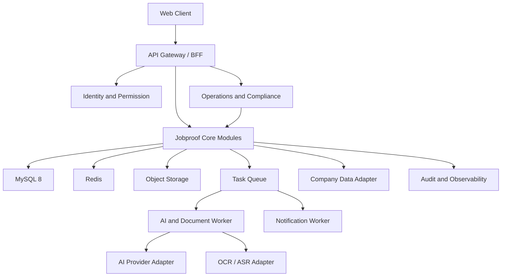

# JobProof AI 技术选型方案

> 文档版本：v0.5（在 v0.4 文件上原位修订）
>
> 文档日期：2026-08-18
>
> 文档状态：技术选型阶段（流程 P2）主路线已选择；供应商与业务参数待确认。P0A 业务契约已于 2026-08-18 冻结，可按 S0→S5 执行后端闭环。冻结后默认后端真实闭环先于前端；正式 Mock 优先不是默认路径。此处“P2”指交付流程的技术选型门，不是产品分期 P2。第 5、6 轮及 P0B/P1/P2 仍不得提前实现。
>
> 关联需求：JobProof AI PRD v0.9
>
> 架构输入：JobProof AI 系统架构设计文档 v0.9
>
> 业务确认输入：JobProof AI P3.5 业务逻辑确认记录 v0.7；已确认规则以该记录与 PRD 第 25 章、架构第 24 章交叉核对后的统一表述为准。

## 1. 文档定位

本文档根据 PRD v0.8 和 P3.5 已确认核心规则记录当前项目的技术路线。v0.5 将 Vue 3 + Spring Boot 3 + MySQL 8 保持为已选择主路线，并与 PRD、架构对齐文档状态、Adapter 端口名、工作台边界和待确认清单轮次。React + NestJS 与 PostgreSQL 保留为条件候选。本文档不设计正式数据库字段，不定义正式 API，也不替代 P3.5 业务契约确认。

本项目属于高敏感个人数据、长流程、多 AI 能力和外部服务集成产品。技术选型优先级为：业务可验证、数据安全、可解释、可回滚、低运维成本，然后才是极限吞吐量。

### 1.1 文档协同与冲突处理

| 主题 | 以谁为准 |
| --- | --- |
| 产品目标、用户、非目标、需求编号、分期验收 | PRD v0.9 |
| 技术栈、供应商隔离、不推荐技术 | 本文档 |
| 模块边界、事件、数据与安全架构 | 架构文档 v0.9 |
| 产品状态中文名与主状态链 | PRD；本文档不另起状态简称 |
| 已确认业务规则 | PRD 第 25 章与架构第 24 章的统一表述 |

技术选型中的“P2”仅表示交付流程的技术选型门，不得与产品分期 P2（官方平台集成与自动化）混用。

## 2. 推荐结论

当前选择 **方案 A：Vue 3 + TypeScript + Vite + Java 17 + Spring Boot 3 的模块化单体**，并配套 MySQL 8、Redis、S3 兼容对象存储和独立异步 Worker。

推荐理由：

- P0A 只启用画像、证据、JD 文本导入、单岗位匹配、简历、投递 CRM、面试记录、基础复盘和最小任务反馈；P0B 再启用收藏、推荐、准备、风险、统计和后台。业务关系复杂但初期吞吐量不会很高，模块化单体更容易保持状态一致。
- 当前团队更适合 Vue 与 Java/Spring Boot，选型优先匹配实际开发能力、长期维护和企业级治理，不为了统一 TypeScript 增加迁移成本。
- MySQL 8 满足 P0A 的关系、事务、版本和审计需要；只有 JSON、全文搜索或 pgvector 需求明确出现时，才重新评估 PostgreSQL。
- P1 的企业查询、文档解析、语音转写和 AI 任务可以通过 Worker 异步执行，不必提前拆成微服务。
- P2 需要规模化时，可以按稳定边界提取 AI 编排、企业数据适配和通知服务，不需要推翻 P0A/P0B。

React + NestJS 仍可作为候选路线，但不再是当前默认实现。该选择不改变 Profile、Evidence、Job、Matching、Resume、Application CRM、Interview、Review 等领域边界。

## 3. 技术约束与前提

### 3.1 产品前提

- P0A 已确认以桌面 Web 为完整工作端，移动 Web 只支持查看、提醒和简单操作；App 与浏览器扩展不进入 P0A。
- P0A 支持文字输入、必要文件上传、JD 文本解析、单岗位匹配、简历版本、投递 CRM、面试记录、基础复盘和最小站内任务反馈。
- P0B 再启用截图/OCR、岗位收藏、多岗位推荐、面试准备、基础风险、个人统计、完整通知中心和最小运营/合规后台。
- 语音实时转写、企查查正式接口、Offer/合同深度对比属于 P1。
- 用户逐条确认发送属于 P1 试点；不逐条确认的自动代聊、自动跳过和批量沟通属于 P2。
- P0A 业务契约已于 2026-08-18 冻结。冻结后默认后端真实闭环先于前端；正式 Mock 优先不是默认路径。若仍制作探索稿，必须显式标记“探索稿 / 非冻结方案”，且不得反推正式数据库字段、API、业务状态、权限或业务规则。
- 页面、组件只消费已冻结契约，且须等对应切片后端可交接后再接入。第 5、6 轮及 P0B/P1/P2 仍不得提前实现。

### 3.2 当前实现基线

当前只允许推进 P0A，顺序为 S0 基础底座、S1 用户画像与能力证据、S2 JD 文本导入与单岗位匹配、S3 简历版本与投递、S4 面试记录与基础复盘、S5 登录后的求职工作台。

P0A 主要模块为 Identity、Profile、Evidence、Job、Matching、Resume、Application CRM、Interview、Review、Task、最小 Notification 和 Data Rights / Audit 基础能力。P0B、P1、P2 只保留架构边界。

P0A 禁止提前创建企业付费查询、多岗位推荐、完整风险评估、薪资谈判、Offer 审核、合同审核、实时面试 Copilot、自动发送 HR 消息、自动代聊、自动跳过招聘人员或招聘平台自动操作。对应 Controller、Service、数据库表、正式页面入口、菜单和 API 均不得提前实现。

P0A 首页是登录后的 JobProof AI 求职工作台，而不是营销宣传首页。首页只允许读取求职画像完成度、能力证据完成度、最近导入的 JD、当前单岗位匹配结果、当前简历版本、当前投递进度、即将进行的面试、待完成的面试复盘、AI/异步任务状态和当前待办任务。这些是数据读取边界，不是已冻结的卡片、排序或快捷操作。工作台只负责展示、导航和继续任务，不拥有业务状态。

### 3.3 工程约束

- 使用 UTF-8 编码，敏感凭据只通过环境变量或安全配置注入。
- 项目运行和开发不采用 Python 服务或 Python 脚本作为默认实现方式。
- 所有外部供应商通过适配层接入，业务模块不能直接绑定供应商 SDK。
- 所有长任务必须有明确任务 ID、可以查询状态、保留失败原因、支持幂等，并追踪输入版本和结果版本。
- 是否可取消、取消时机、最大重试次数、自动重试次数和人工重试条件由具体业务任务契约决定，技术层不得统一预设。
- 所有外部副作用必须记录授权、请求内容、目标、时间和结果。

### 3.4 前台与后台技术边界

前台、管理端、通知和统计分层已由 PRD 吸收为业务职责，不以外部附件为来源。技术实现遵守以下边界：

- 用户工作台与管理后台可以部署在同一个 Web 应用中，但路由、权限策略、菜单和数据查询必须按角色隔离。
- 后台查询只返回完成运营任务所需的脱敏字段；不能通过前端隐藏按钮代替服务端权限校验。
- 规则、模板和学习资源采用版本化发布，草稿与已发布版本分离；发布失败时旧版本继续生效。
- 通知是业务事件的派生结果，通知重试不能重新执行投递、发送、Offer 接受或数据删除等业务动作。
- 运营统计优先从结构化业务事件和聚合数据生成，不直接扫描用户原始对话、简历或合同。

## 4. 三条技术路线

### 4.1 方案 A：Vue + Spring Boot 模块化单体（已选择）

#### 建议组成

| 层次 | 技术方向 |
| --- | --- |
| Web 前端 | Vue 3 + TypeScript + Vite；业务组件按 feature 组织 |
| API 与业务层 | Java 17 + Spring Boot 3；模块化单体，按领域拆分模块 |
| 异步任务 | Redis + 独立 Worker；任务技术基线统一，取消与重试规则按具体业务契约确定 |
| 关系数据 | MySQL 8；关系、状态、审计和结构化 AI 结果统一管理 |
| 文档与原始文件 | S3 兼容对象存储；私有桶、短时签名 URL、版本化文件 |
| 缓存与幂等 | Redis；缓存、短期会话、任务进度和幂等键 |
| 搜索/向量 | P0A 使用 MySQL 8 基础查询；JSON、全文搜索或向量需求明确后再重评 PostgreSQL/pgvector |
| AI 集成 | Java Provider Adapter；统一结构化输出、模型版本、提示词版本和失败降级 |
| 观测 | OpenTelemetry + 结构化日志 + 错误追踪服务 |
| 部署 | Docker 镜像；优先托管 MySQL 8、Redis 和对象存储 |

#### 优点

- Vue 3 与 Spring Boot 3 符合当前项目实际开发能力，长期维护路径清晰。
- Spring 生态适合事务、权限、审计、任务编排和企业级部署治理。
- 单体部署、调试和回滚成本低，适合产品验证期。
- 后续可以按模块边界提取服务，不需要一开始承担微服务治理成本。

#### 风险

- 前后端使用不同语言，需要通过稳定契约保持类型和状态语义一致。
- Worker、API 和前端共享契约时要防止把内部数据库字段暴露为公共契约。
- 团队需要具备 Vue、Java/Spring Boot、MySQL、Redis、异步任务和安全开发能力。

#### 适用判断

适合当前团队和 P0A 证据驱动求职闭环。已选择为当前主路线。

### 4.2 方案 B：React + NestJS 全 TypeScript 单体（候选）

#### 建议组成

| 层次 | 技术方向 |
| --- | --- |
| Web 前端 | React + TypeScript + Vite |
| API 与业务层 | NestJS + TypeScript；模块化单体 |
| 异步任务 | Redis-backed queue + 独立 Worker |
| 关系数据 | MySQL 8 或经重新评估的 PostgreSQL |
| 文档与原始文件 | S3 兼容对象存储 |
| AI 集成 | TypeScript Provider Adapter |
| 观测 | OpenTelemetry、结构化日志、指标和链路追踪 |
| 部署 | Docker、Kubernetes 或企业现有部署平台 |

#### 优点

- 前后端 TypeScript 统一，类型和工程工具链一致。
- AI 结构化输出和 Provider Adapter 迭代灵活。
- 模块边界稳定时也可逐步服务化。

#### 风险

- 不符合当前项目 Java/Vue 开发能力优先级，切换会增加学习和维护成本。
- TypeScript 单体变大后仍需严格隔离 Controller、领域逻辑、AI 调用和持久化。
- 切换路线不得改变已确认业务契约或领域边界。

#### 适用判断

仅在团队能力、维护成本或交付环境发生明确变化时重新评估，不作为 P0A 默认路线。

### 4.3 方案 C：事件驱动服务化

#### 建议组成

| 服务 | 责任 |
| --- | --- |
| Web 应用 | 页面、用户操作和轻量查询 |
| 求职核心服务 | 画像、证据、岗位、简历、投递和权限 |
| AI 编排服务 | 提示词、模型路由、结构化输出和评测 |
| 文档服务 | OCR、文件解析、原文定位和版本 |
| 风险服务 | 规则、企业数据和证据化风险报告 |
| 事件平台 | 投递、面试、Offer 和反馈事件 |
| 数据平台 | 聚合统计、匿名行业基准和模型评测 |

可使用 Java/Go 作为核心服务，TypeScript 作为 AI 编排和前端服务；消息系统可以选择 Kafka、NATS 或云消息服务，具体需在 P3 根据吞吐量和团队能力确认。

#### 优点

- AI、文档、企业数据和统计分析可以独立扩缩容。
- 适合多租户、机构合作、较高数据量和复杂异步任务。
- 领域边界清晰后，团队可以并行开发。

#### 风险

- 状态一致性、幂等、事件补偿、链路追踪、权限传播和数据删除都会变复杂。
- P0A/P0B 需要同时维护服务发现、部署、消息、监控和故障处理，返工成本高。
- P0A 已冻结后仍不建议起步即拆服务；在业务契约未冻结时拆服务，更容易把未确认规则固化到多个服务中。

#### 适用判断

不建议作为 P0A/P0B 起步方案。只有当单体出现明确的吞吐、团队协作或数据隔离瓶颈，并且已经完成稳定业务契约后，才进入后续拆分评估。

## 5. 方案对比

| 维度 | 方案 A：Vue + Java 单体 | 方案 B：React + NestJS 单体 | 方案 C：事件驱动服务化 |
| --- | --- | --- | --- |
| P0A 交付速度 | **高，匹配当前团队** | 中，需要切换能力栈 | 低 |
| 初始运维成本 | 低 | 低 | 高 |
| AI 迭代效率 | 中高，使用 Provider Adapter | 高 | 高，但治理复杂 |
| 事务与状态一致性 | 高 | 高 | 中，需要事件补偿 |
| 私有化与组织级审计 | **高**（Spring 安全、审计与私有化部署更成熟） | 中高（可做，企业治理组件需更多自建） | 高，但实现成本高 |
| 团队技能要求 | Java/Vue/Spring/MySQL | TypeScript/React/Node | 多语言、消息和平台工程 |
| 后期扩展性 | 高，可逐步服务化 | 中高，可按边界拆分 | 高 |
| P0A 推荐度 | **已选择** | 候选 | 不采用 |

## 6. 推荐架构草案

### 6.1 逻辑分层

### 6.2 P0A/P0B 模块边界

| 模块 | 启用阶段 | 阶段职责 | 不负责 |
| --- | --- | --- | --- |
| Identity | P0A | 注册、登录、注销、会话和基础账号安全 | 复杂企业组织架构 |
| Profile | P0A | 画像、偏好、限制和事实/推断确认 | 自动推断未提供事实 |
| Evidence | P0A | 技能、项目、作品、成果和证据关联 | 权威职业资格认定 |
| Job | P0A 文本导入；P0B 收藏/OCR | JD 快照、解析校正和岗位收藏 | 未授权平台批量抓取 |
| Matching | P0A 单岗位；P0B 多岗位 | 可解释匹配、缺口、排序和标签 | 个人敏感属性排序 |
| Resume | P0A | 简历主档、版本、证据关联和导出 | 自动生成虚假经历 |
| Application CRM | P0A | 投递记录、阶段和关联简历版本 | 自动发送、自动代聊或拥有面试轮次状态 |
| Interview | P0A | 面试流程、轮次、时间、结果和材料关联 | AI 复盘结论或未经同意的转写 |
| Review | P0A 基础；P0B 增强 | 手工/文字记录导入、复盘和训练反馈 | 未经用户确认写入正式弱项 |
| Data Rights | P0A | 授权、分享、导出、删除和审计 | 绕过法定义务删除数据 |
| Notification | P0A 最小反馈；P0B 完整中心 | 任务进度、关键提醒、偏好、渠道状态和事件去重 | 重复执行产生通知的原业务动作 |
| Preparation/Risk/Analytics | P0B | 面试准备、基础招聘风险和个人漏斗分析 | 企业正式核验或因果结论 |
| Operations/Compliance | P0A 审计底座；P0B 可视化后台 | 模板、规则、资源、工单和安全审计 | 默认查看用户原始私密材料 |

P0A 单岗位匹配必须以用户确认后的岗位版本作为输入，并采用“证据门槛 + 规则分”。分项和权重为硬性门槛 30、技能与证据 35、经历相关 25、限制符合 10；空限制时按 30:35:25 重分。等级为 `高度匹配`、`部分匹配`、`缺口明显`、`无法判断`。1 个已确认硬性缺口最高 `部分匹配`，2 个及以上最高 `缺口明显`。未知项不打 0 分，只对已判断项计分。JD 文本 80–20000 字；全文相同才自动复用岗位。`PENDING`/`RUNNING` 可取消；瞬时失败最多自动重试 2 次；结构或内容失败只允许手动重试。`STALE` 可查看对比，不自动归档，不改写已成功历史任务。不能自动放弃岗位、阻止查看报告或自动创建/取消投递。细则以确认记录 v0.5 第 4 节为准，技术层不得另设权重或限等。

### 6.3 P1 模块边界

- 企业主体匹配和正式企业信息适配。
- 薪资报价、总包计算和用户确认的谈判辅助。
- 求职材料版本、Offer 结构化和合同/承诺差异报告。
- 授权语音转写和实时 Copilot 试点。
- 经单独合规确认的数据增强或匿名行业基准。
- 企业查询、实时会话和材料审核引入后的供应商异常工单增强能力。

### 6.4 P2 模块边界

- 官方招聘平台授权同步。
- 不逐条确认的自动代聊、规则化跳过和批量沟通。
- 匿名行业基准、独立数据平台和按服务拆分。

## 7. AI 与外部服务技术原则

### 7.1 AI Provider Adapter

业务模块只调用内部统一能力，不直接绑定模型供应商。以下名称只表达逻辑端口，不是正式代码接口，并与架构文档保持同一套名字：

- `structuredGenerate`：按版本化结构生成结果。
- `extractDocument`：返回字段、原文位置、置信度和解析状态。
- `classifyAndScore`：输出标签、分项评分、证据和置信度，供匹配和风险使用。
- `streamSuggestions`：P1 返回三种策略建议、证据引用和风险；传输层可以流式。
- `transcribeAudio`：P1 返回转写片段、说话人、时间戳和删除状态。
- `embed`：仅在评测后启用的语义向量能力。

每次调用记录模型、提示词、规则、输入摘要、输出版本、延迟、费用和失败原因；不得记录不必要的完整敏感原文。

### 7.2 事实与推断隔离

- 用户原始输入和文件字段属于事实候选，需保留来源。
- AI 改写、匹配、风险和训练建议属于推断或建议，必须有类型标记。
- 无法定位来源的内容不得进入“已验证证据”或“正式简历事实”。
- 外部企业数据、用户反馈和 AI 推断不得混成一个不可追溯分数。

### 7.3 任务模型

OCR、文档解析、企业查询、合同对比、语音转写和长报告都使用异步任务：

- JD 解析任务：`PENDING`、`RUNNING`、`SUCCEEDED`、`FAILED`、`CANCELLED`。
- 匹配任务：`PENDING`、`RUNNING`、`SUCCEEDED`、`FAILED`、`CANCELLED`。
- 岗位版本：`DRAFT`、`REVIEW_REQUIRED`、`CONFIRMED`、`ARCHIVED`。
- 匹配报告：`CURRENT`、`STALE`、`ARCHIVED`。

任务必须具备任务 ID、状态查询、失败原因、幂等能力、输入版本和结果版本追踪。用户看到的是业务状态，不直接暴露供应商内部状态。已经 `SUCCEEDED` 的历史任务不因输入变化而修改；变化的是旧报告，由 `CURRENT` 转为 `STALE`，重新计算创建新任务和新报告。

任务是否可取消、允许取消的时机、最大重试次数、自动重试次数和人工重试条件由具体业务任务契约决定。本技术方案不统一预设这些规则。

## 8. 数据与存储选型原则

### 8.1 P0A/P0B 数据分工

| 数据 | 推荐存储 | 原因 |
| --- | --- | --- |
| 用户、画像、岗位、收藏、投递、面试、通知、权限和审计索引 | MySQL 8 | 关系、约束、事务和可追溯 |
| AI 结构化结果、岗位解析字段、评分解释 | MySQL 8 JSON + 版本记录 | 结构会演进，需要保留版本 |
| 模板、技能模型、风险规则、工单和发布记录 | MySQL 8 + 版本记录 | 支持草稿、审核、发布、停用和审计 |
| 简历、JD 截图、Offer、合同和录音 | 私有对象存储 | 大文件、版本、签名访问和生命周期管理 |
| 短期缓存、验证码、任务进度、幂等键 | Redis | 低延迟和过期能力 |
| P0A/P0B 简单关键词搜索 | MySQL 8 基础查询；全文检索按需求评估 | 减少组件数量 |

### 8.2 P1/P2 扩展原则

- 只有 JSON、全文搜索或向量检索需求明确，且 MySQL 8 方案无法合理满足时，才重新评估 PostgreSQL、OpenSearch 或其他搜索服务。
- 只有经过评测确认语义检索能提升岗位匹配或证据召回时，才评估 pgvector 或独立向量服务。
- 事件平台只有在事件量、跨模块异步和团队并行开发形成明确瓶颈后才引入。
- 不为“看起来像 AI 产品”而提前配置向量数据库、知识图谱平台或微服务集群。

## 9. 安全、权限与合规技术要求

- Web 会话优先使用 HttpOnly、Secure、SameSite Cookie；不把长期令牌放在浏览器 localStorage。
- 每个业务对象都以用户租户/用户 ID做服务层权限校验，不能只依赖前端隐藏按钮。
- 原始文件默认私有，使用短时签名 URL；文件访问、导出、分享和删除都写入审计事件。
- 对上传文件进行大小、格式、恶意内容和压缩炸弹检查；解析服务使用隔离运行环境。
- AI 和第三方供应商只发送最小必要字段，供应商配置独立管理并支持关闭训练使用。
- 授权、撤销、删除、外部发送和专业人士分享均保存授权版本和操作结果。
- 个人数据导出和删除使用异步任务，完成前不能显示为成功。
- 关键规则、提示词、模型和企业数据查询结果必须版本化，报告可追溯到版本。
- 后台采用服务端 RBAC；超级管理员、运营管理员、合规人员和普通用户的查询范围与操作权限分离。
- 规则发布、角色变更、封禁解禁、敏感原文访问和批量操作必须生成追加式审计事件。
- 通知事件使用业务事件 ID 和幂等键去重；通知失败重试不重新执行原业务操作。

## 10. 环境与部署建议

### 10.1 本地开发

- Node.js 使用团队统一的 LTS 版本。
- Java 使用 JDK 17，构建工具版本由项目初始化时固定。
- 前端、API、Worker 使用 Docker Compose 或等价方式编排本地依赖。
- 本地提供 MySQL 8、Redis 和 S3 兼容对象存储测试实例。
- 使用 `.env.local` 或安全配置注入密钥，提交模板文件而不提交真实值。
- 使用种子数据覆盖正常、空、错误、权限不足、状态冲突和删除部分失败场景。

### 10.2 测试与生产

- 至少区分开发、测试、预发布和生产环境。
- 数据库、对象存储和 Redis 采用独立凭据和最小权限。
- 生产文件和日志不得复制到开发环境，测试使用脱敏数据。
- 生产发布使用可回滚镜像和数据库迁移检查点。
- API、Worker、外部适配器和任务队列分别监控成功率、延迟、失败原因和积压；重试指标只对已确认支持重试的任务启用。

### 10.3 规模化触发条件

只有出现以下任一条件，才考虑从模块化单体提取服务：

- 某类任务的计算资源与核心 API 明显不同且需要独立扩缩容。
- 企业数据、AI 任务或文档解析的故障域影响核心 CRM 可用性。
- 团队需要独立发布且已经拥有稳定的模块契约和事件契约。
- MySQL 8、任务队列或对象存储已出现可观测的容量瓶颈。

## 11. 测试与质量门槛

### 11.1 P0A/P0B 工程测试

- P0A 领域规则测试：投递非法流转拦截、版本不可变、事实/推断分离和删除边界。
- 集成测试：文件上传、任务状态、失败原因、幂等、输入/结果版本、权限校验、审计事件和数据删除；取消与重试按已冻结任务契约验证。
- 合约测试：前端 Mock 与未来 API 的字段、状态和错误结构保持一致。
- 安全测试：越权读取、签名 URL 过期、重复提交、状态并发和敏感日志泄露。
- P0A 端到端测试：画像 → 证据 → JD 文本 → 单岗位匹配 → 简历版本 → 投递 → 面试轮次 → 基础复盘 → 任务反馈。
- P0B 增量测试：收藏不创建投递、多岗位排序、准备包、风险证据、通知去重、规则发布和工单关闭。

### 11.2 AI 质量门槛

- 每个 AI 功能建立固定评测集和人工标注规范。
- 事实一致性、证据引用、风险召回、合同原文定位和实时延迟分别评估。
- 模型或提示词变更必须保留版本并重新评测。
- AI 指标未达目标时，只能降级为建议或人工校正，不扩大自动化权限。

## 12. 选型决策门

| 决策项 | 推荐默认值 | 用户/团队必须确认 |
| --- | --- | --- |
| 首发端 | **已确认：桌面 Web 为完整工作端，移动 Web 轻量使用** | App 与浏览器扩展只在后续阶段重新立项 |
| 主路线 | **已选择：Vue 3 + TypeScript + Vite；Java 17 + Spring Boot 3；模块化单体 + 独立 Worker** | 未来变更需重新评审成本和迁移影响 |
| 数据库 | **P0A 已选择 MySQL 8** | JSON、全文搜索或 pgvector 需求明确时再重评 PostgreSQL |
| 文件 | 托管对象存储/S3 兼容存储 | 部署地区、合规和预算 |
| AI | Provider Adapter，多供应商可替换 | 首批模型供应商、预算和数据训练条款 |
| OCR/ASR | P0A 不采购 OCR；P0B OCR 候选；P1 语音试点 | 文件格式、语音场景和供应商 |
| 企业数据 | P1 正式采购接口 | 企查查接口、预算、配额和展示许可 |
| 认证 | 安全会话 + 可替换身份服务 | 手机号、邮箱或第三方登录 |
| 后台权限 | 服务端 RBAC + 高风险操作审计 | 是否需要双人复核、是否支持组织级租户 |
| 通知 | P0A 最小站内反馈；P0B 完整中心；邮件/短信按授权扩展 | 首发渠道、模板审批、发送供应商和配额 |
| 部署 | Docker + 托管基础设施 | 云厂商、地域、私有化要求 |
| 自动化 | P2，官方授权后评估 | 平台许可、授权方式和责任边界 |

### 12.1 第二轮业务规则

第二轮匹配与 JD 输入规则已按推荐方案确认，见确认记录 v0.7 第 4 节。技术实现必须遵守已公布的四维权重、限等、取消、重试和 STALE 规则，不得另设。

### 12.2 第三轮业务规则

简历 CRUD、版本保护和投递状态机已按推荐方案确认，见确认记录 v0.7 第 7、10 节。技术层必须保证：冻结版本不可变、已绑定版本不可覆盖、投递绑定冻结版本和 `CONFIRMED` 岗位、乐观并发拒绝覆盖、不得根据外部平台自动改正式状态。P0A 不实现收藏、批量改状态和漏斗。

### 12.3 第四轮与冻结前补包

面试轮次、复盘、最小通知、邮箱登录、画像字段和六类证据已按推荐方案确认，见确认记录 v0.7 第 11–13 节。技术层必须保证：轮次/复盘不回写投递、未确认不写弱项、P0A 仅站内通知且失败不回滚业务、邮箱会话改密全失效、已引用证据不可改正文。

### 12.4 第 5、6 轮及以后再确认

1. 法律数据保留期限。
2. 运营双人复核。

### 12.5 实现前技术参数

这些不得改变已选择的 Vue 3 + Spring Boot 3 + MySQL 8 主路线，也不得破坏 Provider Adapter 和 S3 兼容存储边界：

1. 云对象存储供应商。
2. AI 模型供应商。
3. 部署地区、预算和供应商账号。

上述内容没有明确依据前不得自行固化。

## 13. 分阶段实施建议

### P2 选型结论与剩余 Spike

1. 首发用户、桌面 Web 主终端和主技术路线已确认；部署地域、预算和供应商账号仍待确认。
2. 主路线已选择方案 A；方案 B 仅保留候选，方案 C 不作为 P0A/P0B 起步方案。
3. P0A 只锁定 Provider Adapter、S3 兼容存储和最小通知的技术边界，不锁定具体模型或对象存储供应商；OCR、企业数据和语音供应商分别延后到 P0B/P1 决策。
4. 验证 P0A 最小技术 Spike：JD 文本解析、结构化 AI 输出、文件私有访问、对象级授权、任务状态与幂等、输入/结果版本追踪和删除链路。

### P3 架构阶段

1. 基于已确认业务契约拆分领域模块和模块交互。
2. 形成业务对象、CRUD、权限、状态、模块交互和 Mock 场景草案；不提前设计正式数据表或 API。
3. 评估 MySQL 8 基础查询、任务队列和对象存储容量；PostgreSQL 只作为条件候选记录。
4. 明确部署、备份、恢复、监控、通知补偿和回滚方案。

### P3.5 业务契约确认阶段

P0A 已于 2026-08-18 冻结。未纳入 P0A 冻结范围的第 5、6 轮及 P0B/P1/P2 项不得固化到正式页面、Mock、接口、数据库或测试。

### P4/P5 前端阶段

P0A 已于 2026-08-18 冻结。全局规则 v3.0：冻结后后端真实闭环先于前端；正式 Mock 优先不是默认路径。页面、交互稿和组件只消费已冻结契约与对应切片已交接的后端能力。`MOCK-*` 为验收场景名，不是铺正式 Mock 工程的开工依据。P0A 先完成画像、证据、JD 文本、单岗位匹配、简历版本、投递、面试记录、基础复盘和求职工作台；P0B 的收藏、推荐、准备、风险、统计和后台，以及 P1 的企业、薪资、合同和实时语音均不得提前混入 P0A 页面。

### P6 后端阶段

P0A 已于 2026-08-18 冻结。按 S0→S5 单一业务闭环逐步设计并接入正式 API、数据库和 Worker，不提前实现 P0B/P1/P2 能力。不必等待「前端闭环冻结」才开后端。

## 14. 不推荐的技术决策

- P0A/P0B 直接拆成多个微服务、引入 Kafka 和独立数据平台。
- 以向量数据库替代关系数据库保存用户事实、状态和权限。
- 让页面直接调用模型、企查查或招聘平台接口。
- 使用模型自由文本作为接口契约，不做结构化输出校验。
- 把原始录音、合同和聊天直接写入普通日志。
- 使用 Cookie 提取、逆向 API、反检测或绕过平台限制的方案。
- 把自动发送作为默认功能，或用 AI 输出直接覆盖用户状态。

## 15. 官方文档入口

- Node.js：https://nodejs.org/en/about/previous-releases
- Java 17：https://docs.oracle.com/en/java/javase/17/
- Spring Boot：https://spring.io/projects/spring-boot
- Vue：https://vuejs.org/guide/introduction.html
- Vite：https://vite.dev/guide/
- MySQL 8：https://dev.mysql.com/doc/refman/8.0/en/
- Redis：https://redis.io/docs/latest/
- React 候选：https://react.dev/
- NestJS 候选：https://docs.nestjs.com/
- PostgreSQL 候选：https://www.postgresql.org/docs/current/
- OpenTelemetry：https://opentelemetry.io/docs/

以上链接只作为技术调研入口。正式选型时需记录具体版本、许可证、部署地域、供应商条款和评测结果，不能只凭文档首页冻结技术决策。

## 16. 结论

JobProof AI 当前已选择的技术路线是：**Vue 3 + TypeScript + Vite 构建 Web，Java 17 + Spring Boot 3 的模块化单体承载业务一致性，独立异步 Worker 承载 AI/文档/外部处理，MySQL 8 承载核心事实和状态，S3 兼容对象存储承载原始材料，Redis 承载任务协调和缓存，Provider Adapter 隔离 AI 供应商，使用 Docker 部署**。

先用方案 A 完成 P0A 的证据驱动首发闭环，通过独立门禁后再启用 P0B 的推荐、准备、风险、统计和后台；P1 根据真实任务量和供应商契约扩展企业、薪资、合同和语音能力；产品分期 P2 再评估官方平台集成和服务化拆分。React + NestJS 与 PostgreSQL 仅作为条件候选，不影响当前实现基线，也不改变已确认领域边界。v0.5 已与 PRD v0.9、架构 v0.9、确认记录 v0.7 对齐。P0A 业务契约已于 2026-08-18 冻结，可按 S0→S5 执行后端闭环；正式 Mock 优先不是默认路径。
