# JobProof AI 系统架构设计文档

> 文档版本：v0.9（在 v0.8 文件上原位修订）  
> 编写日期：2026-08-18  
> 当前阶段：P3 架构已形成，P3.5 第一至第四轮及冻结前补包已确认  
> 业务契约状态：P0A 已冻结（2026-08-18）  
> 需求输入：《JobProof AI 求职证据官 - 产品需求文档（PRD）v0.9》  
> 技术输入：《JobProof AI 技术选型方案 v0.5》  
> 业务确认输入：《JobProof AI P3.5 业务逻辑确认记录 v0.7》；已确认规则以该记录与 PRD 第 25 章、本章第 24 章交叉核对后的统一表述为准。

---

## 0. v0.9 一致性修订说明

本次修订在 v0.8 基础上回写第四轮与冻结前补包：

- 面试轮次、复盘、最小通知状态从草案改为已确认，轮次/复盘不得回写投递。
- 登录确定为邮箱 + 密码；画像字段分层、六类证据、已引用不可改正文写入第 24.1 节。
- P0A 已于 2026-08-18 冻结。授权依据：用户下旨放权、勿再询问、自行判断最优并直接执行，视为亲口冻结。可按 S0→S5 执行后端闭环。冻结后默认后端真实闭环先于前端；正式 Mock 优先不是默认路径。第 5、6 轮及 P0B/P1/P2 仍不得提前实现。

v0.8 已对齐的范围继续有效：

本次修订在 v0.7 基础上回写第三轮简历与投递已确认规则：

- 简历主档、简历版本和投递状态从草案改为第三轮已确认约束，允许前进/更正和 `接受后撤回` 与 PRD 第 13.1、13.4 节对齐。
- CRUD、页面操作、事务边界和禁止跨模块写入按确认记录 v0.7 第 7、10 节收紧：未确认 AI 事实不得可投递/冻结；创建投递必须绑定冻结版本和 `CONFIRMED` 岗位；不得自动改投递状态。
- 第 24.3 节从待确认清单改为已确认摘要；面试轮次仍留第四轮。

v0.7 已对齐的范围继续有效：

本次修订以 v0.6 的完整架构为基础，统一当时 PRD、技术选型和 P3.5 第二轮已确认核心规则：

- 产品状态中文名、投递主链、通知/规则/授权状态与 PRD 对齐；架构不再使用“面试 / Offer / 结束”等简称替代产品态。
- Job 模块的“岗位主体”改为“公司名候选”，避免与 P1 企业核验混淆。
- AI 能力端口名与技术选型对齐；事件追踪不再使用笼统的 `ProfileUpdated`。
- P0A 质量门不再把“收藏与投递独立”当作首发验收项。
- 第二轮待确认清单与第三轮对象、技术参数分列。
- 工作台只锁定允许读取的对象，不冻结卡片和快捷操作。

v0.6 已对齐的范围如下，继续有效：

- 保留 P0A/P0B/P1/P2 分阶段架构和 22 个 FR 需求追踪，不扩张首发范围。
- 首发用户确认面向大学生、应届毕业生及毕业三年内的早期职业用户。
- 首发终端确认为桌面 Web 主工作端；移动 Web 只承担查看、提醒和简单操作，App 与浏览器扩展不进入 P0A。
- 画像采用渐进式证据驱动模型，求职方向在匹配前必填，其余信息可以分阶段补充。
- 新增“画像事实候选、正式画像事实、证据引用”概念边界；AI 推断必须由用户确认后才能成为正式事实。
- 被有效简历版本引用的证据不能直接删除，只能归档；解除全部有效引用后才可进入删除流程。
- 冻结 JD 必须确认字段、匹配报告表达、硬性要求缺失处理和输入变化后的报告版本规则。
- 拆分 JD 解析任务、岗位版本、匹配任务和匹配报告状态，避免任务状态与业务对象状态混用。
- 第二轮匹配规则已确认；第三轮简历与投递规则已确认；面试轮次等第四轮对象仍为草案。

### 0.1 技术决策状态

| 决策 | 当前状态 | 当前结论 | 进入实现前要求 |
| --- | --- | --- | --- |
| 架构形态 | 已选择 | P0A 使用模块化单体 + 独立异步 Worker | 保持领域边界和任务追溯要求 |
| Web 技术 | 已选择 | Vue 3 + TypeScript + Vite | React 保留为候选，不进入 P0A 主路线 |
| API 技术 | 已选择 | Java 17 + Spring Boot 3 | NestJS 保留为候选，不进入 P0A 主路线 |
| 核心数据库 | 已选择 | P0A 使用 MySQL 8 | 仅在 JSON、全文搜索或 pgvector 需求明确时重评 PostgreSQL |
| 队列与缓存 | 已选择 | Redis | 完成容量和失败恢复 Spike |
| 文件存储 | 原则确定 | 私有对象存储 + 短时签名访问 | 确认云厂商、地域和生命周期 |
| AI 接入 | 原则确定 | Provider Adapter + 结构校验 + 版本追踪 | 确认供应商、预算和数据条款 |
| 业务契约 | P0A 已冻结（2026-08-18） | 第一至第四轮及冻结前补包已确认 | 按 S0→S5 执行后端闭环；正式 Mock 优先不是默认路径；第 5、6 轮及 P0B/P1/P2 不得提前实现 |
| 首发范围 | 产品方向已确认 | P0A 先于 P0B/P1/P2 独立验收 | 冻结 P0A 业务契约和验收切片 |
| 首发用户 | 已确认 | 大学生、应届毕业生及毕业三年内早期职业用户 | 社招特有规则不进入 P0A |
| 首发终端 | 已确认 | 桌面 Web 为主，移动 Web 轻量使用 | App、浏览器扩展延后 |
| 画像与证据 | 第一轮及补包已确认 | AI 推断需用户确认；六类证据；已引用不可改正文 | 导师、法定年限不挡 P0A |
| P1 实时协议 | 未确定 | WebSocket、SSE 或混合方案均不固化 | 通过 ASR/模型延迟 Spike 选择 |
| P2 平台自动化 | 条件能力 | 仅官方接口和专项授权下评估 | 获得平台许可并单独评审 |

### 0.2 当前实现基线

当前只允许推进 P0A。P0A 首发闭环按以下顺序推进：

```text
S0 基础底座
  -> S1 用户画像与能力证据
  -> S2 JD 文本导入与单岗位匹配
  -> S3 简历版本与投递
  -> S4 面试记录与基础复盘
  -> S5 登录后的求职工作台
```

P0A 当前主要模块为 Identity、Profile、Evidence、Job、Matching、Resume、Application CRM、Interview、Review、Task、最小 Notification，以及 Data Rights / Audit 基础能力。P0B、P1、P2 只保留架构边界，不进入当前实现。

当前禁止提前创建企业付费查询、多岗位推荐、完整风险评估、薪资谈判、Offer 审核、合同审核、实时面试 Copilot、自动发送 HR 消息、自动代聊、自动跳过招聘人员或招聘平台自动操作。对应的 Controller、Service、数据库表、正式页面入口、菜单和 API 均不得提前实现。

### 0.3 文档协同与冲突处理

| 主题 | 以谁为准 |
| --- | --- |
| 产品目标、用户、非目标、需求编号、分期验收 | PRD v0.9 |
| 技术栈、供应商隔离、不推荐技术 | 技术选型方案 v0.5 |
| 模块边界、事件、数据与安全架构 | 本文档 |
| 产品状态中文名与主状态链 | PRD；本文档只做技术映射 |
| 已确认业务规则 | PRD 第 25 章与本章第 24 章的统一表述 |

技术选型中的“P2”指交付流程的技术选型门，不是产品分期 P2。

## 1. 文档目标

本文档把 PRD 中的产品能力转换为可执行的系统架构草案，重点回答以下问题：

1. 系统边界、用户角色和外部依赖是什么。
2. P0A、P0B、P1、P2 各阶段由哪些模块承载，模块之间如何协作。
3. 核心业务对象、状态、权限、事件和异步任务由谁负责。
4. AI、企业数据、OCR、语音、通知和招聘平台能力如何被适配层隔离。
5. 系统如何满足隐私、证据可追溯、可解释、审计、回滚和持续演进要求。

本文档不是数据库设计、接口设计或正式页面设计。出现的对象、状态、操作和事件以 P3.5 记录为准：明确标记“已确认”的内容构成当前业务契约，其他内容仍是草案。

## 2. 架构范围与禁止假设

### 2.1 本次架构范围

- P0A 覆盖身份与数据权利、求职画像、能力证据、JD 文本导入、单岗位匹配、简历版本、投递、面试记录、基础复盘和最小任务反馈。
- P0B 覆盖岗位收藏、多岗位推荐、面试准备、基础风险、个人反馈分析、完整通知和最小运营合规后台。
- 为 P1 的企业核验、薪资谈判、Offer/合同审核、实时面试 Copilot、反馈分析预留独立模块边界。
- 为 P2 的官方招聘平台同步和经专项授权的自动化策略预留适配层，不把平台自动化纳入 P0A/P0B/P1 承诺。
- 覆盖前台、用户工作台、运营后台和合规审计后台的逻辑边界，不生成正式页面。

### 2.2 本阶段不输出

- 不输出正式数据库表、字段、索引或迁移脚本。
- 不输出正式 API 路由、请求体、响应体或错误码。
- 不输出正式前端 Mock、交互稿、组件或页面实现。架构文书本身不铺 Mock 工程。冻结后默认后端真实闭环先于前端；正式 Mock 优先不是默认路径。若仍制作探索稿，必须显式标记为“探索稿 / 非冻结方案”，且不得反推正式字段、API、状态、权限或规则。
- 探索稿不得用于反推正式数据库字段、API、业务状态、权限或业务规则。
- 登录方式已确认为邮箱 + 密码。仍不确定供应商、部署地区、法定保留年限和商业计费方案。
- 不默认取得企查查、招聘平台、短信、日历、语音转写或模型供应商的商业授权。

### 2.3 架构原则

| 原则 | 架构要求 |
| --- | --- |
| 证据优先 | 事实、用户自述、外部数据和 AI 推断分层保存，任何结论可回到来源 |
| 用户控制 | AI 结果默认是建议；影响正式简历、弱项、投递、外发和删除的动作必须经过规则规定的用户确认 |
| 隐私默认 | 用户数据默认私密，管理员默认不可浏览原始简历、对话、Offer 和合同 |
| 模块内聚 | 每个领域模块拥有自己的业务规则和状态写入权，禁止跨模块直接修改数据 |
| 供应商隔离 | 模型、OCR、ASR、企业数据和通知供应商只能通过 Provider Adapter 接入 |
| 异步解耦 | 文档解析、AI 生成、企业查询和复盘等长任务走统一任务模型 |
| 渐进演进 | P0A/P0B 使用模块化单体；只有观测数据证明有必要时才拆服务或增加中间件 |
| 可审计 | 授权、敏感访问、规则发布、外部发送、删除和高风险管理操作必须留痕 |

### 2.4 已确认的架构不变量

以下规则来自 P3.5 第一轮和第二轮已确认内容，后续正式页面、接口、数据和代码设计不得违反：

1. **个人首发边界**：P0A 以个人求职者为数据所有者，不默认存在学校、企业或组织租户。
2. **终端边界**：桌面 Web 承担完整工作流；移动 Web 只提供查看、提醒和简单操作。App 与浏览器扩展只能在后续阶段重新立项。
3. **渐进画像**：用户不需要首次一次性填写完整画像，但进入匹配前必须明确求职方向；缺失字段保持未知，不生成默认事实。
4. **事实写入权**：用户主动填写或主动确认是正式画像事实的唯一业务写入来源。AI、文件解析和外部服务只能创建候选事实。
5. **来源可追溯**：画像候选和正式事实都必须能回到用户输入、文件、对话或 AI 处理来源；拒绝的 AI 候选不得继续参与正式匹配和简历生成。
6. **证据引用保护**：有效简历版本引用证据时，证据只能归档，不能删除；解除全部有效引用后才可发起删除。
7. **历史版本保护**：归档或删除不能破坏历史投递简历的证据追踪关系；投递时绑定的事实和证据引用不可被后续编辑静默覆盖。
8. **最小权限**：运营人员默认不能查看用户画像、简历、对话和证据原文；导师、专业人员和合规访问仍需后续确认。
9. **JD 确认门槛**：正式匹配前至少确认岗位名称、主要职责、硬性技能、经验要求、学历要求、地点和工作方式；缺失薪资、福利等保持未知。
10. **可解释匹配**：报告展示总分、分项、加分项、扣分项、缺失项、对应证据、AI/规则依据、置信信息和未知项。P0A 分项和权重为硬性门槛 30、技能与证据 35、经历相关 25、限制符合 10；空限制时按 30:35:25 重分。
11. **硬性要求保护**：硬性要求缺失必须醒目标记。1 个已确认硬性缺口最高 `部分匹配`，2 个及以上最高 `缺口明显`。硬性技能整体计 1 个缺口。未知不当成缺口。不得自动放弃岗位、阻止查看报告或自动创建/取消投递。等级为 `高度匹配`、`部分匹配`、`缺口明显`、`无法判断`。
12. **报告版本保护**：画像、证据、已确认 JD 或规则版本变化时，历史任务保持原状态，旧报告由 `CURRENT` 变为 `STALE`；重新计算创建新任务和新报告。

除上述规则外，其余业务矩阵仍为待确认草案。

## 3. 技术路线决策

### 3.1 候选方向

| 方向 | 适用条件 | 优点 | 主要风险 | 结论 |
| --- | --- | --- | --- | --- |
| A. Vue + Spring Boot 模块化单体 | 当前团队能力、企业级治理和长期维护 | Java 生态成熟，Vue 上手和交付成本可控 | 前后端双语言需要清晰契约和模块边界 | **已选择主路线** |
| B. React + NestJS 模块化单体 | 团队希望全栈 TypeScript 并已有成熟经验 | 类型和工程工具统一 | 不符合当前项目实际开发能力优先级 | 候选路线 |
| C. 事件驱动服务化 | 高并发、多团队、跨地域和独立扩缩容已被验证 | 隔离和扩展能力强 | 早期运维、数据一致性和排障成本过高 | P0A/P0B 不采用 |

### 3.2 推荐基线

- Web：Vue 3 + TypeScript + Vite，按业务 feature 组织。
- API：Java 17 + Spring Boot 3 模块化单体。
- Worker：独立异步进程运行，与 API 共享稳定的领域契约和基础设施约定。
- 核心数据：P0A 使用 MySQL 8；只有 JSON、全文搜索或 pgvector 需求明确出现时才重新评估 PostgreSQL。
- 缓存与任务：Redis。
- 原始材料：私有 S3 兼容对象存储。
- 可观测：OpenTelemetry、结构化日志、指标、链路和错误追踪。
- 部署：Docker 镜像，优先使用托管 MySQL 8、Redis 和对象存储。

Vue 3 + Spring Boot 3 已是当前项目主路线。React + NestJS 仅保留为候选，不再作为 P0A 默认实现；无论未来是否重评技术栈，Profile、Evidence、Job、Matching、Resume、Application CRM、Interview、Review 等领域边界不得改变。

## 4. 系统上下文

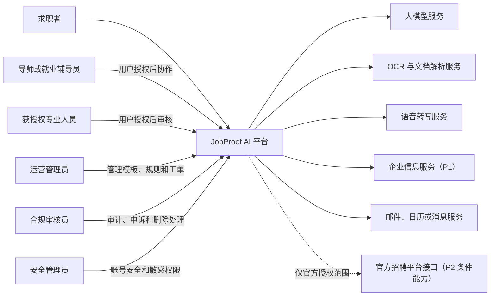

### 4.1 信任边界

1. 用户终端与平台之间是公开网络边界，所有请求必须认证、授权和防重放。
2. 平台与外部供应商之间是第三方数据处理边界，必须限制发送字段并记录供应商、用途和授权。
3. 用户业务数据与运营后台之间是高风险权限边界，后台默认只看脱敏元数据。
4. 原始简历、录音、聊天、Offer 和合同属于敏感材料边界，使用私有对象存储和短时签名访问。
5. P2 平台发送属于外部副作用边界，必须使用独立权限、开关、幂等和审计策略。

## 5. 容器与运行时架构

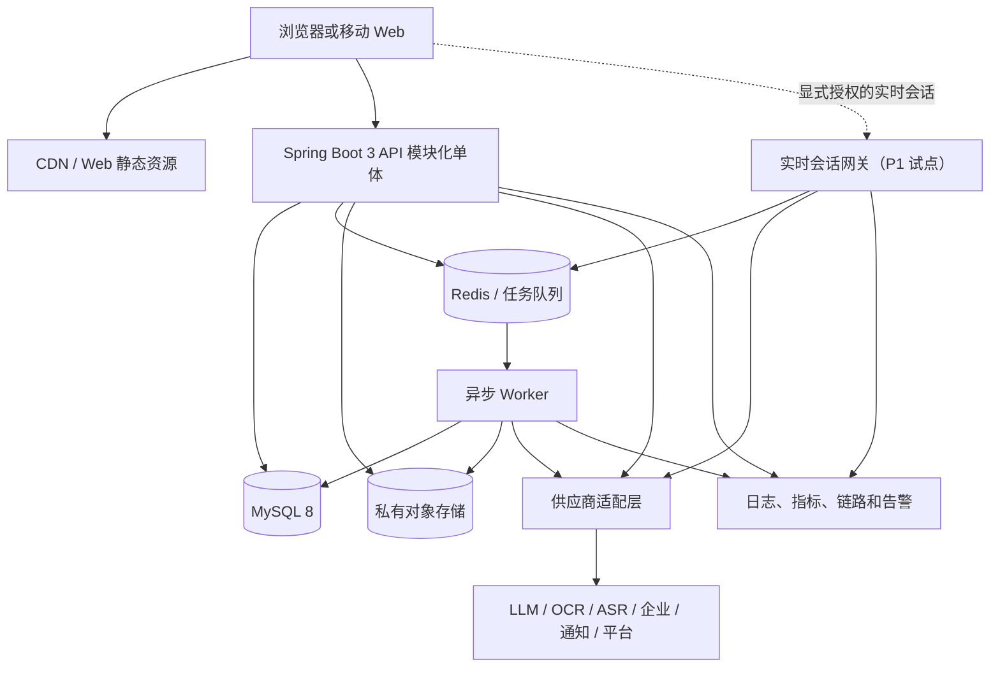

### 5.1 容器职责

| 容器 | 核心职责 | 禁止承担 |
| --- | --- | --- |
| Web | 页面渲染、本地交互、可访问性、用户输入和结果展示 | 最终权限判定、敏感业务规则、供应商密钥 |
| API | 身份鉴别、业务命令、查询编排、事务、授权、任务创建 | 长时间阻塞的 AI/文档处理；直接依赖供应商 SDK |
| 实时网关 | P1 会话授权、音频/文本流、建议流和断线恢复 | 无授权采集；P1 无确认外发；修改 CRM 正式状态 |
| Worker | OCR、解析、AI 生成、企业查询、复盘、审核等长任务 | 直接向用户绕过通知模块发送；无幂等外部副作用 |
| MySQL 8 | 核心事实、状态、版本、关系、审计索引和事务性记录 | 原始大文件；向量检索平台的职责 |
| Redis | 队列、短期缓存、任务进度、限流和幂等键 | 永久事实源或唯一审计存储 |
| 对象存储 | 原始文件、导出文件、必要的处理产物和版本 | 公共永久 URL；无生命周期管理的无限保留 |
| 适配层 | 供应商协议转换、超时、重试、费用、降级和数据最小化 | 领域状态决策和用户权限决策 |

## 6. 应用分层与依赖规则

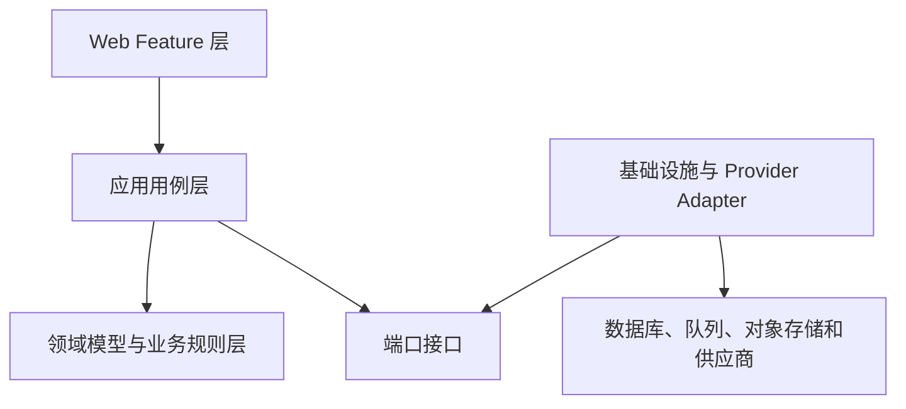

### 6.1 分层职责

- Web Feature 层：消费已冻结的页面-业务操作契约，不推导业务规则。
- 应用用例层：编排命令、查询、权限、事务、领域事件和任务。
- 领域层：保存状态机、值对象、规则和不变量，不依赖 Spring Boot、数据库或供应商 SDK。
- 基础设施层：实现数据库仓储、队列、文件、通知和 Provider Adapter。

### 6.2 模块依赖约束

1. 一个模块只能通过对方公开的应用服务、只读查询或领域事件协作。
2. 禁止跨模块直接写数据库记录。
3. 同一用户操作需要强一致时，由发起模块在单一应用事务中完成其拥有的状态；跨模块影响通过事务外盒事件传递。
4. 外部调用不得放在数据库长事务内，必须使用任务或可补偿流程。
5. 模块之间不得循环依赖；共享概念进入内核类型包，共享业务规则仍归单一领域模块所有。
6. 供应商 SDK 只存在于基础设施适配器中，领域模块依赖稳定端口。

### 6.3 前端逻辑架构

前端属于同一产品架构的一部分，但 P3 只定义责任边界，不生成页面或组件实现。

| 前端层次 | 职责 | 约束 |
| --- | --- | --- |
| App Shell | 路由、登录状态、全局错误边界、主题和可访问性基线 | 不保存领域事实，不绕过服务端权限 |
| Feature | 按 Profile、Job、Resume、CRM 等领域组织操作和视图 | 只能调用本 feature 的应用契约或公共查询 |
| Server State | 查询缓存、任务轮询/订阅、失效和重试 | 服务端事实是最终来源，禁止用本地状态覆盖正式状态 |
| Form State | 编辑草稿、校验和未保存提醒 | 提交前后要处理版本冲突和重复提交 |
| Local Preference | 纯展示偏好、未敏感的本地设置 | 不在 localStorage 保存长期令牌或高敏正文 |
| Upload Client | 分片/直传协调、进度、取消和失败恢复 | 上传凭证短时有效；上传完成不等于解析完成 |
| Task UI Adapter | 按具体任务契约映射状态和允许操作 | 页面不得直接解释供应商内部状态，也不得默认所有任务均可取消或重试 |

前台、用户工作台和管理后台可以共享设计系统和技术底座，但路由、权限守卫、查询范围和审计要求必须分开。浏览器扩展如进入后续版本，应作为独立客户端，只在用户主动操作时读取当前页面最小必要内容，并复用同一授权和导入契约。

P0A 的桌面 Web 承担画像维护、证据管理、JD 分析、简历编辑、投递管理和复盘等完整工作流。移动 Web 只能在已冻结业务契约允许的范围内提供查看、提醒、状态确认和简单编辑，不得因为适配移动端而创建新的业务操作。App 与浏览器扩展在 P0A 不构建、不占用发布依赖。

#### 6.3.1 P0A 首发首页边界

P0A 首发首页采用登录后的 JobProof AI 求职工作台作为主入口，而不是营销宣传首页。其数据读取边界只允许访问 P0A 已启用对象：求职画像完成度、能力证据完成度、最近导入的 JD、当前单岗位匹配结果、当前简历版本、当前投递进度、即将进行的面试、待完成的面试复盘、AI/异步任务状态和当前待办任务。这些是读取边界，不是已冻结的卡片、排序或快捷操作。

首页只负责展示、导航和继续任务，不拥有上述任何业务状态；所有写入必须调用对应领域模块的公开应用服务。多岗位智能推荐、企业风险查询、薪资谈判、Offer/合同审核、实时 Copilot、自动代聊、漏斗摘要和收藏入口在 P0A 不暴露。公开宣传首页属于独立访客区域，不纳入 P0A 主闭环验收。

### 6.4 应用契约与 API 治理

本节只定义契约原则，不定义正式路由或字段：

1. 将用户意图分为命令、查询、异步任务和事件，不用一个接口同时承担多种语义。
2. 写命令携带幂等信息和对象版本；服务端返回明确的已接受、已完成、冲突或失败语义。
3. 长任务立即返回业务任务引用，结果通过轮询、SSE 或 WebSocket 获取；具体协议按场景评测后确定。
4. 列表查询统一支持分页、稳定排序和可追踪过滤条件，避免无边界全量读取。
5. 错误响应区分用户可修正、权限禁止、状态冲突、依赖失败、系统故障和人工处理，不能直接暴露供应商错误或堆栈。
6. 契约先形成版本化规范，再生成前端类型和 Provider 契约；不能由页面字段反推正式接口。
7. 破坏性变更优先新增兼容版本并提供迁移窗口；内部事件和外部 API 分别治理。
8. 所有敏感查询和文件访问在应用服务中执行对象级授权与用途校验。

## 7. 领域模块划分

### 7.1 P0A/P0B 核心模块

本节描述完整领域边界，不表示所有模块在 P0A 同时启用。P0A 只启用第 19.2 节 S0-S5 所需能力；收藏、准备、风险、个人统计和可视化后台在 P0B 通过独立功能开关启用。

| 模块 | 拥有的业务能力 | 对外提供 | 明确不负责 | 需求追踪 |
| --- | --- | --- | --- | --- |
| Identity & Access | 账号、会话、角色、基础安全 | 当前用户、角色和会话校验 | 业务对象权限细节、用户画像 | ACCOUNT-FR-001 |
| Profile | 渐进画像、画像事实候选、正式事实、完整度和用户确认 | 已确认画像快照、缺失项和候选事实处理用例 | AI 直接写正式事实、简历版本、岗位评分 | PROFILE-FR-001 |
| Evidence | 项目、成果、来源、证据引用、归档和受控删除 | 可引用证据、证据完整度和引用检查 | 破坏历史投递引用、AI 虚构事实、投递状态 | EVIDENCE-FR-001 |
| Job | JD 导入、解析校正、公司名候选和收藏 | 结构化岗位、岗位文本来源、JD 中的公司名称候选 | 投递阶段、企业主体核验、付费企业查询 | JOB-FR-001、COLLECTION-FR-001 |
| Matching | P0A 单岗位可解释匹配和缺口；P0B 才增加多岗位排序和标签 | 版本化匹配报告 | 修改画像、自动投递、P0A 多岗位排序 | MATCH-FR-001 |
| Resume | 主简历、岗位定制、证据校验、版本冻结和导出 | 不可变投递版本、导出任务 | 投递阶段、编造证据 | RESUME-FR-001 |
| Application CRM | 投递记录、阶段、跟进、关联简历版本 | 投递时间线和阶段事件 | 面试轮次细节、平台自动发送 | CRM-FR-001 |
| Interview | 面试流程、轮次、时间、结果和材料关联 | 面试轮次上下文、日程事件 | AI 复盘结论、实时采集 | INTERVIEW-FR-001 |
| Preparation | 面试问题、技能清单、反问和资源导航 | 版本化准备包 | 修改岗位事实、正式弱项 | PREP-FR-001 |
| Review | 导入记录、回答分析、改进建议和用户确认 | 复盘报告、候选改进任务 | 未经确认写入正式弱项 | REVIEW-FR-001 |
| Risk | 基于 JD 和用户材料的基础招聘风险规则 | 证据化风险报告和动作建议 | 将联系人个人属性作为风险依据 | RISK-FR-001 |
| Feedback Analytics | 个人投递漏斗、简历版本效果和弱项趋势 | 带样本量的个人统计 | 匿名行业基准、把相关性表述为因果 | FEEDBACK-FR-001 |
| Notification | 站内通知、提醒、任务结果、送达和已读 | 去重后的通知和状态 | 业务事件真假判断 | NOTIFY-FR-001 |
| Data Rights | 授权、分享、导出、撤销和删除请求 | 授权检查、删除编排和进度 | 默认法定保留期限 | DATA-FR-001 |
| Operations | 模板、技能模型、风险规则、合同检查项、法律/学习资源和版本发布 | 已发布配置快照 | 直接修改历史报告；发布无来源或已过期法律规则 | OPS-FR-001 |
| Compliance & Audit | 申诉、删除工单、敏感访问和高风险操作审计 | 审计查询、工单流转 | 默认读取全部用户原文 | AUDIT-FR-001 |

### 7.2 P1 扩展模块

| 模块 | 主要职责 | 关键边界 | 需求追踪 |
| --- | --- | --- | --- |
| Company Intelligence | 企业主体匹配、正式接口查询、来源和时效 | 查询失败不得推导低风险；供应商数据与用户判断分离 | COMPANY-FR-001 |
| Salary | 底线、目标、报价、工资构成和总包换算 | 低于底线只提醒；不代替用户退出 | SALARY-FR-001 |
| Materials & Offer | JD、聊天、Offer、合同和协议的原始材料与版本 | 更新不覆盖历史版本 | MATERIAL-FR-001 |
| Contract Compare | 多材料条款提取、差异定位和异常提示 | 不是法律意见；每个差异回到原文 | CONTRACT-FR-001 |
| Realtime Copilot | 授权会话、实时转写、意图和三种建议 | P1 只允许用户确认采用；异常时不采集、不发送 | COPILOT-FR-001 |
| Feedback Analytics Extension | 经单独合规确认的数据增强或匿名基准 | 显示样本量、退出机制和去标识化边界；不把相关性表述为因果 | FEEDBACK-FR-001 |

### 7.3 P2 条件模块

| 模块 | 进入条件 | 安全边界 |
| --- | --- | --- |
| Recruitment Platform Integration | 获得官方授权 API、明确读写范围、撤销和回调协议 | 不逆向 API、不提取 Cookie、不实现规避平台风控 |
| Automation Policy | 用户专项授权、规则已确认、平台允许、可审计可撤销 | 与 P1 用户确认发送使用独立权限、状态和审计类型 |

### 7.4 横切能力

- AI Orchestration：模型路由、提示词版本、结构化输出、证据引用、评测和降级。
- Document Processing：上传校验、恶意文件扫描、OCR、解析、原文定位和版本。
- Task Orchestration：提供任务 ID、状态查询、失败原因、幂等和输入/结果版本追踪；取消与重试规则由具体业务任务契约决定。
- Audit & Observability：业务审计、技术日志、指标、链路、费用和敏感字段脱敏。
- Feature Flag：按环境、用户群和阶段隔离 P0B/P1/P2 能力。

横切能力不能拥有用户画像、岗位、投递或报告的业务状态；它们只能提供基础能力或编排已授权的模块用例。

## 8. 概念领域对象关系

以下关系用于确定所有权和交互，不代表数据库表或最终基数。

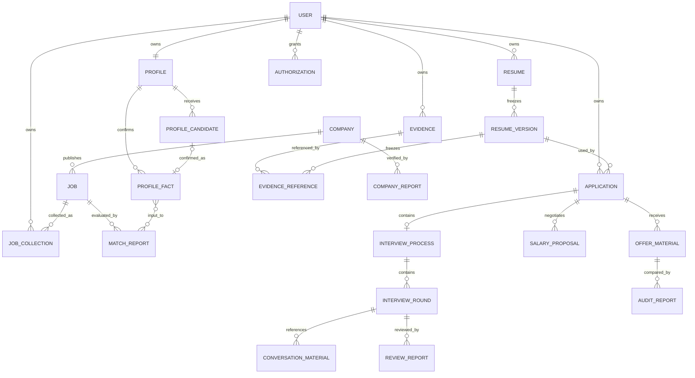

### 8.1 聚合与写入所有权草案

| 对象 | 事实源模块 | 允许发起修改的角色 | 其他模块的使用方式 |
| --- | --- | --- | --- |
| 用户账号/会话 | Identity & Access | 用户、安全管理员 | 只读身份与角色查询 |
| 求职画像 | Profile | 用户；授权协作者的范围待确认 | 读取画像版本、完整度和缺失项 |
| 画像事实候选 | Profile | 系统创建候选，只有用户可确认、拒绝或更正 | AI、解析器和外部服务只能提交候选，不得直接写正式事实 |
| 正式画像事实 | Profile | 用户主动填写或确认 | Matching、Resume 读取已确认快照；拒绝候选不可读取为事实 |
| 能力证据 | Evidence | 用户；授权协作者的范围待确认 | 按证据 ID 和版本读取，不复制事实 |
| 证据引用 | Evidence/Resume 边界 | Resume 创建引用，Evidence 校验删除条件 | 历史投递读取冻结引用；其他模块不得绕过引用检查删除证据 |
| 岗位/JD | Job | 用户；运营只管理公共规则 | 读取岗位快照和解析版本 |
| 匹配报告 | Matching | 系统任务生成，用户可反馈 | 不允许其他模块改分数 |
| 简历版本 | Resume | 用户确认创建 | 投递模块只绑定不可变版本 |
| 投递 | Application CRM | 用户 | 面试、提醒、分析通过事件关联 |
| 面试轮次 | Interview | 用户 | 复盘和准备读取上下文 |
| 风险报告 | Risk | 系统任务生成，用户可申诉 | 使用发布时规则版本只读展示 |
| 通知 | Notification | 系统事件生成，用户改已读 | 业务模块只发送通知请求 |
| 授权/删除请求 | Data Rights | 用户；合规按工单处理 | 所有敏感模块执行授权和删除指令 |
| 规则版本 | Operations | 运营起草，审核发布 | 各模块读取已发布不可变快照 |

### 8.2 跨模块共享值与不变量

这些规则是技术级不变量，不替代 P3.5 对业务字段和状态的确认：

- **标识**：对象使用稳定、不可预测的业务 ID；展示名称、外部 ID 和内部 ID 分开保存，外部供应商 ID 不作为用户对象的唯一权限依据。
- **时间**：事件保存绝对时间，并保留用户输入的时区和本地时间语义；提醒、面试和合同期限不能只存一个无时区字符串。
- **金额**：薪资、奖金、培训费、押金和赔偿等金额必须带币种、周期、税前/税后口径和来源；计算不得使用二进制浮点近似。
- **比例**：匹配权重、概率、折扣和回复率必须带计算口径、样本范围和版本，不把百分比直接当作事实。
- **来源**：用户输入、文件提取、外部查询、规则命中和 AI 推断分别标记来源类型、版本、时间和置信度；AI 推断只能进入画像事实候选。
- **版本**：可影响报告和投递判断的输入、规则、提示词、模型、模板和输出都可追溯；历史结果不被当前版本静默覆盖。
- **地域**：法律规则、通知时间、劳动合同提示和企业数据必须记录适用地区；未匹配地区时显示范围不足。
- **删除**：任何派生对象都能反向找到上游来源和下游影响；存在有效简历版本引用时，证据只能归档，不能删除。解除全部有效引用后，删除仍需经过数据权利编排。

## 9. 业务契约草案

本章是 P3 草案，只为 P3.5 提供确认输入。凡标记“待确认”的操作不得直接变成页面按钮、接口、数据库规则或测试固化。

### 9.1 CRUD 责任矩阵摘要

| 业务对象 | 新增 | 查看 | 编辑 | 删除/归档 | 审核/发布 | 批量/导出 |
| --- | --- | --- | --- | --- | --- | --- |
| 画像事实候选 | AI 编排、用户输入 | 用户 | 用户确认、拒绝或更正 | 保留操作结果；具体删除规则待确认 | 用户确认后才升级为正式事实 | 导出范围待确认 |
| 正式画像事实 | 用户 | 用户 | 用户 | 数据权利流程 | 用户确认或主动填写 | 导出范围待确认 |
| 能力证据 | 用户 | 用户 | 用户 | 有效引用时只能归档；解除全部有效引用后才可删除 | 用户确认真实性 | 批量导入待确认 |
| 证据引用 | Resume、Profile、Evidence | 用户 | 用户解除或系统随版本冻结 | 有效简历版本引用不可绕过删除保护 | 无独立审核 | 不提供独立导出 |
| 岗位/JD | 用户导入 | 用户 | 用户校正解析 | 归档 | 无人工审批 | 批量导入待确认 |
| 收藏 | 用户 | 用户 | 标签/备注待确认 | 取消收藏/归档 | 无 | 批量操作待确认 |
| 匹配报告 | 系统任务 | 用户 | 不改报告；重新生成新版本 | 归档策略待确认 | 用户反馈不等于改分 | 导出待确认 |
| 简历 | 用户空白/模板/导入；AI 只出候选 | 用户；被分享人只读 | 用户编辑正式字段 | 归档可恢复；物理删除走数据权利 | 用户确认后才可投递 | 单份导出；P0A 不做批量生成 |
| 简历版本 | 用户从可投递主档冻结；AI 定制只产出待用户确认 | 用户 | 冻结后不可原地编辑 | 可归档 | 用户确认后冻结 | 从已冻结或已绑定版本导出 PDF |
| 投递 | 准备投递或记录已投递 | 用户 | 按合法流转改阶段 | 归档；硬删走数据权利 | 无 | P0A 不做批量改状态 |
| 面试流程/轮次 | 用户 | 用户 | 用户 | 取消/归档 | 无 | 日历导出 |
| 复盘报告 | 系统任务 | 用户 | 用户反馈/重新生成 | 归档 | 正式弱项必须用户确认 | 导出待确认 |
| 风险报告 | 系统任务 | 用户 | 不改原报告；生成新版本 | 归档 | 规则由运营审核发布 | 导出待确认 |
| 规则/模板 | 运营 | 运营/审核员 | 草稿阶段 | 停用 | 审核发布 | 导入导出待确认 |
| 授权/删除工单 | 用户/系统 | 用户、合规按权限 | 限定状态可补充 | 不允许普通删除 | 合规处理 | 审计导出受控 |

### 9.2 页面与业务操作映射摘要

本节只定义未来页面需要承载的业务操作，不构成 UI 方案。

| 业务工作区 | 必须可追溯的操作 | 依赖对象 | 未冻结前禁止默认增加 |
| --- | --- | --- | --- |
| 画像与证据 | 补充画像、查看候选、确认/拒绝/更正候选、关联证据、归档证据、受保护删除 | 画像事实候选、正式画像事实、证据、证据引用 | 自动把推断写成事实；删除有效引用中的证据 |
| 岗位分析 | P0A：导入、解析、校正、单岗位匹配；P0B：收藏和基础风险 | 岗位、收藏、匹配报告、风险报告 | 自动创建投递；P0A 不暴露收藏和综合风险 |
| 简历工作台 | 创建/导入/编辑、处理 AI 候选、证据校验、冻结、对比、导出 | 简历、证据、版本 | 覆盖已绑定投递版本；未确认就标可投递 |
| 求职 CRM | 准备投递或记录已投递、合法改阶段、查看时间线 | 投递、简历版本、通知 | 根据平台聊天自动改正式阶段；P0A 强制创建面试轮次 |
| 面试准备与复盘 | P0A：手写或粘贴记录、逐条确认、完成复盘；P0B：准备包 | 岗位、简历、面试轮次、复盘 | 未确认写入正式弱项；自动创建复盘 |
| 数据与授权 | 查看授权、撤销、导出、删除、查看进度 | 授权、导出任务、删除工单 | 隐藏不可逆影响 |
| 运营与合规 | 草稿、审核、发布、停用、工单、审计 | 规则版本、模板、工单、审计 | 运营直接查看用户原文 |
| P1 决策中心 | 企业核验、工资拆解、Offer/合同差异和行动建议 | 企业报告、薪资、材料、审核报告 | 用 AI 风险结论替代法律或财务判断 |
| P1 实时 Copilot | 授权、转写、三条建议、编辑、采用、结束 | 会话、转写、建议、授权 | 无确认外发或自动跳过联系人 |

### 9.3 权限矩阵草案

| 能力 | 求职者 | 导师/辅导员 | 授权专业人员 | 运营管理员 | 合规审核员 | 安全管理员 |
| --- | --- | --- | --- | --- | --- | --- |
| 查看/编辑个人画像和证据 | 完整 | 授权范围待确认 | 授权范围待确认 | 默认无 | 仅工单必要范围 | 默认无 |
| 查看简历、聊天、Offer、合同原文 | 完整 | 授权范围待确认 | 授权范围待确认 | 默认无 | 经工单和二次确认 | 仅安全调查必要范围 |
| 修改投递和面试状态 | 完整 | 默认无 | 默认无 | 无 | 无 | 无 |
| 确认正式弱项和 AI 事实 | 完整 | 只能建议 | 只能建议 | 无 | 无 | 无 |
| 撤销授权、导出、删除 | 完整 | 无 | 无 | 无 | 处理工单 | 处理安全相关账号动作 |
| 编辑模板/技能/风险规则 | 无 | 无 | 无 | 草稿和提交审核 | 审核/驳回范围待确认 | 无 |
| 发布高风险规则 | 无 | 无 | 无 | 不可单独发布 | 待确认 | 待确认 |
| 查看审计记录 | 自己的授权/删除记录 | 无 | 无 | 业务范围脱敏记录 | 合规范围 | 安全范围 |

权限必须由服务端基于角色、对象归属、授权范围、用途和数据敏感度共同判定，不能只依赖前端隐藏入口。

### 9.4 状态所有权草案

| 对象 | 状态事实源 | 允许写入者 | 核心状态草案 | 关键限制 |
| --- | --- | --- | --- | --- |
| 画像事实候选 | Profile | AI 编排创建候选；用户确认、拒绝或更正 | AI 推断候选、正式画像事实、已拒绝候选 | 只有用户确认或更正确认后才能成为正式事实；状态名称待冻结 |
| 能力证据 | Evidence | 用户；Data Rights 受控删除 | 可用、已归档、删除处理中、已删除、删除失败 | 有效简历引用存在时不得进入删除处理中；历史引用必须可追溯 |
| JD 解析任务 | Job/Task | 系统；用户可发起，取消与重试权限待确认 | `PENDING`、`RUNNING`、`SUCCEEDED`、`FAILED`、`CANCELLED` | 只表达任务执行结果；不得承载岗位确认状态 |
| 岗位版本 | Job | 用户编辑和确认；系统只创建 AI 候选 | `DRAFT`、`REVIEW_REQUIRED`、`CONFIRMED`、`ARCHIVED` | 只有 `CONFIRMED` 可作为正式匹配输入；归档不删除历史 |
| 匹配任务 | Matching/Task | 系统；用户可发起，取消与重试权限待确认 | `PENDING`、`RUNNING`、`SUCCEEDED`、`FAILED`、`CANCELLED` | 已成功历史任务保持 `SUCCEEDED`，不因输入变化改状态 |
| 匹配报告 | Matching | 系统生成；用户触发重新计算 | `CURRENT`、`STALE`、`ARCHIVED` | 输入变化使 `CURRENT` 变为 `STALE` 并标记“输入已变化 / 结果可能过期”；重算产生新任务和新报告，不覆盖历史 |
| 收藏 | Job | 用户 | `已收藏 -> 已归档`，归档后可恢复；取消收藏是操作不是第三态 | 不驱动投递状态；P0B 对象 |
| 简历 | Resume | 用户 | `草稿 -> 待确认 -> 可投递 -> 已归档` | 存在未确认 AI 事实时不得进入可投递；已归档恢复为归档前状态 |
| 简历版本 | Resume | 用户冻结 | `生成中 -> 待用户确认 -> 已冻结 -> 已绑定投递 -> 已归档` | 仅可投递主档可冻结；已绑定投递后不可原地覆盖或回滚内容 |
| 投递 | Application CRM | 用户 | `待投递 -> 已投递 -> 已查看 -> 笔试 -> 面试中 -> 已获Offer -> Offer已接受 / Offer已拒绝`；终止态为`主动放弃、招聘方拒绝、岗位关闭、长期无回复、接受后撤回` | 不设独立“结束”态；必须绑定冻结版本和 CONFIRMED 岗位；允许前进/更正见确认记录 v0.7 第 7.3 节；`Offer已接受` 只能走接受后撤回 |
| 面试轮次 | Interview | 用户 | `待安排 -> 已安排 -> 进行中 -> 已完成`，另有 `已取消` | 结果不覆盖投递；无时间不建提醒；P0A 无录音 |
| 复盘 | Review | 系统生成候选，用户确认 | `待生成 -> 分析中 -> 待确认 -> 已确认`，另有 `失败`、`已归档` | 未确认不能写正式弱项；不改投递或轮次 |
| 风险报告 | Risk | 系统、用户申诉 | 待评估、评估中、已生成、用户已查看、用户已确认/有异议、无法判断、已更新、已过期 | 外部数据失败、规则过期和主体不明必须可见 |
| 求职材料 | Materials & Offer | 用户、系统任务 | 待上传/粘贴、上传中、解析中、待校正、可使用、已归档、删除处理中 | 原文件和解析版本分开；失败原因保留，重试规则由具体任务契约决定 |
| Offer | Materials & Offer | 用户确认 | 待确认来源、待校正、已确认、已接受、已拒绝、已失效、已归档 | 不能用 AI 解析结果代替用户确认 |
| 审核报告 | Contract Compare | 系统、用户确认 | 待生成、对比中、报告已生成、待确认问题、已确认、已过期、已归档 | 差异必须定位原文，不是法律意见 |
| 薪资谈判 | Salary | 用户 | 未设置预期、已设置边界、收到报价、信息待补齐、谈判中、达成一致、用户退出、招聘方结束 | 低于底线只提醒，不自动退出 |
| 企业核验 | Company Intelligence | 系统、用户确认主体 | 待匹配主体、匹配中、待确认主体、查询中、报告已生成、数据过期、查询失败、待重查 | 主体不唯一不得自动选定 |
| 规则版本 | Operations | 运营/审核 | `草稿 -> 待审核 -> 审核通过/审核驳回 -> 已发布 -> 已停用/已归档` | 已发布版本不可原地修改；“已回滚”表示停用当前版本并指向上一已发布版本 |
| 授权 | Data Rights | 用户/系统 | `待授权 -> 已同意/已拒绝`；已同意可进入`已使用 -> 已撤销/已到期` | 撤销后停止新的处理；“待确认/有效”不得作为另一套产品状态名 |
| 删除请求 | Data Rights/Compliance | 用户、合规 | 已提交、处理中、部分受限、已完成、失败 | 保留例外和范围待确认 |
| 通知 | Notification | 系统、用户 | P0A：`待发送 -> 已送达 -> 已读`，另有 `发送失败`、`已过期`、`已归档` | 仅站内；事件 ID+类型+接收人去重；失败不回滚业务 |
| 实时会话 | Realtime Copilot | 用户、系统 | 未开始、授权确认、连接中、进行中、暂停/网络中断、重连中、已结束、待复盘、已归档、异常 | 授权撤销立即停止采集 |
| AI 建议 | Realtime Copilot | 系统、用户 | 生成中、已生成、已查看、已编辑、已复制、已忽略、待发送确认、发送中、发送成功、发送失败 | P1 采用用户确认；发送失败不得自动重试 |
| 运营工单 | Compliance & Audit | 用户、运营、合规 | 待处理、处理中、待用户补充、待内部复核、已解决、已驳回、已关闭 | 关闭后新证据创建重开记录 |

### 9.5 模块交互矩阵草案

| 发起模块 | 接收模块 | 触发动作 | 传递内容 | 方式 | 一致性与失败处理 |
| --- | --- | --- | --- | --- | --- |
| AI Orchestration | Profile | 从简历、对话或项目材料生成候选 | 候选内容、来源类型、置信信息和输入版本 | 受控写入候选 | 结构或来源校验失败则保留失败任务，不写正式事实 |
| Profile/Evidence | Matching | 已确认画像事实或有效证据摘要变化 | 对象 ID、正式版本和变化类型 | 异步事件 | 候选/拒绝事实不得参与；相关 `CURRENT` 报告转为 `STALE`，不自动重算 |
| Job | Matching | 用户确认岗位版本 | 岗位 ID、确认版本和变化类型 | 异步事件 | 只有 `CONFIRMED` 版本可匹配；版本变化使相关报告转为 `STALE` |
| Resume | Application CRM | 用户创建投递 | 已冻结/已绑定版本 ID、CONFIRMED 岗位版本 ID | 同步命令 | 创建失败不改变简历版本内容；无有效绑定则整单失败 |
| Application CRM | Interview | 用户手动创建轮次，非自动 | 投递 ID、可选时间 | 同步命令 | 创建失败不推进投递；进入面试中不强制建轮次 |
| Interview | Notification | 面试已安排/变更 | 事件 ID、时间和接收者 | 异步事件 | 通知失败不回滚面试；后续处理按通知任务契约执行 |
| Interview | Review | 面试完成并导入记录 | 轮次 ID、材料引用 | 异步任务 | 分析失败保留原材料和失败原因；重试条件待具体任务契约确认 |
| Review | Evidence/Profile | 用户确认改进项 | 已确认弱项或证据建议 | 同步命令或事件待确认 | 未确认不得写入 |
| Operations | Matching/Risk/Preparation | 规则发布 | 规则类型、版本和生效时间 | 异步事件 | 历史报告保持旧版本；新任务用新版本 |
| Data Rights | 所有数据模块 | 授权撤销/删除 | 用户、范围、请求 ID | 编排任务 | 各模块回执；部分失败进入补偿和工单 |
| Task | Notification | 长任务完成/失败 | 任务 ID、业务引用、结果状态 | 异步事件 | 事件去重；不含敏感正文 |
| Company Intelligence | Risk/Contract | 企业报告完成 | 主体 ID、来源版本、查询时间 | 异步事件 | 数据过期或失败显式标记 |
| Salary | Realtime Copilot/Contract Compare | 用户确认薪资边界或收到报价 | 薪资口径、期望区间、底线、报价版本和来源 | 同步读取或受控事件 | 口径缺失时只提示补充，不计算总包或触发退出 |
| Materials & Offer | Contract Compare | 用户确认材料版本并发起核对 | 材料 ID、版本、来源和用户校正状态 | 异步任务 | 解析失败保留原件并回到待校正，不生成完整结论 |
| Application CRM | Feedback Analytics | 投递或面试阶段变化 | 投递 ID、阶段事件、时间和简历版本 | 异步事件 | 事件可重放且消费幂等；聚合失败不回滚业务状态 |
| Contract Compare | Notification | 报告完成或发现待确认问题 | 报告 ID、问题级别和业务引用 | 异步事件 | 通知失败不回滚报告；正文按最小披露生成 |
| Realtime Copilot | Audit | 用户采用或外发 | 会话、建议、动作和授权引用 | 外发前同步校验，外发后异步审计 | P1 必须校验授权和内容确认；审计失败时外发策略待 P3.5 确认 |
| Resume/Evidence | Evidence | 冻结版本建立或解除引用 | 简历版本、证据 ID、引用状态 | 引用关系与版本冻结强一致 | 有效引用存在时阻止删除；解除全部有效引用后才允许发起删除 |

### 9.6 异常与边界场景草案

| 场景 | 系统行为 | 用户可见反馈 | 禁止行为 |
| --- | --- | --- | --- |
| AI 输出缺少证据 | 标为推断或待确认 | 显示证据缺口和来源 | 写入正式事实或可投递简历 |
| 关键成果无证据且未逐条确认 | 阻止冻结 | 要求关联证据或逐条确认 | 默认放行冻结 |
| 无冻结版本或岗位未确认 | 阻止创建投递 | 说明缺失对象 | 用草稿或未确认 JD 创建投递 |
| 非法投递流转或 Offer已接受后退回 | 拒绝；后者只允许接受后撤回 | 说明当前态与允许去向 | 静默改状态或并入主动放弃 |
| JD/OCR 解析失败 | 保存原文和失败原因，允许重试/校正 | 明确失败阶段 | 生成看似完整的岗位报告 |
| 外部企业接口失败 | 标记查询失败或数据过期 | 显示来源和时间 | 推导“低风险”结论 |
| 同一任务重复提交 | 命中幂等键并返回原任务 | 显示已有任务进度 | 重复扣费或生成冲突版本 |
| 用户撤销授权 | 停止新采集和新处理，触发范围清理 | 展示生效范围和进度 | 继续发送给供应商 |
| 数据删除部分失败 | 保留请求状态并进入补偿/工单 | 显示未完成范围 | 提前显示全部删除完成 |
| 投递状态并发修改 | 采用版本检查，拒绝过期写入 | 提示刷新并保留输入 | 静默覆盖新状态 |
| 规则发布后发现问题 | 停用或回滚到上一版本 | 新结果展示当前版本 | 重写历史报告 |
| 实时网络中断 | 暂停采集，尝试恢复，明确缺失区间 | 显示断线和未覆盖时段 | 把缺失内容补成事实 |
| P1 用户未确认建议 | 只保留候选建议 | 可编辑、复制或放弃 | 自动发送或自动结束沟通 |
| AI 候选被用户拒绝 | 保留必要来源和操作结果，不进入正式画像 | 明确已拒绝且不会参与匹配/简历 | 后台继续当作已确认事实使用 |
| 画像关键字段缺失 | 标记缺失项并降低相关结果可信度 | 显示未知或待补充 | 用未知字段推断为满足岗位要求 |
| 证据存在有效简历引用 | 阻止删除，允许归档 | 显示引用的有效版本和可执行处理方式 | 删除证据后留下无法追溯的历史事实 |
| 证据已解除全部有效引用 | 允许进入删除流程并执行状态检查 | 显示删除处理中、完成或失败 | 未检查引用就执行物理删除 |
| 恶意或超限文件 | 拒绝处理并记录安全事件 | 提示格式/大小/安全原因 | 直接交给解析器或模型 |

### 9.7 Mock 场景输入草案

P0A 已于 2026-08-18 冻结。下列场景是验收场景输入，用来对照已确认异常与边界；`MOCK-*` 编号不是铺正式 Mock 工程的开工依据。冻结后默认路径为后端真实闭环先于前端；正式 Mock 优先不是默认路径。第 5、6 轮及 P0B/P1/P2 仍不得提前实现。

- 所有核心模块：正常、加载、空、错误、权限不足、校验失败、提交中、禁用和成功反馈。
- 状态型对象：状态冲突、并发版本冲突、关联限制、危险操作确认和操作后的新状态。
- AI 任务：排队、处理中、超时、供应商失败、结构校验失败、证据不足、人工校正，以及任务契约允许重试时的重试结果。
- 文件任务：上传失败、病毒/恶意格式、OCR 失败、部分页识别、原文定位失败和删除处理中。
- 权限场景：本人、授权协作者、授权过期、撤销后访问、管理员脱敏视图和高风险二次确认。
- P1 外部服务：企业查询配额耗尽、数据过期、ASR 断线、建议延迟超标和用户未确认外发。

### 9.8 一致性与事务边界草案

| 业务动作 | 一致性要求 | 事务边界 | 跨模块处理 | 失败结果 |
| --- | --- | --- | --- | --- |
| 冻结简历版本 | 强一致 | Resume 模块事务 | 冻结事件异步通知其他模块 | 失败时不产生半成品版本 |
| 创建投递并绑定版本 | 强一致 | Application CRM 事务，引用已存在冻结版本 | 通知和分析异步 | 创建失败不修改简历内容 |
| 变更投递阶段 | 强一致 + 乐观并发 | Application CRM 事务 | 面试、通知、分析按事件更新 | 版本冲突时拒绝覆盖 |
| 安排面试轮次 | 强一致 | Interview 模块事务 | 通知最终一致 | 通知失败不撤销面试 |
| 发布规则版本 | 强一致 | Operations/Compliance 事务边界待确认 | 消费者按事件切换新版本 | 发布失败继续使用旧版本 |
| 生成 AI 报告 | 最终一致 | 任务状态和结果版本分别原子写入 | 通知异步 | 旧报告保留；失败原因和版本关系可追踪，重试按任务契约执行 |
| 确认/拒绝画像事实候选 | 强一致 | Profile 模块事务 | 画像更新事件异步通知 Matching/Preparation | 失败时不升级候选；候选仍可再次处理 |
| 归档或删除能力证据 | 强一致 | Evidence 模块事务；删除前检查有效引用 | 变更事件异步通知 Resume/Matching | 有效引用存在时拒绝删除；删除失败保留可重试状态 |
| 撤销授权 | 新处理强阻断，历史清理最终一致 | Data Rights 保存撤销事实 | 高优先级事件通知各模块 | 模块清理失败进入补偿工单 |
| 删除账号/材料 | 编排一致性 | 各模块各自事务 | 汇总回执和补偿 | 任何未完成范围不得显示全部完成 |
| P2 外部发送 | 本地意图与副作用可追踪 | 本地副作用账本 | 官方平台调用 + 回执 | 超时先查询状态，禁止盲目重发 |

### 9.9 禁止的跨模块写入

- Matching 不得修改 Profile、Evidence、Job 或投递，只能生成新报告版本；失败、取消或 `无法判断` 不得自动创建或取消投递。
- Interview 与 Review 不得回写投递主状态；Review 不得在用户确认前写入弱项。
- AI Orchestration 不得直接写入正式画像事实；只能创建来源可追溯的候选，正式事实必须由用户主动填写或确认。
- Review 不得直接修改正式画像或证据，只能提交用户待确认建议。
- 任何模块不得绕过 Evidence 的有效引用检查删除能力证据；历史简历版本的引用关系不得被静默改写。
- Notification 不得回调修改原业务状态，只记录送达和已读。
- Operations 发布新规则不得批量覆盖历史报告。
- Analytics 不得成为投递、简历、面试或用户事实的写入入口。
- Provider Adapter 不得直接写领域对象，只能返回供应商结果或任务状态。
- 前端不得通过组合多个底层请求模拟服务端事务。

## 10. 核心业务流程

### 10.1 画像、证据、岗位与匹配

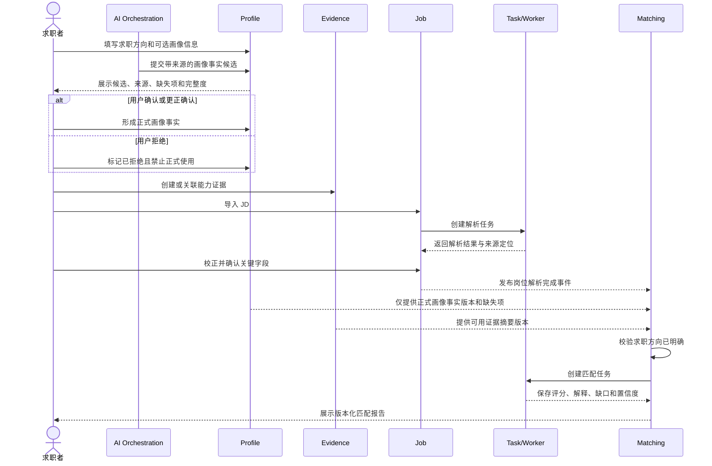

### 10.2 简历版本冻结与投递创建

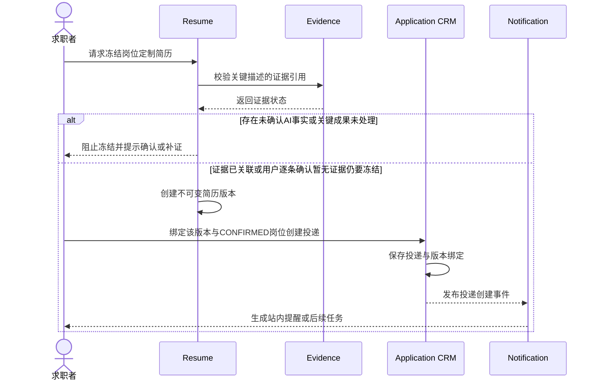

### 10.3 统一异步任务

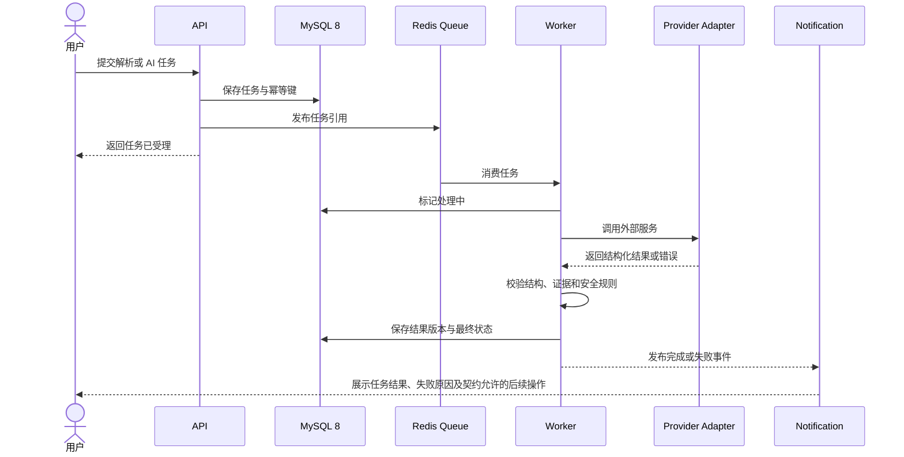

### 10.4 面试复盘与正式弱项确认

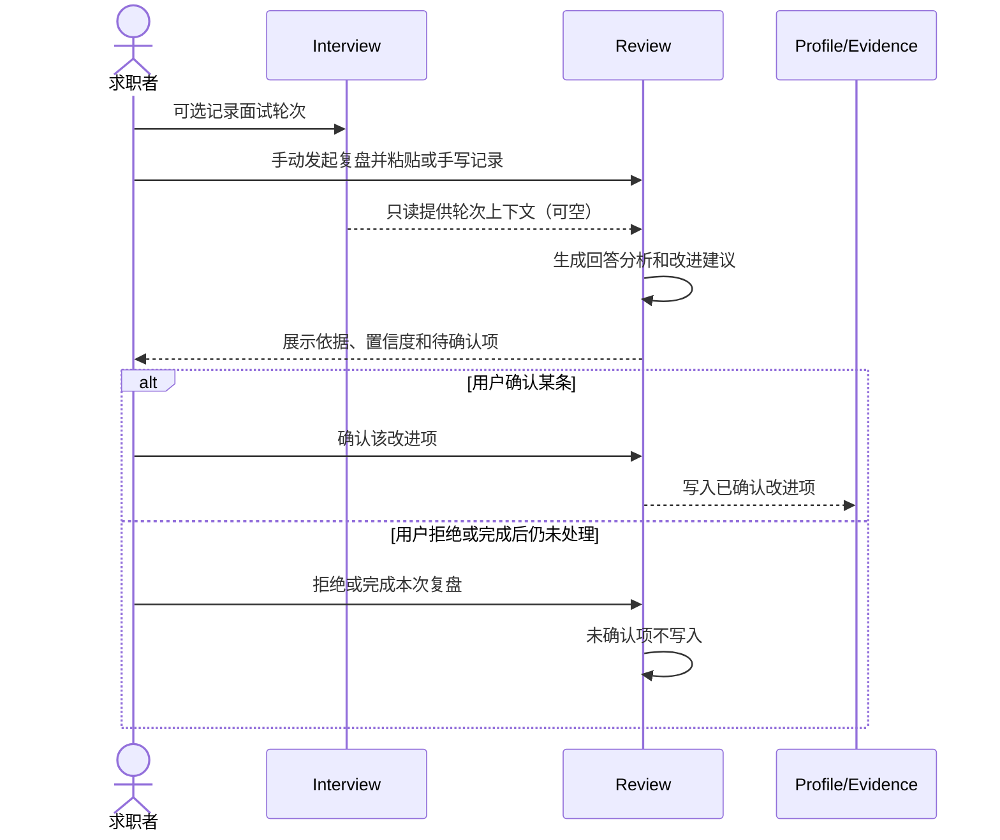

### 10.5 授权撤销与数据删除编排

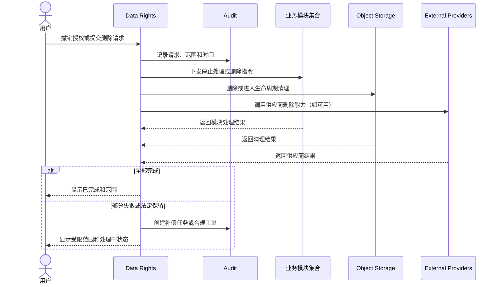

### 10.6 P1 实时 Copilot 安全流程

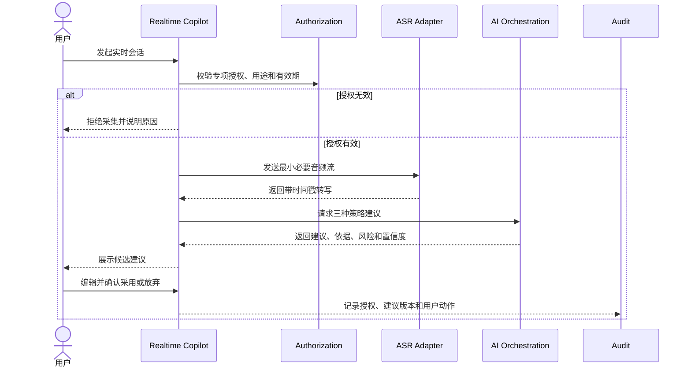

P1 不在此流程中实现无确认外发。若未来进入 P2，平台发送必须是独立应用命令，并重新完成业务契约、安全和合规评审。

## 11. 业务事件架构

### 11.1 事件规则

- 事件描述已经发生的事实，使用过去时语义，不携带供应商私有对象。
- 事件只传递业务标识、版本、时间和必要的非敏感摘要；消费者按权限读取详情。
- 发布采用事务外盒模式草案：业务状态和待发布事件在同一数据库事务中落地，由后台发布器发送到 Redis-backed queue。
- 消费者必须以事件 ID 和业务版本实现幂等。
- P0A/P0B 不引入 Kafka；当吞吐、保留、重放或多团队治理达到明确阈值后再评估事件平台。

### 11.2 候选事件目录

| 事件 | 产生模块 | 主要消费者 | 一致性 | 失败策略 |
| --- | --- | --- | --- | --- |
| ProfileCandidateCreated | Profile/AI Orchestration | Profile、Audit | 最终一致 | 失败不写正式事实；用户仍可手工填写 |
| ProfileFactConfirmed/Rejected | Profile | Matching、Preparation、Audit | 强事实 + 最终通知 | 仅 Confirmed 进入后续业务；旧报告不被覆盖 |
| ProfileSnapshotChanged | Profile | Matching、Resume | 最终一致 | 只携带已确认快照版本和变化类型，不使用笼统的 ProfileUpdated |
| EvidenceChanged | Evidence | Resume、Matching | 最终一致 | 不修改旧版本，只影响后续计算 |
| EvidenceReferenceChanged | Resume/Evidence | Evidence、Audit | 强事实 + 最终通知 | 引用状态未确认时禁止删除证据 |
| JobImported | Job | Task、Audit | 最终一致 | 失败原因保留；重试按 JD 解析任务契约执行 |
| JobParsed | Job | Matching；P0B 才增加 Risk | 最终一致 | P0A 不得据此启动综合风险流水线；消费幂等 |
| ResumeVersionFrozen | Resume | Application CRM、Audit | 强事实 + 最终通知 | 版本创建必须原子化 |
| ApplicationCreated | Application CRM | Notification；P0B 才增加 Analytics | 最终一致 | 通知失败不回滚投递；P0A 不启动漏斗统计 |
| ApplicationStageChanged | Application CRM | Interview、Notification；P0B 才增加 Analytics | 最终一致 | 状态写入使用版本检查 |
| InterviewScheduled | Interview | Notification | 最终一致 | 按事件和渠道去重 |
| InterviewRoundCompleted | Interview | Review、Analytics | 最终一致 | 复盘失败原因保留；重试按复盘任务契约执行 |
| ReviewConfirmed | Review | Profile/Evidence、Analytics | 待确认 | 写入范围在 P3.5 冻结 |
| RiskReportGenerated | Risk | Notification | 最终一致 | 报告版本不可覆盖 |
| RulePublished | Operations | Matching、Risk、Preparation | 最终一致 | 支持停用和回滚版本 |
| AuthorizationRevoked | Data Rights | 所有敏感处理模块 | 高优先级最终一致 | 立即阻止新处理，后台清理重试 |
| DeletionRequested | Data Rights | 所有数据模块、Compliance | 编排一致性 | 汇总回执，部分失败进工单 |
| TaskCompleted/Failed | Task | Notification、业务模块 | 最终一致 | 去重和人工重试 |
| NotificationRequested | 各业务模块 | Notification | 最终一致 | 渠道失败分级重试 |

正式事件名称、字段和保留时间必须在 P3.5 后进入接口与数据设计。

## 12. 异步任务架构

### 12.1 适用任务

- JD、简历、聊天、Offer 和合同的 OCR/文档解析。
- 简历生成、匹配、面试准备、复盘、风险和合同差异分析。
- 企业信息查询、语音转写、批量导出和数据删除。
- 通知渠道发送、规则影响范围重算和历史数据迁移。

### 12.2 任务技术基线与业务状态

所有长任务必须具有明确任务 ID、可查询状态、失败原因、幂等能力，以及输入版本和结果版本追踪。Task 模块只提供这些通用技术能力，不替具体领域决定取消和重试规则。

P3.5 第二轮已经确认：

- JD 解析任务状态：`PENDING`、`RUNNING`、`SUCCEEDED`、`FAILED`、`CANCELLED`。
- 匹配任务状态：`PENDING`、`RUNNING`、`SUCCEEDED`、`FAILED`、`CANCELLED`。
- 岗位版本状态：`DRAFT`、`REVIEW_REQUIRED`、`CONFIRMED`、`ARCHIVED`。
- 匹配报告状态：`CURRENT`、`STALE`、`ARCHIVED`。

任务、岗位版本和报告是不同对象。输入变化不得把已经 `SUCCEEDED` 的历史任务改成其他状态；变化的是旧报告，由 `CURRENT` 变为 `STALE`。用户重新计算时创建新的匹配任务和新的 `CURRENT` 报告。

### 12.3 可靠性规则

1. 创建任务和记录业务意图必须具备幂等键。
2. Worker 消费必须幂等，重复投递不能生成重复业务结果或副作用。
3. 每次执行必须记录输入版本、结果版本、失败原因和必要的供应商调用摘要。
4. 外部扣费或发送类副作用必须使用供应商幂等能力或本地副作用账本。
5. 授权撤销事件优先于普通队列任务，执行前再次校验授权。
6. 通知需区分“业务通知尚未生成”和“通知已生成但渠道未送达”，避免把渠道故障误判为业务失败。

是否可取消、何时允许取消、最大重试次数、自动重试次数和人工重试条件，必须由具体业务任务契约单独决定。技术架构不得把“所有任务可取消、可重试”固化为统一业务规则。

### 12.4 故障分类与处理

| 故障类别 | 示例 | 技术判断 | 降级与恢复 |
| --- | --- | --- | --- |
| 瞬时网络故障 | 超时、连接重置、短暂 5xx | 可被识别为瞬时故障；是否自动重试由任务契约决定 | 熔断、保留失败原因和恢复依据 |
| 供应商限流 | 429、配额临时限制 | 记录 Retry-After 或配额窗口 | 降低并发、排队或提示等待；重试策略待任务契约确认 |
| 供应商配额耗尽 | 日/月额度用尽 | 不应持续调用 | 切换供应商或降级人工输入须由已确认策略控制 |
| 输入不可处理 | 文件损坏、语言不支持、内容过长 | 记录不可处理原因 | 提示校正、拆分或更换格式；JD 长度上限待确认 |
| 输出结构错误 | JSON/Schema 不合格、来源缺失 | 记录结构校验失败 | 修复重试次数和人工校正条件待任务契约确认 |
| 权限/授权错误 | 授权过期、用户撤销、对象不属于本人 | 立即停止本次处理 | 记录审计，不复用无权结果 |
| 内容安全风险 | 恶意提示、违法内容、敏感外传 | 隔离任务 | 是否转人工由专项契约决定 |
| 业务状态冲突 | 旧版本写入、对象已归档 | 拒绝过期写入 | 返回冲突，用户刷新后重新决定 |
| 外部副作用未知 | 平台发送超时但结果未知 | 禁止直接重复副作用 | 先用官方查询/回调确认，必要时人工处理 |

### 12.5 外部依赖降级矩阵

| 依赖 | 正常能力 | 不可用时 | 核心业务是否继续 |
| --- | --- | --- | --- |
| LLM | 匹配解释、简历建议、准备和复盘 | 规则/模板、人工编辑、明确“暂不可生成” | 画像、证据、CRM 可继续 |
| OCR/文档解析 | 截图和文件结构化 | 用户粘贴文本、人工校正 | 文本导入路径继续 |
| ASR | P1 实时转写 | 文字输入、会后导入 | P0A/P0B 完全不受影响 |
| 企业信息 API | P1 企业主体和风险数据 | 公共来源或无法判断 | P0B JD 基础风险继续 |
| 通知供应商 | 邮件/短信/日历 | 站内通知、日历文件导出 | 原业务状态不回滚 |
| 对象存储 | 上传和下载材料 | 暂停文件能力并保护元数据一致性 | 文本型操作按策略继续 |
| Redis/队列 | 长任务和短期缓存 | API 拒绝新长任务或进入受控本地降级 | 已有核心查询尽量继续 |
| 官方招聘平台 | P2 同步和外发 | 用户主动导入、复制和手工记录 | P0A/P0B/P1 核心流程继续 |

## 13. 数据架构

### 13.1 存储职责

| 数据类型 | 建议载体 | 原因与规则 |
| --- | --- | --- |
| 用户、画像、岗位、投递、面试、权限和状态 | MySQL 8 | 需要关系约束、事务、版本和可追溯 |
| AI 结构化结果、解析结果和解释 | MySQL 8 JSON + 版本记录 | 输出结构会演进；保留模型、提示词、规则和来源版本 |
| 原始简历、截图、录音、聊天、Offer 和合同 | 私有对象存储 | 大文件、版本、生命周期和短时签名访问 |
| 缓存、限流、任务进度和幂等键 | Redis | 短期、低延迟、可过期；不能作为唯一事实源 |
| P0A/P0B 搜索 | MySQL 8 基础查询；全文检索按明确需求评估 | 降低早期系统复杂度 |
| 未来高级检索 | PostgreSQL 全文检索或 pgvector 候选 | 只有 JSON、全文搜索或向量检索需求明确且评测证明收益后重评 |

### 13.2 数据分级

| 等级 | 示例 | 控制要求 |
| --- | --- | --- |
| L1 公开/低敏 | 公共岗位链接、公开企业来源 | 来源和抓取时间；仍遵守平台条款 |
| L2 账户业务 | 收藏、任务状态、普通通知 | 身份鉴别、对象级授权、常规审计 |
| L3 个人敏感 | 画像、简历、项目证据、薪资预期、聊天 | 加密、最小权限、脱敏日志、授权和生命周期 |
| L4 高敏材料 | 身份材料、录音、Offer、合同、法律相关内容 | 更严格访问审批、短时 URL、完整审计和用途限制 |

实际数据分类、是否收集身份材料及保留周期必须在 P3.5 和合规评审中确认。

### 13.3 版本与来源

- 可影响判断的对象保存来源类型、来源引用、采集/确认时间和版本。
- 匹配、风险、复盘、企业和合同报告保存输入快照引用，不随当前数据变化而重写。
- 已发布规则、模板和技能模型不可原地修改；新版本只影响新生成结果。
- 简历投递版本不可变，主简历后续修改不影响历史投递。
- 用户纠正 AI 结果时保留原始输出、用户修改和最终采用结果，具体保留范围待确认。

### 13.4 生命周期与删除

1. 原始材料、派生文本、结构化结果、模型日志和导出文件分别管理生命周期。
2. 删除请求由 Data Rights 统一编排，各模块回传处理结果。
3. Redis 缓存和签名 URL 使用短期过期，不依赖手工清理。
4. 备份删除、审计保留、供应商副本和法定保留例外必须在 P3.5 明确。
5. 删除流程不能只删数据库索引而遗留对象存储或供应商副本。
6. 能力证据删除前必须同步检查有效引用；存在有效简历版本引用时只能归档，解除全部有效引用后才可进入删除编排。
7. 归档或删除当前证据不得破坏历史投递简历保存的证据引用快照和审计链。

### 13.5 分析数据与匿名基准边界

- P0B/P1 的个人反馈分析优先使用用户自己的投递、简历版本和阶段事件，不需要独立数据仓库。
- 个人业务数据和产品运营指标使用不同查询视图和访问权限；运营默认只看聚合结果。
- 匿名行业基准属于 P2 候选能力，必须先确认合法依据、退出机制、最小样本阈值、去标识化和重识别风险。
- 学历、性别、年龄、地区等敏感或易引发歧视的属性不得默认进入推荐和风险评分。
- 聚合结果必须显示样本量、时间窗口和适用范围；样本不足时不输出排名或确定性结论。
- P0A/P0B 不引入独立湖仓；只有分析量、事件规模或监管隔离要求明确后才评估数据平台。

### 13.6 数据派生关系登记

系统需要维护“原始数据 -> 解析文本 -> 结构化对象 -> AI 报告 -> 用户确认结果”的派生关系，以支持：

1. 删除原始材料时识别受影响的摘要、向量、报告和导出文件。
2. 来源被用户纠正时标记旧报告过期，而不是静默修改历史报告。
3. 供应商调用和 AI 结果能够定位到最小必要输入版本。
4. 审计时解释某项结论由哪些数据、规则、模型和用户确认产生。

派生关系只记录必要标识和版本，不复制高敏正文。

## 14. AI 架构

### 14.1 AI Provider Adapter

稳定能力端口建议按业务能力定义，而不是按模型厂商定义。名称与技术选型方案保持同一套：

- `structuredGenerate`：按版本化结构生成结果。
- `extractDocument`：从文本或文档提取结构化内容并定位来源。
- `classifyAndScore`：输出标签、分项评分、证据和置信度。
- `streamSuggestions`：P1 实时候选建议流。
- `transcribeAudio`：P1 转写片段、说话人、时间戳和删除状态。
- `embed`：仅在评测后启用的语义向量能力。

以上名称仅表达逻辑能力，不是正式代码接口。

### 14.2 AI 输出流水线

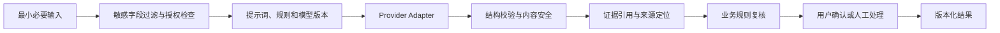

### 14.3 事实与推断隔离

- 用户明确提供并确认的内容标为用户事实。
- 文件解析内容标为材料提取事实，并保留原文位置和解析置信度。
- 企业服务内容标为外部来源事实，并保留主体、来源和查询时间。
- 模型归纳、评分和建议标为 AI 推断，不自动升级为事实。
- AI 从简历、对话或项目提取的个人技能与经历先进入“画像事实候选”；只有用户确认或更正确认后才能写入正式画像事实。
- 被用户拒绝的候选不得参与正式匹配、简历生成或能力结论，只保留满足追溯和反馈所需的最小记录。
- 证据不足时输出“无法判断”或待补充，不用常识补全个人经历。
- AI 不直接改变投递阶段、正式弱项、授权、合同结论或外发动作。

### 14.4 质量与评测

- 为 JD 提取、证据一致性、匹配解释、简历事实性、风险识别、复盘和合同差异分别建立版本化评测集。
- 同时评估结构有效率、证据引用率、事实错误率、人工采纳率、拒绝率、延迟和单任务成本。
- 模型升级先离线回归，再小流量灰度；不直接全量替换。
- Provider 失败时按能力降级为规则、模板、人工编辑或“无法判断”，不隐藏失败。
- 大数据分析只使用合法、可解释、足够样本的数据；小样本必须展示样本数和不确定性。

### 14.5 提示词与工具安全

- 将 JD、简历、聊天和合同视为不可信内容，不允许其中的指令改变系统权限、工具范围或数据访问规则。
- 系统指令、业务规则、用户内容和外部检索内容使用明确边界传递。
- AI 工具调用采用能力白名单、参数校验、对象级授权和最小数据返回。
- 模型不能自行决定下载其他用户文件、查询未授权企业数据、发送消息或改变投递状态。
- 对高风险输出执行确定性规则复核；模型自述“已经核验”不能替代真实来源。
- 提示词和模型版本进入发布、评测、灰度和回滚流程，不允许直接在线覆盖。

### 14.6 招聘风险与公平性边界

- 系统评估的是岗位、报价、企业主体、沟通承诺和材料之间的风险信号，不对面试官个人作“骗子”或“虚高报价者”的身份判定。
- 不使用姓名、头像、性别、年龄、民族、籍贯等个人属性推导欺诈概率或报价真实性。
- 可用证据仅包括用户主动提供的沟通内容、岗位与薪资口径、企业主体数据、付款要求、合同/Offer 差异和已发布风险规则。
- 输出必须拆分为“观察到的事实、命中的规则、AI 推断、缺失信息、建议动作和置信度”，证据不足时返回无法判断。
- 涉及培训贷、押金、扣证件、付费内推等高风险信号时，优先给出停止付款、核验主体、保留证据或咨询专业机构等动作，不生成确定性违法结论。
- 风险规则和法律参考必须标注适用地区、来源、版本和更新时间；过期规则不能继续作为无提示的判断依据。

## 15. 安全、权限与合规架构

### 15.1 身份与会话

- Web 会话优先使用安全、HttpOnly、SameSite Cookie；P0A 登录为邮箱 + 密码，改密后全部会话失效。
- 所有写操作启用 CSRF、防重放、频率限制和会话风险控制。
- 高风险后台操作要求二次确认；是否启用 MFA 及适用角色待确认。
- 服务端执行 RBAC + 对象归属 + 授权范围 + 用途约束，前端只负责展示权限结果。

### 15.2 文件与密钥

- 对象存储使用私有桶、服务端加密和短时签名 URL。
- 上传前校验大小、MIME、扩展名；处理前进行恶意文件扫描和内容隔离。
- 供应商密钥保存在密钥管理服务或环境安全配置中，不进入源码、日志和文档。
- 生产、测试和开发使用不同凭据和数据环境。

### 15.3 威胁与控制

| 风险 | 场景 | 控制措施 |
| --- | --- | --- |
| IDOR/越权 | 猜测他人简历、投递或文件 ID | 每次请求对象级授权；不可预测 ID 不能替代授权 |
| 提示词注入 | JD/简历包含指令诱导模型泄露或越权 | 内容与系统指令隔离；工具白名单；输出结构校验 |
| 恶意文件 | 上传脚本、压缩炸弹或解析器漏洞文件 | 限制格式/大小、扫描、沙箱解析、超时和资源配额 |
| 敏感日志泄漏 | 日志记录简历、合同、音频或 Token | 字段白名单、脱敏、采样、访问控制和短保留 |
| 重放/重复副作用 | 重试造成重复通知、扣费或外发 | 幂等键、副作用账本、供应商幂等和去重 |
| 权限提升 | 运营角色修改权限或查看原文 | 职责分离、审批、二次确认、不可篡改审计 |
| 供应商数据滥用 | 模型供应商训练或长期保存用户数据 | 合同审查、关闭训练、数据最小化、地区和删除能力评估 |
| 规则污染 | 未审核规则直接影响风险结论 | 草稿-审核-发布-停用-回滚状态机和版本绑定 |
| 自动化误操作 | P2 自动发送错误内容或错误跳过 | 独立授权、范围限制、模拟预览、速率限制、熔断和审计 |
| SSRF/恶意链接 | 用户导入 URL 访问内网、云元数据或超大响应 | 仅允许 HTTP(S)、解析与重定向前后校验 DNS/IP、阻断私网/回环/链路本地地址、受控出口、响应大小和超时上限 |
| Webhook 伪造或重放 | 伪造供应商回调推进状态或重复触发副作用 | 验证签名、时间戳、事件 ID、来源和密钥版本；使用去重窗口与幂等消费；拒绝记录进入安全审计 |
| 浏览器扩展越权 | 扩展读取非目标页面、Cookie 或长期后台数据 | 最小权限、用户主动触发、限定活动标签页和站点白名单；禁止提取 Cookie、绕过平台权限或逆向私有 API |

### 15.4 审计边界

必须审计的候选事件包括：登录风险、授权授予/撤销、敏感材料访问、管理员高风险操作、规则发布、数据导出/删除、AI 结果版本、用户确认、实时采集、外部发送和供应商调用元数据。

业务审计记录与技术日志分离；审计记录的不可变性、可见范围和保留周期在 P3.5 冻结。

### 15.5 网络输入与回调安全

- URL 导入由隔离抓取组件执行，不允许直接访问核心业务网段；响应正文不进入普通日志。
- Webhook 通过独立入口接收，按供应商隔离密钥、验签策略、重放窗口和速率限制。
- 外部供应商调用采用出口域名白名单、连接与响应上限；降级或切换供应商仍需经过同等安全控制。
- 上传文件先进入隔离区，完成类型校验、恶意内容扫描和安全解析后，才能进入业务处理区。
- 网络输入被拒绝、回调验签失败和异常出口访问均应产生可关联、无敏感正文的安全事件。

## 16. 非功能架构

### 16.1 性能目标承接

| 场景 | PRD 目标方向 | 架构措施 |
| --- | --- | --- |
| 常规页面和查询 | 主要操作约 2 秒内可反馈 | 查询投影、分页、必要索引、缓存和骨架状态 |
| JD 文本解析 | 目标约 10 秒内给出结果或进度 | 快速文本路径、异步任务、阶段进度 |
| 简历生成/分析 | 目标约 30 秒内完成或持续反馈 | 异步 Worker、流式进度、超时和降级 |
| P1 实时候选建议 | 目标约 3 秒内提供首批建议 | 实时网关、流式 ASR/模型、上下文裁剪和区域部署 |

这些是设计目标，不是已承诺 SLA。实际指标需要在供应商评测和容量测试后确认。

### 16.2 可用性与弹性

- API 保持无状态，支持水平扩展；会话状态和任务状态不只存在进程内。
- Worker 按任务类型设置独立并发、限流、超时和熔断，避免高成本任务拖垮核心 API。
- 外部供应商故障不得阻断画像、简历编辑和 CRM 等本地核心功能。
- 对高成本 AI 和企业查询设置用户级、环境级和全局预算保护；若后续确认组织级租户，再增加组织预算维度。
- 任务积压、供应商错误率和延迟触发降级开关。

### 16.3 容量触发条件

只有出现以下可观测证据才考虑拆分服务或新增平台组件：

- 单一模块需要独立发布、独立合规隔离或独立扩容。
- Worker 队列延迟持续超标且按任务类型隔离仍不能解决。
- MySQL 8 在合理索引、归档、读写分离或分区后仍成为瓶颈。
- 多团队协作已经因模块发布耦合产生持续交付风险。
- 事件重放、长保留或多消费者需求超过 Redis-backed queue 能力。

## 17. 部署架构

### 17.1 环境

- Local：前端、API、Worker 和本地基础服务；只使用测试数据和测试供应商账号。
- Test：自动化测试、契约验证和供应商沙箱。
- Staging：接近生产拓扑，用于灰度、容量、安全和恢复演练。
- Production：独立网络、凭据、数据、监控、备份和访问审批。

### 17.2 生产逻辑拓扑

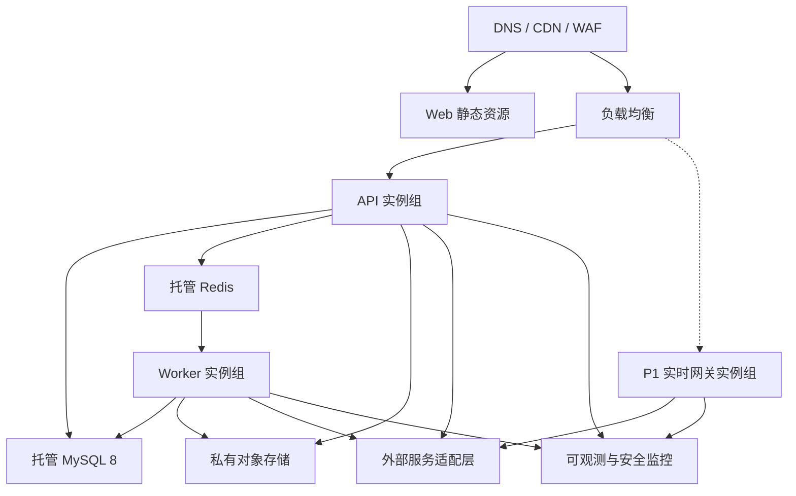

### 17.3 发布与回滚

1. 应用使用不可变 Docker 镜像和版本化配置。
2. 数据变更采用向后兼容的扩展-迁移-收缩策略；正式迁移规则待数据库设计阶段确定。
3. AI 模型、提示词、规则和供应商通过独立版本与功能开关灰度。
4. P0B/P1/P2 能力可单独关闭，不影响 P0A 画像、简历和 CRM 主链路。
5. Worker 发布前停止领取新任务或等待安全点，避免处理中任务重复副作用。
6. 回滚保留旧应用镜像、旧规则版本和兼容读取路径。
7. MySQL 8 备份、对象存储版本和恢复演练必须配置；RPO/RTO 待业务确认。

### 17.4 恢复分级草案

| 恢复等级 | 能力 | 恢复优先级 | 最低恢复要求 |
| --- | --- | --- | --- |
| A | 身份、授权、数据权利、审计 | 最高 | 保证权限和用户权利状态不倒退 |
| B | 画像、证据、简历版本、投递和面试 | 高 | 恢复核心事实、关系和版本历史 |
| C | 原始文件和导出文件 | 高 | 数据库引用与对象版本一致，签名访问重新生成 |
| D | AI 报告、解析结果和任务 | 中 | 可从输入版本重建；避免重复扣费和副作用 |
| E | 缓存、搜索索引和聚合视图 | 低 | 允许重建，不作为唯一事实源 |

正式 RPO、RTO、备份频率、跨区策略和演练周期必须结合部署地域、预算、用户规模和合规要求确认。恢复演练不仅验证数据库，还要验证对象存储、队列积压、密钥、授权状态和删除请求的一致性。

### 17.5 CI/CD 与发布质量门

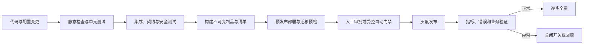

- 代码、数据库迁移、规则、提示词和模型配置使用可追踪版本，禁止直接修改生产配置而无记录。
- 构建产物生成依赖清单和安全扫描结果；高危依赖、密钥泄漏或许可问题阻断发布。
- 数据迁移在预发布执行兼容性和回滚预检，破坏性收缩在旧版本完全退出后进行。
- AI 或规则变更必须附带离线评测结果；涉及权限、删除或自动化的变更需要专项审查。
- 灰度期间同时观察技术指标、任务成本、AI 质量和关键业务不变量。

### 17.6 运行健康与操作手册

- 存活检查只判断进程能否继续运行，不把单个外部供应商故障作为进程重启依据。
- 就绪检查验证核心依赖和服务接流条件；非核心供应商不可用时保持核心 API 就绪，并显式进入降级模式。
- Worker 上报心跳、消费速率、队列滞留时间和死信数量；停止时先停止领取新任务，再等待安全点或归还任务。
- 每个高风险链路必须有可执行操作手册，至少覆盖：供应商故障、队列积压、数据库切换、对象存储异常、删除部分失败、安全事件、错误规则发布和成本异常增长。
- 操作手册需记录判定信号、处置权限、熔断动作、数据一致性检查、恢复步骤、用户沟通和复盘责任人。
- Staging 定期演练关键操作手册；演练发现的缺口进入版本化整改记录，正式频率和责任人待运维决策确认。

## 18. 可观测性

### 18.1 统一关联

每次用户请求、业务命令、异步任务、外部供应商调用和通知应共享可追踪的关联标识，但日志中不得包含敏感正文。

### 18.2 观测维度

| 类型 | 关注内容 |
| --- | --- |
| 日志 | 结构化事件、错误分类、脱敏字段、版本和关联 ID |
| 指标 | API 延迟/错误率、队列深度、任务耗时、供应商成功率、费用、通知送达、授权撤销时延 |
| 链路 | Web/API/Worker/Provider 的端到端耗时与瓶颈 |
| 业务监控 | 投递创建、简历冻结、面试提醒、删除完成率、规则版本命中 |
| AI 监控 | 结构有效率、证据引用率、模型拒绝、事实错误反馈、采纳率、成本和延迟 |
| 安全监控 | 登录异常、越权拒绝、批量下载、敏感后台访问和密钥错误 |

### 18.3 告警分级

- SEV-0：数据泄露、越权、删除错误、无授权采集或外发，立即停止相关能力并响应。
- SEV-1：核心 API 大面积不可用、任务队列停止、数据一致性风险。
- SEV-2：单供应商故障、延迟超标、通知积压，可自动降级并在工作时间处理。
- P3：成本增长、低采纳率、容量趋势和非阻断错误。

### 18.4 功能开关与紧急熔断

- 每个开关必须有负责人、适用环境、目标用户范围、默认值、生效时间、到期时间和变更审计；临时开关到期后必须清理或转为正式配置。
- P1/P2 高风险能力默认关闭并按环境、用户群或版本灰度，至少为实时采集、外部发送、企业付费查询、AI 生成、文件解析和规则发布提供独立熔断能力。
- 开关不能替代权限、授权、状态校验和业务规则；关闭后要定义在途请求、排队任务和已产生副作用的处理方式。
- 紧急处置优先级为：停止新请求 -> 暂停队列消费 -> 切换降级路径 -> 回滚规则/模型/应用版本 -> 执行一致性核对。
- 生产开关变更需要最小权限和审计；涉及数据权利、外发或自动化的开关需要双人复核，具体审批角色在 P3.5 确认。

## 19. 测试架构与质量门

| 测试层 | 重点 |
| --- | --- |
| 领域单元测试 | 状态机、不变量、权限决策、版本和证据规则 |
| 应用用例测试 | 命令编排、事务、事件、任务创建、失败补偿 |
| 模块集成测试 | MySQL 8、Redis、对象存储和仓储实现 |
| Provider 契约测试 | LLM/OCR/ASR/企业/通知适配器的结构、超时、错误和降级 |
| 异步可靠性测试 | 重复消息、幂等、失败原因、输入/结果版本、授权撤销抢占，以及按已冻结任务契约验证取消和重试 |
| 安全测试 | 对象越权、CSRF、注入、上传、签名 URL、日志泄露和后台权限 |
| AI 离线评测 | 事实性、证据引用、结构有效、偏差、拒绝、成本和延迟 |
| 端到端验收 | 画像-证据-JD-匹配-简历版本-投递-面试-复盘-反馈主闭环 |
| 恢复演练 | 备份恢复、供应商故障、队列积压、规则回滚和删除补偿 |

### 19.1 P0A 最小质量门

- 所有 P0A 需求编号能够追踪到模块、业务用例和验收测试；P0B/P1/P2 只验证边界不被提前调用。
- 已绑定投递的简历版本不可被后续编辑覆盖。
- 创建投递必须绑定冻结简历版本和 `CONFIRMED` 岗位版本；匹配报告不是前置；非法流转必须拦截。
- P0A 不实现收藏，投递创建不依赖收藏对象。收藏与投递状态独立作为 P0B 质量门，见技术选型第 11.1 节。
- AI 推断未经用户确认不能进入正式画像、正式匹配或可投递简历；被拒绝候选不得被后台继续使用。
- 轮次结果和复盘结论不得回写投递；未确认复盘建议不得写弱项。
- P0A 仅站内通知，失败不回滚业务；登录为邮箱 + 密码。
- 有效简历版本引用的证据必须阻止删除并允许归档；解除全部有效引用后才允许进入删除流程。
- 用户数据越权测试、文件访问测试和授权撤销测试通过。
- 异步任务重复消费不产生重复业务结果或重复副作用。
- 外部供应商故障时核心本地功能可用并显示真实失败状态。

### 19.2 P0A 架构实施切片草案

以下顺序用于完成 P0A 首发闭环；P0B 不得与 P0A 并行扩张：

| 切片 | 端到端结果 | 主要模块 | 完成证据 |
| --- | --- | --- | --- |
| S0 | 基础底座可用 | Identity、Data Rights、Task、Notification、Audit | 对象授权、删除编排、任务幂等和私有文件 Spike 通过 |
| S1 | 画像与证据可追溯 | Profile、Evidence | 候选/正式事实分离；用户确认生效；有效引用阻止删除且历史关系可追溯 |
| S2 | JD 单岗位匹配可解释 | Job、Matching | 文本导入、人工确认、可解释报告、状态拆分和历史版本保护通过 |
| S3 | 简历冻结并创建投递 | Resume、Application CRM | 无证据内容阻止，投递绑定不可变版本 |
| S4 | 面试记录可复盘 | Interview、Review | 可手动记录轮次、导入文本、用户确认后写入弱项 |
| S5 | 求职工作台可继续任务 | Web Workspace、Task UI Adapter | 首页只汇总 P0A 对象，入口均有业务操作映射 |

P0A 出口条件是上述 S0-S5 全部通过：每刀先完成后端真实闭环与契约说明，再交前端接入并完成该切片联调；P0B 需要重新确认业务契约后再增加收藏、推荐、准备、风险、统计和后台模块。

每个切片先完成后端本切片真实闭环与契约说明，再交前端接入。不得把「正式 Mock 优先」或「先完成 P4/P5 前端 Mock 再进 P6」写成默认路径，也不得把此表解释为允许跳过 P3.5。

### 19.3 需求到架构追踪

| 需求编号 | 阶段 | 主模块 | 关键存储/运行容器 | 关键事件或任务 | 重点架构验证 |
| --- | --- | --- | --- | --- | --- |
| ACCOUNT-FR-001 | P0A | Identity & Access | API、MySQL 8、Redis | 登录风险、注销请求 | 会话安全、对象隔离、注销编排 |
| PROFILE-FR-001 | P0A | Profile | API、MySQL 8 | ProfileFactConfirmed / ProfileFactRejected；泛化通知使用 ProfileSnapshotChanged | 事实/推断分离、版本冲突 |
| EVIDENCE-FR-001 | P0A | Evidence | API、MySQL 8、对象存储 | EvidenceChanged、EvidenceReferenceChanged | 来源追踪、有效引用阻止删除、历史关系保留 |
| JOB-FR-001 | P0A | Job | API、Worker、MySQL 8 | JobImported、JobParsed | 文本解析、人工校正、版本化 |
| COLLECTION-FR-001 | P0B | Job | API、MySQL 8 | 收藏变化事件待确认 | 收藏不创建投递、重复合并 |
| MATCH-FR-001 | P0A/P0B | Matching | Worker、MySQL 8 | 匹配任务、报告生成 | P0A 单岗位；P0B 多岗位；任务与报告状态分离、旧报告保留 |
| RESUME-FR-001 | P0A | Resume | API、Worker、MySQL 8、对象存储 | ResumeVersionFrozen | 证据约束、版本不可变、导出安全 |
| CRM-FR-001 | P0A | Application CRM | API、MySQL 8 | ApplicationCreated、StageChanged | 非法流转、乐观并发、版本绑定 |
| INTERVIEW-FR-001 | P0A | Interview | API、MySQL 8 | InterviewScheduled、RoundCompleted | 手动轮次、时区和状态一致性 |
| PREP-FR-001 | P0B | Preparation | Worker、MySQL 8 | 准备包任务 | 来源链接、规则/模型版本 |
| REVIEW-FR-001 | P0A/P0B | Review | Worker、MySQL 8、对象存储 | ReviewConfirmed | P0A 基础复盘；P0B 训练任务和原文定位增强 |
| RISK-FR-001 | P0B | Risk | Worker、MySQL 8 | RiskReportGenerated | 证据化、无法判断、规则版本 |
| SALARY-FR-001 | P1 | Salary | API、MySQL 8 | 报价变化事件待确认 | 口径换算、底线只提醒 |
| COMPANY-FR-001 | P1 | Company Intelligence | Worker、MySQL 8、Adapter | 企业查询任务 | 主体匹配、时效、供应商失败 |
| MATERIAL-FR-001 | P1 | Materials & Offer | API、Worker、对象存储 | 材料解析任务 | 原文版本、更新不覆盖历史 |
| CONTRACT-FR-001 | P1 | Contract Compare | Worker、MySQL 8、对象存储 | 合同比对任务 | 差异定位、免责声明、规则地域版本 |
| COPILOT-FR-001 | P1 | Realtime Copilot | 实时网关、Redis、Adapter | 会话授权、建议采用审计 | 无授权不采集、P1 无确认不外发 |
| FEEDBACK-FR-001 | P0B/P1 | Feedback Analytics | MySQL 8 查询投影 | 业务结果事件 | P0B 个人统计；P1 样本量、相关非因果和隐私聚合 |
| DATA-FR-001 | P0A | Data Rights | API、Worker、MySQL 8、对象存储 | AuthorizationRevoked、DeletionRequested | 全链路删除、部分失败和回执 |
| NOTIFY-FR-001 | P0A/P0B | Notification | Worker、MySQL 8、Redis | NotificationRequested | P0A 最小站内反馈；P0B 去重、提醒和送达增强 |
| OPS-FR-001 | P0B/P1 | Operations | API、MySQL 8 | RulePublished | P0B 最小后台；P1 企业、材料和合同规则扩展；历史版本保留 |
| AUDIT-FR-001 | P0A/P0B/P1 | Compliance & Audit | API、MySQL 8（追加式审计） | 敏感访问和工单事件 | P0A 安全审计；P0B 工单和脱敏查询；P1 高风险能力审计扩展；独立审计存储待确认 |

## 20. 推荐代码仓库结构草案

以下结构只表达模块边界，不代表已开始代码实现：

```text
web/
  src/features/
backend/
  src/main/java/.../modules/
  src/test/
worker/
  src/main/java/.../jobs/
shared-contracts/
docs/
  plan/
  architecture/
  business-contract/
```

Spring Boot API 的 `modules/` 建议与第 7 章领域模块对应。Worker 是独立运行进程，但复用稳定的应用契约和 Provider 端口；共享契约只放稳定技术协议和少量跨领域值类型，业务对象不得全部塞入公共包。

## 21. 分阶段演进

### 21.1 P0A：证据驱动的首发闭环

- 启用身份与数据权利、画像、证据、JD 文本导入、单岗位匹配、简历版本、投递、面试记录、基础复盘和最小任务反馈。
- 使用模块化单体、独立异步 Worker、MySQL 8、Redis 和对象存储；先完成 S0-S5 端到端切片。
- 首发只依赖用户输入、岗位文本、基础规则和必要 AI 结构化能力；截图/OCR、岗位平台同步和外部企业数据不作为出口条件。
- 登录后的求职工作台只汇总 P0A 对象，不拥有领域状态；公开宣传页不属于 P0A 主闭环验收。

### 21.2 P0B：求职管理增强闭环

- 在 P0A 前端冻结和真实数据闭环稳定后，重新确认并启用收藏、多岗位推荐、面试准备、基础招聘风险、个人反馈分析、完整通知中心和最小运营合规后台。
- P0B 继续使用模块化单体和统一 Worker，新增能力通过功能开关隔离，不能反向改变 P0A 已冻结的事实和版本规则。
- 风险分析必须以 JD、聊天文本和用户提供材料为依据；没有企业正式数据时不得输出确定性低风险结论。

### 21.3 P1：企业、薪资、材料审核与实时试点

- 启用 Company、Salary、Materials、Contract、Copilot 和 Feedback 的扩展能力。
- 对企业 API、ASR 和更高成本模型设置独立预算、限流、功能开关和供应商适配器。
- 实时网关可作为独立运行容器，但仍由统一身份、授权、审计和业务契约约束。
- P1 用户确认发送与 P2 自动化保持权限和状态隔离。

### 21.4 P2：官方平台集成与条件自动化

- 仅在官方接口和平台条款允许时启用。
- 单个平台使用独立适配器、授权范围、Webhook 验证、配额、错误映射和撤销机制。
- 自动化策略需专项风险评审、模拟模式、限速、熔断、审计和用户可随时停止。
- 无官方能力时继续使用用户主动导入、复制和导出，不采用逆向技术。

### 21.5 服务拆分顺序建议

若达到第 16.3 节触发条件，优先考虑拆出：

1. 文档与 AI Worker：计算和供应商依赖最独立。
2. 实时 Copilot：协议、延迟和扩缩容特征不同。
3. 通知：多渠道和送达重试独立。
4. 企业查询：商业配额、缓存和审计边界独立。

身份、画像、证据、简历和投递在业务规则稳定前保持同一事务边界，避免过早分布式一致性。

## 22. 架构决策记录建议

后续应将以下决策分别形成 ADR：

| ADR | 决策主题 | 当前建议 |
| --- | --- | --- |
| ADR-001 | 核心架构形态 | P0A/P0B 模块化单体 |
| ADR-002 | 主技术栈 | Vue 3 + TypeScript + Vite；Java 17 + Spring Boot 3 |
| ADR-003 | 核心数据存储 | P0A 使用 MySQL 8；PostgreSQL 为条件候选 |
| ADR-004 | 异步任务机制 | MySQL Outbox + Redis + 独立 Worker；取消/重试由任务契约决定 |
| ADR-005 | 文件存储 | 私有 S3 兼容对象存储 |
| ADR-006 | AI 供应商隔离 | 业务能力端口 + Provider Adapter |
| ADR-007 | 事实与推断模型 | 来源、版本、置信度和用户确认分层 |
| ADR-008 | 简历版本不变性 | 投递绑定不可变版本 |
| ADR-009 | 收藏与投递隔离 | 两套独立生命周期 |
| ADR-010 | P1/P2 外发边界 | 用户确认发送与自动化权限隔离 |
| ADR-011 | 能力证据删除保护 | 有效简历引用时仅归档，解除全部有效引用后进入删除流程 |

## 23. 架构风险与缓解

| 风险 | 影响 | 缓解措施 |
| --- | --- | --- |
| 首发范围再次膨胀 | P0A 周期变长、核心闭环无法验收 | 采用 P0A/P0B 门禁；P0A 未通过前，P0B/P1/P2 只能保留边界，不得进入实现 |
| 模块化单体退化 | 跨模块直接查询和写入形成耦合 | 代码边界检查、公开用例、事件和架构测试 |
| AI 事实错误 | 简历虚构、错误判断和用户信任下降 | 证据约束、结构校验、来源定位、用户确认和离线评测 |
| 外部服务不稳定/昂贵 | 延迟、失败和成本不可控 | Adapter、预算、队列、缓存、降级和供应商切换 |
| 敏感材料泄露 | 合规和声誉风险 | 数据最小化、加密、对象授权、脱敏日志和访问审计 |
| 状态定义未冻结 | 页面、接口和数据库返工 | P0A 状态已于 2026-08-18 冻结；第 5、6 轮及 P0B/P1/P2 仍须确认后再实现 |
| P2 平台限制 | 自动化能力无法上线 | 仅支持官方接口；产品提供主动导入/复制降级路径 |
| 删除不完整 | 用户权利无法落实 | 中央编排、模块回执、供应商删除、补偿和工单 |
| 规则更新污染历史 | 同一报告无法复现 | 报告绑定规则/模型/输入版本，历史不重算覆盖 |
| 小样本分析误导 | 用户做出错误职业决策 | 展示样本数、置信度和相关性边界 |

## 24. P3.5 必须确认的业务契约

P0A 对象与 S0-S5 所需业务操作已于 2026-08-18 冻结。授权依据：用户下旨放权、勿再询问、自行判断最优并直接执行，视为亲口冻结。冻结后按全局规则 v3.0 执行后端真实闭环先于前端；正式 Mock 优先不是默认路径。第 5、6 轮及 P0B/P1/P2 仍不得提前实现。

### 24.1 第一轮：用户、画像与证据

**已确认项：**

- P0A 面向大学生、应届毕业生及毕业三年内早期职业用户；社招特有规则不进入首发验收。
- 桌面 Web 是完整工作端；移动 Web 只承担查看、提醒和简单操作；App 和浏览器扩展不进入 P0A。
- 画像采用渐进填写；求职方向在进入匹配前必填，学历、技能、兴趣、城市和现实限制可后补。
- AI 提取或归纳的技能、经历先成为来源可追溯的候选，必须由用户确认或更正确认后才成为正式画像事实。
- 被用户拒绝的候选不得进入正式匹配和简历生成。
- 有效简历版本引用的能力证据不能删除，只能归档；解除全部有效引用后才可发起删除，历史投递引用关系继续保留。

**待确认项：**

- 精确字段、证据类型、登录和导出删除最小集已按推荐写入确认记录 v0.7 第 12 节，本轮不再追问。
- 导师、辅导员收费协作仍不进入 P0A。
- 法定保留具体年限、云厂商和 AI 供应商不挡冻结。

**禁止假设项：**

- 不得要求用户首次使用时填完所有画像字段，也不得为缺失字段生成默认事实。
- 不得让 AI、运营、导师或专业人员代替用户确认正式画像事实。
- 不得让任何页面、接口、后台任务或数据权利流程绕过有效引用检查删除证据。
- 不得默认 P0A 支持组织租户、批量画像操作、App 或浏览器扩展。

### 24.2 第二轮：JD 文本导入、人工校正和单岗位匹配

**本轮已确认项：**

- P0A 由用户粘贴 JD 文本；AI 解析结果只是候选，用户确认后才成为正式岗位事实。
- 正式匹配前至少确认岗位名称、主要职责、硬性技能、经验要求、学历要求、地点和工作方式；未提供的薪资、福利等保持未知。
- 匹配报告展示总匹配分、分项维度、主要加分项、主要扣分项、缺失项、对应证据、AI/规则依据、置信信息和未知项，不能只给黑盒百分比。
- P0A 权重由系统固定并公开，普通用户不能修改；具体维度和百分比权重下一小轮冻结。
- 岗位要求区分硬性要求、普通要求和加分项；硬性要求缺失时醒目标记，可以降分并限制最高等级，但不能自动放弃岗位、阻止查看报告或自动创建/取消投递。
- 用户画像、能力证据、已确认 JD 或匹配规则版本变化时，历史任务保持 `SUCCEEDED`，旧报告由 `CURRENT` 变为 `STALE`；重新计算创建新任务和新报告。
- JD 解析任务和匹配任务使用 `PENDING`、`RUNNING`、`SUCCEEDED`、`FAILED`、`CANCELLED`；岗位版本使用 `DRAFT`、`REVIEW_REQUIRED`、`CONFIRMED`、`ARCHIVED`；匹配报告使用 `CURRENT`、`STALE`、`ARCHIVED`。
- P0A 单岗位匹配采用“证据门槛 + 规则分”，细则见确认记录 v0.7 第 4 节：四维权重 30/35/25/10；未知项缩小分母；空限制不加权；1 个硬性缺口最高 `部分匹配`，2 个及以上最高 `缺口明显`；JD 文本 80–20000 字；全文相同才自动复用；`PENDING`/`RUNNING` 可取消；瞬时失败最多自动重试 2 次；`STALE` 可查看对比、不自动归档。

**待确认项：**

- 第二轮匹配与 JD 输入规则已按推荐方案确认，见确认记录 v0.7 第 4 节，本轮不再追问。
- 第四轮面试、复盘和通知已按推荐方案确认，见确认记录 v0.7 第 11 节。

**禁止假设项：**

- 不得补造 JD 未提供的信息，也不得让未确认解析结果直接进入正式匹配。
- 不得把任务状态、岗位版本状态和报告状态混为同一状态机。
- 不得在输入变化后覆盖历史报告或修改已成功历史任务状态。
- 不得另设权重、限等、自动重算或自动创建投递。

### 24.3 第三轮：简历与投递

**本轮已确认项：**

- 采用流程管控型。主档 `草稿 -> 待确认 -> 可投递 -> 已归档`；版本 `生成中 -> 待用户确认 -> 已冻结 -> 已绑定投递 -> 已归档`。
- 只有求职者本人可编辑。AI 改写只出候选。未确认 AI 事实不得标可投递或冻结。
- 冻结前每条关键成果须关联允许使用的证据，或用户逐条确认“暂无证据仍要冻结”。失败不产生半成品版本。
- 创建投递必须绑定 `已冻结`/`已绑定投递` 版本和 `CONFIRMED` 岗位版本；匹配报告不是前置。收藏不进 P0A，也不自动建投递。
- 投递主链、终止态、允许前进、允许更正和 `接受后撤回` 见确认记录 v0.7 第 7.3 节。并发用版本号，拒绝覆盖。
- 常规只归档；物理删除走数据权利。归档不解除已绑定简历版本。P0A 不做批量改状态、批量导入和漏斗。
- 进入 `面试中` 不强制创建轮次；投递与轮次不自动互写。

**待确认项：**

- 面试轮次、复盘已按第四轮确认，见 24.4。简历翻译、评分和 A4 预览的页面交互不阻塞本轮契约。

**禁止假设项：**

- 不得覆盖已绑定投递的简历版本。
- 不得根据聊天或外部平台自动改正式投递状态。
- 不得把收藏做成投递，也不得在 P0A 做批量改状态。
- 不得让 Matching 因失败或 `无法判断` 自动创建或取消投递。

### 24.4 第四轮：面试、复盘与通知

**本轮已确认项：**

- P0A 不单独做面试流程状态机。轮次 `待安排 -> 已安排 -> 进行中 -> 已完成`，另有 `已取消`。类型：HR初筛、一面、二面、终面、加面、其他。
- 进入 `面试中` 不强制建轮次。轮次结果不改投递。无时间不建提醒。P0A 无录音、无转写。
- 复盘必须属于一条投递，可空关联轮次。用户手动发起。逐条确认才写弱项；完成时未处理项不写入。复盘不改投递或轮次。
- P0A 仅站内通知：任务完成/失败、面试提醒、导出删除进度、安全与数据权利。`待发送 -> 已送达 -> 已读`。失败不回滚业务。时区默认 `Asia/Shanghai`。

**待确认项：**

- 无。第 5、6 轮不挡 P0A 冻结。

**禁止假设项：**

- 不得用轮次或复盘自动改投递状态。
- 不得未确认写入弱项。
- 不得在 P0A 采集录音或发送邮件/短信。

### 24.5 第五轮：运营、权限与数据权利

- 运营规则的审核发布是否需要双人复核。
- 合规与安全角色的职责分离及原文访问条件。
- 数据导出范围、删除例外、备份删除和审计保留。
- 登录方式、MFA、跨设备会话和账号注销规则。

### 24.6 第六轮：P1/P2 扩展

- 企业数据供应商、查询费用、缓存、数据地区和主体纠错。
- 工资口径、底线提醒、谈判状态和退出动作。
- Offer/合同审查边界、专业人员协作和免责声明。
- “P1 用户逐条确认发送、P2 不逐条确认自动化”的术语与权限边界。
- “跳过面试官”在 P1 仅表示暂不回复、结束沟通或主动放弃投递；P2 是否评估规则化自动跳过。
- 官方招聘平台是否提供合法、稳定、可撤销的读写接口。

### 24.7 待确认清单（按轮次拆分）

**第二轮：**

- 匹配与 JD 输入规则已按推荐方案确认，见确认记录 v0.7 第 4 节，本轮不再追问。

**第三轮：**

- 简历 CRUD、版本保护和投递状态机已按推荐方案确认，见确认记录 v0.7 第 7、10 节。

**第四轮：**

- 面试轮次、复盘和最小通知已按推荐方案确认，见确认记录 v0.7 第 11、13 节。

**冻结前补包：**

- 邮箱登录、画像字段、六类证据、导出删除最小集已确认，见确认记录 v0.7 第 12 节。

**第 5、6 轮及以后再确认（不挡 P0A）：**

- 法律数据保留期限。
- 运营双人复核。

**实现前技术参数（不得改变 Vue 3 + Spring Boot 3 + MySQL 8 主路线）：**

- 云对象存储供应商。
- AI 模型供应商。

以下运营与容量参数也需要在进入相关实现前确认：

- 部署地区、预算、供应商账号、数据处理协议和灾备目标。
- P0A 的首发验收时间、责任人和首批用户规模。
- P0B 的启动条件、优先级和是否在 P0A 后立即进入。
- P0A/P0B 的日活、文件量、AI 任务量、实时会话量和企业查询量级预估。
- P1 实时建议采用 WebSocket、SSE 还是混合协议，以及断线恢复和音频分片策略。
- 是否存在组织级租户；若没有，权限、配额和数据隔离只按个人账号及后台角色设计。
- API 契约版本策略和任务进度协议；浏览器扩展已确认不进入 P0A，如后续立项需重新确认权限和网络边界。
- 审计记录是否需要独立不可篡改存储，以及相应保留和查询成本。
- 金额单位、薪资周期、税前税后口径、汇率处理和缺失口径时的展示规则。
- 系统默认时区、用户时区、企业所在地和跨时区提醒的计算规则。
- URL 导入的允许协议、出口网络策略和重定向限制；浏览器扩展仅作为 P0A 之后的独立候选能力。
- Webhook 供应商清单、验签方式、重放窗口、回调失败重试和人工补偿策略。
- 功能开关负责人、审批级别、灰度范围、到期清理和紧急熔断权限。
- 核心 API、任务队列、通知、外部查询和实时建议的 SLI/SLO、告警接收人和操作手册责任人。

P3.5 已于 2026-08-18 冻结 P0A 对象和 S0-S5 所需业务操作。冻结后按全局规则 v3.0：后端真实闭环先于前端；正式 Mock 优先不是默认路径。第 5、6 轮及 P0B/P1/P2 仍不得提前实现。P0A 验收后再对 P0B 进行独立确认。P1/P2 只保留边界，不得阻塞或借道进入 P0A。

每轮确认后必须输出“已确认项、待确认项、禁止假设项”。全部核心对象确认后，形成冻结版《业务逻辑确认记录》《CRUD 操作矩阵》《页面-业务操作映射表》《权限矩阵》《状态流转表》《模块交互矩阵》《异常与边界场景表》《Mock 数据场景清单》。

## 25. 架构验收标准

本 P3 文档可进入评审的条件：

- PRD 中 P0A/P0B/P1/P2 需求编号均有明确模块归属和阶段边界。
- 系统上下文、运行容器、信任边界和外部依赖清楚。
- 领域对象拥有者、写入边界、状态事实源和模块交互已形成草案。
- 企业、薪资、材料、Offer、合同报告、AI 建议和反馈分析对象均有状态事实源及失败路径。
- 金额、时间、来源、版本、地域和删除范围等跨模块不变量已有统一承载位置。
- AI、文档、企业、语音、通知和平台服务均通过适配层隔离。
- 异步任务具备任务 ID、状态查询、失败原因、幂等和输入/结果版本追踪；取消、重试和人工处理只按具体已冻结任务契约验收。
- 超时、通知未生成、通知未送达、外部副作用未知等状态可以被区分和恢复。
- 权限、数据分类、授权、删除、审计和文件安全有明确架构承载。
- URL 导入、Webhook 回调、文件解析和浏览器扩展具备最小权限与网络安全边界。
- 部署、观测、测试、发布、回滚和演进路径可执行。
- 健康检查、功能开关、紧急熔断和高风险故障操作手册已有架构位置。
- 所有未确认业务规则均进入 P3.5 清单，没有被包装成已确定实现。
- 第一轮与第二轮已确认的首发用户、终端、渐进画像、候选确认、证据引用保护、JD 确认、匹配解释和报告版本规则已贯穿模块、CRUD、状态、交互、异常、事务、流程和测试门。
- 需求追踪表覆盖全部 22 个 FR 编号，并能映射到阶段、模块、运行容器、任务/事件和验证重点；P0A S0-S5 有明确出口条件。


## 25.1 AI 通道池架构冻结回写（2026-08-19）

`aiconfig` 拥有系统/个人通道、模型目录、通道模型、价格版本、健康快照与 AI 审计；`aigateway` 只经端口读取可路由配置并在事务外调用供应商；`aibilling` 拥有钱包、冻结、订阅、用量与账单。MySQL V7 固化上述事实表，金额统一 `DECIMAL(19,8)`，JPA 使用 `BigDecimal` 和 `@Version`。HTTP 统一为 `/api/v1/ai/**`，用户/管理员权限、DTO、错误码、分页、幂等和并发控制以冻结契约 v1.0 为准。

## 26. 结论

JobProof AI 当前采用“Vue 3 + TypeScript + Vite 构建 Web，Java 17 + Spring Boot 3 构建模块化单体，独立异步 Worker 承载 AI、文档和外部处理，MySQL 8 承载核心事实与版本，对象存储承载原始材料，Redis 承载任务协调与缓存，Provider Adapter 隔离模型供应商”的架构落地。

该架构能够先完整支撑 P0A 的证据驱动求职闭环，再在独立门禁下扩展 P0B；同时为 P1 的企业、薪资、Offer/合同和实时 Copilot 留出了边界。P2 的平台同步和自动化在技术上可预留，但能否实现取决于官方接口、平台协议、专项授权和合规评审，不能作为无条件承诺。

当前 v0.9 已完成与 PRD v0.9、技术选型 v0.5、确认记录 v0.7 的第一至第四轮及冻结前补包对齐。P0A 业务契约已于 2026-08-18 冻结，可按 S0→S5 执行后端闭环。冻结后默认后端真实闭环先于前端；正式 Mock 优先不是默认路径。第 5、6 轮及 P0B/P1/P2 仍不得提前实现。
