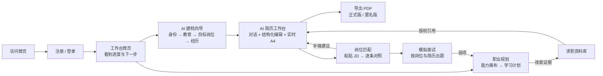

# JobProof AI 需求规格说明书

| 项 | 内容 |
| --- | --- |
| 文档版本 | v2.0（重写版） |
| 日期 | 2026-10-06 |
| 状态 | 生效，替代 `docs/archive/v0-开发文档/JobProof-AI-产品需求文档-PRD-v0.7.md`（文件内标注 v0.9） |
| 读者 | 产品、设计、前后端开发、测试 |
| 协同文档 | [技术选型](02-技术选型.md) · [架构设计](03-架构设计.md) · [UI/UX 设计规范](04-UIUX设计规范.md) |

> 阅读顺序：第 1 章说明为什么重写；第 2–5 章定义产品是什么、给谁用、怎么串起来；第 6 章是逐模块的功能需求与验收标准；第 7–8 章是跨模块规则和非功能需求。

---

## 1. 为什么重写：旧需求的问题诊断

旧 PRD 约 12 万字，经过 9 轮原位修订。它的问题不在篇幅，而在于**它描述的已经不是这个产品**：

| # | 问题 | 证据 | 后果 |
| --- | --- | --- | --- |
| 1 | 文档与代码严重脱节 | PRD 的 P0A 主链是“画像 → 证据库 → JD → 匹配 → 投递 CRM → 面试复盘”。后端 README 写明投递管理、独立画像、旧证据库、传统面试复盘均已**退役**；职业规划、模拟面试、模板中心、更新日志都已上线，PRD 却没有它们的需求。 | 新成员和 AI 助手按文档开发会重建已退役的模块；测试找不到验收依据。 |
| 2 | 需求和过程记录混在一起 | 正文大量出现“第 X 轮确认”“冻结落档”“用户下旨”“不得提前实现”等过程性措辞。 | 读者无法区分“产品要什么”和“当时怎么决定的”，规则被埋在历史里。 |
| 3 | 没有登录后的首页 | 登录后直接进入“求职资料库”，品牌 Logo 指向“最近使用的简历”。 | 用户不知道自己进行到哪一步、下一步该做什么；五个模块各自是孤岛。 |
| 4 | 模块之间缺少串联 | 简历、匹配、规划、面试各自有入口，但几乎没有“做完这一步，去做下一步”的引导。 | 价值链断裂，用户用完一个功能就流失。 |
| 5 | 全局能力缺失 | 搜索框只存在于资料库页面内部；没有快捷键、命令面板和外观偏好（深色模式）。 | 熟练用户效率低；夜间使用刺眼；体验不一致。 |
| 6 | 未完成能力暴露给用户 | 模板中心的“智能编辑”标着“建设中”，配一张施工插图。 | 显得产品不可信。 |
| 7 | 验收标准不可测试 | 大量“应当”“必须清楚”，缺少可执行的 Given/When/Then 和数值指标。 | 测试只能凭感觉。 |
| 8 | 缺少用户画像与旅程 | 只有角色列表，没有具体用户、场景和情绪曲线。 | 设计决策没有依据，页面按“能放什么”堆功能。 |

**本版的处理原则**：以当前代码中真实存在、真实可用的能力为基线；保留已验证的核心产品模型（AI 只出候选、事实需确认、版本可追溯）；补上缺失的串联和全局能力；把历史过程记录移入 `docs/archive/`，不再出现在需求正文中。

---

## 2. 产品定位

### 2.1 一句话

**JobProof AI 是面向大学生与早期职场人的“证据驱动型”AI 求职工作台：用一次对话写出每一句都能自证的简历，再用岗位匹配、职业规划和模拟面试把它变成 Offer。**

### 2.2 核心价值主张

| 用户的问题 | 市面工具的做法 | JobProof 的做法 |
| --- | --- | --- |
| 不会写简历 | 给一个模板，让用户自己填 | AI 一次问一个问题，像聊天一样把经历挖出来，实时排版成 A4 |
| 怕 AI 乱编 | AI 一键润色，数字和经历随意生成 | AI 只给“候选修改”，每一条标注来源事实；用户点对勾才写入 |
| 不知道配不配这个岗位 | 给一个百分比 | 逐条对照 JD 要求和简历证据，硬性缺口醒目标出，给出可执行的补强建议 |
| 不知道往哪个方向发展 | 泛泛的职业测试 | 基于真实经历生成可编辑的能力画布，拆成学习计划并验证掌握程度 |
| 面试紧张、没练过 | 题库背诵 | 结合简历和目标岗位出题，文字或语音作答，逐题反馈 |

### 2.3 产品原则（所有需求评审都以此为准）

1. **事实不虚构**：系统不得生成用户没有提供、也无法证明的公司、时间、项目、角色、数字成果或证书。
2. **AI 只出候选，人来拍板**：任何 AI 生成内容在用户确认前都不写入正式数据。
3. **一处输入，处处复用**：资料库中的事实可以授权给简历、匹配、规划、面试复用，用户不必重复填写。
4. **随时知道下一步**：每个页面都要回答“我现在在哪”“下一步做什么”。
5. **渐进披露**：默认只展示完成当前任务所需的信息，高级选项按需展开。
6. **可解释、可撤销**：评分要给出依据，修改要能回退，删除要说明影响。

### 2.4 非目标

- 不承诺用户一定获得面试或 Offer。
- 不提供招聘平台自动投递、自动聊天、Cookie 抓取或逆向接口。
- 不对企业或面试官做“欺诈”“人格”等定性判断。
- 不提供法律意见（合同审核等能力不在本期范围）。
- 不以学历、性别、年龄、地域、民族、婚育等敏感属性评价用户能力。

---

## 3. 目标用户

### 3.1 用户画像

**画像 A：林晓，大三，计算机专业（核心用户，占比约 50%）**
- 场景：暑期实习投递季，第一次写简历。
- 目标：两天内拿出一份像样的简历，投 20 家公司的后端实习。
- 痛点：不知道课程项目算不算经历；不会写“成果”；看了很多模板不知道选哪个。
- 期望：有人一步步带着写；写完能立刻看到排版效果；能针对不同岗位改出几个版本。

**画像 B：周杰，应届生，市场营销专业（核心用户，占比约 35%）**
- 场景：秋招，同时准备快消、互联网运营两个方向。
- 目标：搞清楚自己更适合哪个方向，并为两个方向各准备一份简历和面试。
- 痛点：社团和实习经历多但零散；面试常被追问细节答不上来。
- 期望：岗位匹配告诉他差在哪；模拟面试能针对简历内容追问。

**画像 C：Mia，工作两年，测试工程师想转数据分析（扩展用户，占比约 15%）**
- 场景：在职准备转岗，时间碎片化，常用手机查看。
- 目标：规划半年的转岗学习路线，并把已有工作成果改写成数据分析视角。
- 痛点：不知道技能缺口具体在哪；简历里工作内容和新岗位关联弱。
- 期望：能力画布清晰展示缺口和学习顺序；简历可以基于同一份资料开“分支”版本。

**辅助角色**
- **运营管理员**：维护智能模板、Word 模板库、AI 通道、更新日志。默认不能浏览用户私密资料。

### 3.2 使用环境

- 桌面 Web（Chrome / Edge / Safari / Firefox 最新两个大版本）是完整工作端，主力屏幕 1366–1920 宽。
- 移动 Web（≥ 360 宽）支持查看、轻量编辑、通知、模拟面试文字作答；简历工作台在手机上以“对话 / 预览”切换的形式可用。

---

## 4. 用户旅程与产品闭环

### 4.1 主旅程



### 4.2 关键时刻（Moments that matter）

| 时刻 | 用户情绪 | 设计要求 |
| --- | --- | --- |
| 第一次进入工作台 | 期待又迷茫 | 用一个清晰的“开始写第一份简历”主行动，配简短的三步说明；不要堆数据卡片。 |
| 第一次看到 A4 预览自动成形 | 惊喜 | 每确认一张卡片，右侧预览要有可感知的“落版”动效。 |
| AI 给出修改建议 | 谨慎 | 以“前 / 后”对比和来源事实呈现，逐条采纳或拒绝，能撤销。 |
| 导出 PDF | 紧张（怕出错） | 导出前检查溢出、空模块、未确认内容，并给出明确结论。 |
| 匹配结果不理想 | 沮丧 | 先肯定已匹配项，再给可执行的补强清单，并一键跳回简历对应模块。 |

---

## 5. 信息架构

### 5.1 站点地图

```text
公开区
├── 首页（产品介绍 + 登录 / 注册弹层）
├── 模板中心（浏览智能模板与 Word 模板库）
├── 更新日志
└── 用户协议 / 隐私政策

登录后（应用外壳：侧边导航 + 顶栏）
├── 工作台（新）
├── 简历
│   ├── 简历列表
│   ├── AI 建档向导（/ai-resume/new）
│   ├── AI 简历工作台（/ai-resume/:id）——全屏专注布局
│   └── 手动编辑 / 版本与导出（/resumes/:id/manual）
├── 岗位匹配（列表 → 新建 → 分析中 → 澄清 → 报告 → 相似岗位）
├── 职业规划（画布总览 → 规划会话 / 能力画布）
├── 模拟面试（总览 → 新建 → 面试中 → 报告）
├── 资料库（个人信息 / 经历成果 / 文件资料）
├── 模板中心
├── 通知中心
└── 设置（账号与安全 / 外观（新）/ AI 用量 / 数据与隐私）

管理后台（仅管理员）
├── 模板管理
├── AI 通道
└── 更新日志管理
```

### 5.2 导航规则

- 侧边导航分三组：**主要**（工作台、简历、岗位匹配、职业规划、模拟面试）、**资料**（资料库、模板中心）、**系统**（通知、更新日志、设置）。管理员额外显示“管理”组。
- 侧边导航可折叠为图标栏，状态按用户记忆。
- 顶栏显示当前页面标题 / 面包屑、全局搜索（⌘K / Ctrl+K）、通知、主题切换、头像菜单。
- AI 简历工作台、能力画布使用**专注布局**：隐藏侧边导航，只保留顶部工具栏和返回按钮，最大化编辑空间。
- 移动端侧边导航变为抽屉，顶栏保留菜单、标题、搜索、通知。

---

## 6. 功能需求

优先级：**P0** 本期必须交付；**P1** 本期应交付；**P2** 后续版本。
每个模块的验收标准采用 Given / When / Then 形式，可直接转为测试用例。

### 6.1 账号与安全

**目标**：几秒内完成登录或注册，会话安全可控。

| 编号 | 功能 | 优先级 | 说明 |
| --- | --- | --- | --- |
| AUTH-01 | 邮箱 / 手机号 + 密码登录 | P0 | 登录在首页弹层内完成，不跳转独立页面；支持“下一步跳转”回到原受保护页面。 |
| AUTH-02 | 验证码注册 | P0 | 邮箱或手机号接收验证码；密码强度实时提示。 |
| AUTH-03 | 找回密码 | P0 | 验证码验证后重设，成功后撤销其他会话。 |
| AUTH-04 | 会话过期处理 | P0 | 任意接口返回未登录时，弹出登录层并保留当前地址，登录后回到原处；未保存的编辑内容保留在本地。 |
| AUTH-05 | 登录频控 | P0 | 按账号与可信客户端 IP 双维度限速，超限给出剩余等待时间。 |
| AUTH-06 | 账号设置 | P0 | 修改密码、查看与退出其他会话、绑定联系方式。 |
| AUTH-07 | 注销账号 | P0 | 走数据权利流程，展示影响范围后二次确认。 |

**验收**
- Given 未登录用户访问 `/resumes`，When 页面加载，Then 打开登录弹层且登录成功后进入 `/resumes`。
- Given 用户在简历工作台编辑时会话过期，When 下一次保存失败，Then 编辑内容不丢失，弹出登录层，重新登录后自动重试保存。
- Given 同一账号 5 分钟内连续输错密码超过阈值，When 再次登录，Then 返回限速提示和等待秒数，且不泄露账号是否存在。

### 6.2 工作台首页（新增）

**目标**：登录后的第一屏，回答“我进行到哪了、下一步做什么”。

| 编号 | 功能 | 优先级 | 说明 |
| --- | --- | --- | --- |
| DASH-01 | 问候与求职进度 | P0 | 按时段问候；展示“求职准备度”进度环，由资料完整度、是否有可导出简历、是否完成匹配、是否练过面试四项构成，每项可点击直达。 |
| DASH-02 | 下一步建议 | P0 | 根据当前数据给出 1 个主行动 + 至多 2 个次行动。规则见下表。 |
| DASH-03 | 继续上次的工作 | P0 | 最近编辑的简历（含缩略图、更新时间、完成度）、进行中的匹配、未完成的模拟面试，一键继续。 |
| DASH-04 | 快捷创建 | P0 | 新建简历、新建岗位匹配、开始模拟面试、新建能力画布。 |
| DASH-05 | 最近动态 | P1 | 最近 5 条通知（任务完成、导出完成等），可跳转通知中心。 |
| DASH-06 | 首次使用状态 | P0 | 没有任何数据时，展示欢迎插画与“三步开始”引导，主行动为“用 AI 写第一份简历”。 |

**下一步建议规则（按顺序取第一条命中的作为主行动）**

| 条件 | 主行动 |
| --- | --- |
| 没有任何简历 | 用 AI 写第一份简历 |
| 有简历但没有确认完成的模块 ≥ 3 个 | 继续完善简历 |
| 有可导出的简历但从未做过岗位匹配 | 用一个真实 JD 测试匹配度 |
| 有匹配报告但从未模拟面试 | 针对该岗位模拟面试 |
| 没有能力画布 | 规划你的职业方向 |
| 其他 | 继续最近的工作 |

**验收**
- Given 新注册用户，When 首次进入 `/dashboard`，Then 看到欢迎状态，主按钮为“用 AI 写第一份简历”，点击进入 AI 建档向导。
- Given 用户有一份进行中的简历，When 进入工作台，Then “继续上次的工作”首位显示该简历的缩略图和“继续编辑”按钮。
- Given 任一子数据接口失败，When 加载工作台，Then 其他区块正常展示，失败区块显示可重试的局部错误。
- 工作台首屏数据在 P75 网络下 1.0 秒内可交互（骨架屏先行）。

### 6.3 AI 简历工作台（核心模块，保留并增强现有编辑模式）

**目标**：用对话 + 结构化卡片 + 实时 A4 预览，写出每一句都可自证的简历。

> 现有的“左侧 AI 对话 / 编辑 / 设计 / 模板四视图 + 可拖拽分栏 + 右侧实时 A4 预览 + 卡片确认制”编辑模式经用户确认保留。本期只重构实现、提升视觉与交互，不改变交互模型。

#### 6.3.1 布局与视图

| 编号 | 功能 | 优先级 | 说明 |
| --- | --- | --- | --- |
| ARW-01 | 专注布局 | P0 | 顶部工具栏：返回、简历标题（可内联重命名）、保存状态、AI 额度、分支、历史、隐私、手动编辑、导出 PDF。隐藏应用侧边栏。 |
| ARW-02 | 左右分栏 | P0 | 左侧编辑区、右侧 A4 预览；中间分隔条可拖拽（34%–66%），双击复位，支持键盘 ←/→ 调整，宽度按用户记忆。 |
| ARW-03 | 四个视图 | P0 | **对话**（AI 引导 + 自由提问）、**编辑**（按模块编辑）、**设计**（字体、字号、行距、边距、密度、日期格式、头部布局、标题样式、照片、主题色、模块显隐与排序）、**模板**（12 款智能模板一键换版）。视图切换有平滑过渡且保留各自滚动位置。 |
| ARW-04 | 移动端 | P0 | 小于 960px 时以“编辑 / 预览”分段切换代替分栏。 |

#### 6.3.2 AI 建档与引导卡片

| 编号 | 功能 | 优先级 | 说明 |
| --- | --- | --- | --- |
| ARW-10 | 身份分流 | P0 | 先问“是否已有简历”：有则导入文本 / 文件生成候选；没有则选择学生 / 应届生 / 职场人士，决定后续卡片顺序与文案。 |
| ARW-11 | 引导卡片 | P0 | AI 一次只问一个模块：目标岗位（岗位分类选择器）、教育、实习 / 工作、项目、社团组织、技能、证书、荣誉、语言、个人总结、联系方式。卡片内结构化填写，实时投影到右侧预览。 |
| ARW-12 | 追加判断 | P0 | 确认一段经历后询问“还要再添加一段吗”，可继续添加或进入下一步。 |
| ARW-13 | AI 帮写 | P0 | 描述字段提供“AI 帮写”：基于已填事实生成候选，展示来源字段与需核实项，用户采用 / 修改 / 放弃。 |
| ARW-14 | 智能推荐 | P0 | 技能、证书、荣誉、个人总结提供 AI 推荐列表，可多选采用。 |
| ARW-15 | 卡片确认制 | P0 | 卡片草稿停止输入约 1 秒后自动保存；点击“确认”才生成正式修订。未确认内容在预览中以浅色标识，不进入正式导出。 |

#### 6.3.3 对话与变更集

| 编号 | 功能 | 优先级 | 说明 |
| --- | --- | --- | --- |
| ARW-20 | 自由对话 | P0 | 用户可直接描述经历或提问，AI 流式回复，可随时停止。Enter 发送、Shift+Enter 换行。 |
| ARW-21 | 变更集卡片 | P0 | AI 的修改建议以“变更集”呈现：逐条显示修改前 / 后、理由、来源事实与事实状态；支持逐条采纳、拒绝、修正后采纳、撤销。 |
| ARW-22 | 资料库证据 | P0 | 对话框上方开关“使用求职资料库作为证据”，开启后 AI 仅引用已确认的结构化资料，并显示快照版本。 |
| ARW-23 | 首次授权 | P0 | 首次使用 AI 前展示授权说明（只发送已确认事实与当前问题，照片不发送给模型），同意后才可调用。 |
| ARW-24 | 额度显示 | P0 | 顶栏显示本月剩余 AI 次数；不足时在调用入口提前提示，不在调用后才报错。 |

#### 6.3.4 预览与排版

| 编号 | 功能 | 优先级 | 说明 |
| --- | --- | --- | --- |
| ARW-30 | 实时 A4 预览 | P0 | 所见即所得，自动分页，显示页码与“共 N 页 / 推荐 M 页”。 |
| ARW-31 | 点击定位 | P0 | 点击预览中的模块，左侧自动切到“编辑”并定位到对应模块与条目，目标字段获得焦点并高亮闪烁一次。 |
| ARW-32 | 缩放 | P1 | 预览支持“适应宽度 / 75% / 100% / 125%”，⌘+/⌘- 调整。 |
| ARW-33 | 溢出检测 | P0 | 内容超出模板推荐页数或单页溢出时，预览状态栏警示并给出“压缩建议”（调小字号、减少密度、精简描述）。 |
| ARW-34 | 无内部值泄露 | P0 | 预览与导出中不得出现 `NO_PHOTO` 等内部枚举或占位键名。 |

#### 6.3.5 编辑效率（增强）

| 编号 | 功能 | 优先级 | 说明 |
| --- | --- | --- | --- |
| ARW-40 | 拖拽排序 | P1 | 模块顺序（设计视图）与同模块内条目顺序支持拖拽，保留上移 / 下移按钮作为键盘可达的替代。 |
| ARW-41 | 保存状态 | P0 | 顶栏统一显示“已保存 / 保存中 / 待保存 / 保存失败（重试）”；离开页面前若有未保存内容则提示。 |
| ARW-42 | 快捷键 | P1 | ⌘K 命令面板、⌘Enter 确认当前卡片、⌘S 立即保存草稿、⌘/ 聚焦对话输入、⌘E 导出、Esc 关闭抽屉。快捷键在“?”面板中可查。 |
| ARW-43 | 离线与恢复 | P0 | 网络中断时草稿保存在本地；恢复后自动重试；冲突时保留双方内容让用户选择。 |

#### 6.3.6 版本、分支与导出

| 编号 | 功能 | 优先级 | 说明 |
| --- | --- | --- | --- |
| ARW-50 | 修订历史 | P0 | 列出每次确认产生的修订；“恢复”会生成新修订，不删除历史。 |
| ARW-51 | 分支 | P0 | 可从当前确认版本建立语言分支（中 / 英）或岗位分支；父分支变化后提示“确认同步”，并展示字段差异。 |
| ARW-52 | 翻译 | P1 | 语言分支可调用 AI 翻译，专有名称需逐项确认后才算完成。 |
| ARW-53 | PDF 导出 | P0 | 导出前检查：溢出、空模块、未确认修改。可选正式版（含姓名、照片、联系方式）或匿名版（隐藏身份信息）。导出冻结当前已确认内容、模板版本与设计设置，异步生成后自动下载并发送通知。 |
| ARW-54 | 照片 | P0 | PNG / JPEG ≤ 1MB，可更换、移除；照片仅用于排版，不发送给模型。 |
| ARW-55 | 隐私偏好 | P0 | 写作风格（受控选项）、撤销 AI 授权、清除 AI 历史正文（二次确认）。 |

**验收**
- Given 用户在姓名字段输入后 1 秒内切换模板，When 模板切换完成，Then 姓名保持新输入值，且随后自动保存提交的是新值。
- Given 用户连续修改字号 1.1 → 1.2，When 第一次保存的响应晚于第二次修改返回，Then 最终保存值为 1.2，状态显示“已保存”。
- Given 用户点击预览中“项目经历”第 2 条，When 点击发生，Then 左侧切换到“编辑 → 项目经历”，第 2 条展开并获得焦点。
- Given 简历内容超出模板推荐页数，When 打开导出对话框，Then 显示溢出警示且“确认导出”不可用，并提供压缩建议。
- Given AI 变更集中有 3 条建议，When 用户采纳第 1 条、拒绝第 2 条，Then 只有第 1 条写入新修订，第 3 条保持待决，变更集状态为“部分采纳”。
- 预览在输入停止后 150ms 内更新；切换模板 300ms 内完成重新排版（12 款模板、2 页内容）。

### 6.4 简历管理

| 编号 | 功能 | 优先级 | 说明 |
| --- | --- | --- | --- |
| RES-01 | 简历列表 | P0 | 卡片网格展示：A4 缩略图、标题、模板、语言、状态、更新时间；支持“全部 / 主简历 / 定制版 / 冻结版本 / 已归档”分段筛选，按标题搜索、按更新时间排序。 |
| RES-02 | 新建 | P0 | 入口统一为“AI 新建”（进入建档向导）和“空白新建”（直接进入工作台的编辑视图）；从模板中心选择模板新建时预选该模板。 |
| RES-03 | 卡片操作 | P0 | 继续编辑、复制、重命名、归档 / 恢复、导出最近 PDF；危险操作二次确认。 |
| RES-04 | 冻结版本与对比 | P0 | 在手动编辑页可冻结版本、查看冻结版本、对比两个版本的字段差异、从冻结版本导出 PDF。 |
| RES-05 | 关联证据 | P1 | 冻结前检查关键成果是否关联资料库证据；未关联的需逐条确认“暂无证据仍要冻结”。 |

**验收**
- Given 用户有 8 份简历，When 在搜索框输入“英文”，Then 列表 200ms 内只显示标题包含“英文”的简历。
- Given 用户归档一份简历，When 操作成功，Then 卡片以动画移出当前列表，并出现带“撤销”的提示条，5 秒内可撤销。

### 6.5 模板中心

| 编号 | 功能 | 优先级 | 说明 |
| --- | --- | --- | --- |
| TPL-01 | 智能模板 | P0 | 12 款可在工作台中一键换版的结构化模板，展示真实缩略图、推荐页数、语言、适用岗位；“用此模板新建”直接进入工作台。不再显示“建设中”。 |
| TPL-02 | Word 模板库 | P0 | 浏览 HICV 开源 Word 模板（2000+），按职业大类、岗位、版式、语言、页数、照片类型、职业阶段筛选；预览与下载原始 DOCX，注明来源与许可。 |
| TPL-03 | 公开访问 | P0 | 未登录可浏览；下载与“用此模板新建”需登录。 |
| TPL-04 | 筛选体验 | P0 | 筛选项变化即时生效（无需点击“筛选”按钮），URL 同步筛选条件，可分享；空结果给出放宽条件建议。 |

### 6.6 求职资料库

**目标**：长期维护个人求职事实，供简历、匹配、规划、面试按授权复用。

| 编号 | 功能 | 优先级 | 说明 |
| --- | --- | --- | --- |
| LIB-01 | 个人信息 | P0 | 姓名、联系方式、所在地、个人链接、头像；求职意向（目标岗位、岗位分类、城市、工作方式、毕业时间、专业）。 |
| LIB-02 | 经历成果 | P0 | 教育、实习 / 工作、项目、组织、技能、证书、荣誉等结构化记录；支持新增、编辑、排序、归档；显示被哪些简历版本引用。 |
| LIB-03 | 文件资料 | P0 | 上传作品集、证书扫描件、成绩单等私有文件（类型与大小受限，经恶意文件扫描），逐页预览，鉴权下载。 |
| LIB-04 | 完整度 | P0 | 展示资料完整度与待完善项，点击直达对应字段。 |
| LIB-05 | 隐私声明 | P0 | 明示“仅在你授权后用于 AI”，不采集年龄、性别、婚育、民族等敏感字段。 |
| LIB-06 | 引用保护 | P0 | 被有效冻结版本引用的记录不能直接删除，只能归档，并说明引用位置。 |

### 6.7 岗位匹配

**目标**：把一份真实 JD 和一份简历逐条对照，给出有证据的匹配分析和行动建议。

| 编号 | 功能 | 优先级 | 说明 |
| --- | --- | --- | --- |
| JM-01 | 四步创建 | P0 | ① 粘贴 JD（80–20000 字）→ AI 解析为结构化要求，用户可校正；② 选择简历（已有主简历或上传文件）；③ 证据授权（仅简历 / 简历 + 资料库）；④ 确认并开始分析。步骤条清晰显示当前位置，可返回修改。 |
| JM-02 | 分析进度 | P0 | 异步分析，显示阶段与百分比；可离开页面，完成后通知；可取消。 |
| JM-03 | 澄清问题 | P0 | 证据不足时提出澄清问题（选项 + 备注），用户可回答或跳过。 |
| JM-04 | 匹配报告 | P0 | 总分与等级、分项（硬性门槛 / 技能与证据 / 经历相关 / 限制符合）、逐条要求的匹配状态与对应证据、硬性缺口醒目标记、未知项、补强建议。 |
| JM-05 | 行动联动 | P0 | 补强建议可一键“去简历修改”，跳转工作台对应模块；可“用此岗位模拟面试”。 |
| JM-06 | 历史与对比 | P1 | 历史列表；输入变化后旧报告标记“已过期”，可重新计算并与旧报告对比。 |
| JM-07 | 相似岗位 | P1 | 基于当前 JD 推荐相似方向，说明推荐依据。 |

**规则**：硬性要求缺失时最高等级受限，但不阻止查看报告；评分权重公开，普通用户不可修改；JD 未提供的信息标为“未知”，不推断。

### 6.8 职业规划

**目标**：把“想做什么”拆成可执行、可验证的能力成长路径。

| 编号 | 功能 | 优先级 | 说明 |
| --- | --- | --- | --- |
| CP-01 | 画布总览 | P0 | 一个账号可管理多个职业目标，每张画布独立保存；显示节点数、待验证数、版本数；搜索与状态筛选。 |
| CP-02 | 规划会话 | P0 | 通过访谈了解背景（可授权引用资料库证据），推荐职业方向并说明理由，用户选择目标。 |
| CP-03 | 能力画布 | P0 | 以树形图展示 职业 → 领域 → 技能 → 知识 / 任务 → 证据；节点可编辑、拖动、锁定、拆分；节点状态：未开始 / 已计划 / 学习中 / 待验证 / 已掌握 / 暂停。 |
| CP-04 | AI 推演 | P0 | 可按方向（向下细化 / 前置条件 / 同级扩展 / 目标缺口）和深度生成候选节点，逐项采纳或拒绝。 |
| CP-05 | 学习计划 | P0 | 由画布生成阶段性学习计划，可修订并保留修订历史。 |
| CP-06 | 能力验证 | P0 | 针对节点生成验证任务，提交后由 AI 评估，通过后节点标记“已掌握”并可沉淀为资料库证据。 |
| CP-07 | 版本 | P1 | 画布版本列表与差异对比，可回到任一版本。 |

### 6.9 模拟面试

| 编号 | 功能 | 优先级 | 说明 |
| --- | --- | --- | --- |
| MI-01 | 总览 | P0 | 累计场次、平均分、文字 / 语音场次；“继续未完成的面试”；最近记录。 |
| MI-02 | 新建 | P0 | 选择岗位（可来自岗位匹配）、公司、面试类型、难度、模式（文字 / 语音）、题量；可引用简历与资料库。 |
| MI-03 | 面试中 | P0 | 一题一屏，显示进度；文字作答自动保存草稿；语音作答实时录音、转写，可重录；可暂停后继续。 |
| MI-04 | 逐题反馈 | P0 | 每题评分维度、亮点、问题、参考回答方向；有效零分必须保留，不得被过滤。 |
| MI-05 | 报告 | P0 | 总分、维度雷达、逐题回顾、改进建议；可“再练一次”。 |
| MI-06 | 麦克风安全 | P0 | 离开页面立即停止录音与释放设备，迟到的授权回调不得启动录音。 |

### 6.10 通知中心

| 编号 | 功能 | 优先级 | 说明 |
| --- | --- | --- | --- |
| NTF-01 | 通知列表 | P0 | 任务完成 / 失败、导出完成、安全与数据权利事件；按全部 / 未读筛选；按日期分组。 |
| NTF-02 | 已读 | P0 | 单条已读、全部已读；侧边导航与顶栏显示未读数。 |
| NTF-03 | 跳转 | P0 | 通知可直接跳转到相关对象（如导出的简历、完成的匹配报告）。 |
| NTF-04 | 实时更新 | P1 | 页面打开期间每 60 秒或窗口重新获得焦点时刷新未读数。 |

### 6.11 全局搜索与命令面板（新增）

| 编号 | 功能 | 优先级 | 说明 |
| --- | --- | --- | --- |
| CMD-01 | 唤起 | P0 | ⌘K / Ctrl+K 或点击顶栏搜索框唤起，Esc 关闭。 |
| CMD-02 | 页面跳转 | P0 | 输入关键字匹配所有导航页面（支持拼音首字母，如“jl”命中“简历”）。 |
| CMD-03 | 快捷操作 | P0 | 新建简历、新建匹配、开始模拟面试、切换主题、退出登录等。 |
| CMD-04 | 搜索我的简历 | P1 | 按标题搜索简历并直达工作台。 |
| CMD-05 | 键盘操作 | P0 | ↑/↓ 选择、Enter 执行，最近使用的命令置顶。 |

### 6.12 设置

| 编号 | 功能 | 优先级 | 说明 |
| --- | --- | --- | --- |
| SET-01 | 账号与安全 | P0 | 见 AUTH-06。 |
| SET-02 | 外观（新增） | P0 | 主题：浅色 / 深色 / 跟随系统；侧边栏默认折叠；减少动效（默认跟随系统）。 |
| SET-03 | AI 用量 | P0 | 本月额度、已用、冻结中、明细。 |
| SET-04 | 数据与隐私 | P0 | 授权列表与撤销、数据导出（异步打包）、只读限时分享、账号删除（展示影响后二次确认）。 |

### 6.13 管理后台

| 编号 | 功能 | 优先级 | 说明 |
| --- | --- | --- | --- |
| ADM-01 | 智能模板管理 | P0 | 模板版本、设计预设、发布门禁（ATS / 独立设计 / 安全检查）、上下线。 |
| ADM-02 | Word 模板库 | P0 | 批量导入、候选文件扫描、审批、下架。扫描失败一律按不可信处理。 |
| ADM-03 | AI 通道 | P0 | 配置模型通道、协议、密钥（加密存储，界面只显示掩码）、健康状态与配额。 |
| ADM-04 | 更新日志 | P0 | 编辑、预览、发布版本说明。 |
| ADM-05 | 职责边界 | P0 | 管理员不能浏览用户私密资料；所有管理操作写审计日志。 |

### 6.14 公开页面

| 编号 | 功能 | 优先级 | 说明 |
| --- | --- | --- | --- |
| PUB-01 | 产品首页 | P0 | 价值主张、核心流程演示（插画 + 动效，不依赖 WebGL）、功能介绍、模板展示、常见问题、行动按钮。首屏 LCP ≤ 2.0 秒。 |
| PUB-02 | 更新日志 | P0 | 按版本展示，支持按类型筛选。 |
| PUB-03 | 协议与隐私 | P0 | 用户协议、隐私政策。 |

---

## 7. 跨模块业务规则

| 规则 | 内容 |
| --- | --- |
| **AI 候选确认制** | AI 产出（帮写、推荐、变更集、推演节点、翻译、反馈）一律为候选；用户确认后才写入正式数据；拒绝的候选不得进入后续 AI 上下文。 |
| **事实来源标注** | AI 候选必须标注来源：来自用户材料 / 合理改写 / 需要用户确认。数字成果无来源时改为定性描述或标“待补证”。 |
| **AI 授权与额度** | 首次使用需授权，可随时撤销；每次调用先预占额度、成功后结算、失败释放；额度不足在入口提前提示。 |
| **乐观并发** | 所有可编辑对象带版本号；写入时以版本号作为条件，冲突返回 409 并保留双方内容供用户选择，绝不静默覆盖。 |
| **草稿保存** | 编辑停止约 1 秒自动保存；同一对象同时最多一个在途请求；迟到响应不得覆盖更新的本地修订；导出、提交前等待保存队列排空。 |
| **幂等** | 创建类与 AI 调用类请求携带客户端请求 ID；重复请求不产生重复业务结果。 |
| **归档优先** | 常规整理用归档；物理删除只走数据权利流程，并展示关联影响。 |
| **异步任务** | 导出、解析、分析、生成等长任务统一为“排队 / 运行中 / 成功 / 失败 / 已取消”五态；完成或失败都发站内通知；页面可离开。 |
| **敏感信息** | 不采集年龄、性别、婚育、民族；照片不发送给模型；日志与审计中不记录简历原文。 |

---

## 8. 非功能需求

### 8.1 性能（P75，桌面宽带 / 移动 4G）

| 指标 | 目标 |
| --- | --- |
| 首页 LCP | ≤ 2.0s / ≤ 2.5s |
| 应用页面切换（已缓存数据） | ≤ 100ms 呈现，后台静默刷新 |
| 应用页面首次加载（骨架屏出现） | ≤ 300ms |
| INP（交互到下一帧） | ≤ 200ms |
| CLS | ≤ 0.05 |
| 简历预览更新 | 输入停止后 ≤ 150ms |
| 首屏 JS（gzip，公开首页） | ≤ 180KB（移除 Three.js 后） |
| 接口 P95（非 AI） | ≤ 300ms |
| AI 流式首字 | ≤ 3s（受模型通道影响，超时 30s 给出可重试提示） |

### 8.2 可用性与体验

- 所有异步操作必须有即时反馈（按钮 loading、骨架屏、进度）；超过 10 秒的操作显示阶段说明。
- 所有破坏性操作二次确认或提供撤销；归档类操作优先提供 5 秒撤销。
- 所有列表有空状态（插画 + 一句说明 + 主行动）、加载状态、错误状态（可重试）。
- 动效遵循 UI/UX 规范的时长与缓动；系统开启“减少动态效果”时关闭非必要动画。

### 8.3 可访问性

- 满足 WCAG 2.2 AA：正文对比度 ≥ 4.5:1，大字与图标 ≥ 3:1。
- 全部功能可键盘操作，焦点可见（2px 焦点环）；弹层打开时焦点锁定、关闭后归还。
- 表单错误与字段关联（`aria-describedby`），错误信息说明如何修正。
- 图标按钮有可读名称；装饰性插画 `alt=""`。

### 8.4 兼容性

- 桌面：Chrome / Edge / Firefox / Safari 最新两个大版本；最小宽度 1024 完整可用。
- 移动：iOS Safari 16+、Android Chrome 最新两个大版本；最小宽度 360 无横向滚动。

### 8.5 安全与隐私

- 全站 HTTPS；会话 Cookie `HttpOnly + Secure + SameSite=Lax`；写操作 CSRF 防护。
- 密码 BCrypt；登录与验证码双维度限速；仅信任配置的反向代理转发头。
- 私有文件对象级鉴权；上传文件类型白名单 + 恶意文件扫描，扫描失败按不可信处理。
- 源码与镜像中不得包含真实密钥；CI 执行秘密扫描与依赖漏洞扫描。

### 8.6 可观测性

- 每个请求生成或透传 `X-Request-Id`，写入日志并在错误响应中返回，便于用户反馈时定位。
- 生产日志结构化（JSON）；健康检查、指标（Actuator / Prometheus）可用。
- 前端捕获未处理异常与接口失败，带 Request-Id 上报（上报端点可配置，默认关闭）。

---

## 9. 成功指标

| 层级 | 指标 | 定义 |
| --- | --- | --- |
| 北极星 | 每周产出可投递简历的用户数 | 一周内至少导出 1 份 PDF 的用户 |
| 激活 | 首份简历完成率 | 注册 7 日内完成 ≥ 5 个模块确认的用户占比 |
| 价值 | AI 候选采纳率 | 已采纳候选 / 已决策候选 |
| 串联 | 跨模块使用率 | 30 日内使用 ≥ 2 个核心模块（简历、匹配、规划、面试）的用户占比 |
| 留存 | 30 日留存 | 注册后第 30 天仍有登录的用户占比 |
| 体验 | 编辑丢失投诉 | 目标为 0 |

---

## 10. 版本规划

| 里程碑 | 范围 |
| --- | --- |
| **M1（本次重构交付）** | 新设计系统与应用外壳；工作台首页；命令面板；外观设置；AI 简历工作台组件化重构（保留编辑模式）与体验增强；全部页面视觉与交互升级；首页去 WebGL 改为插画；后端健壮性加固（请求追踪、结构化日志、架构约束测试、工作台概览接口）。 |
| M2 | 简历缩略图服务端生成、拖拽排序全面覆盖、预览缩放、离线草稿冲突解决界面、通知实时推送（SSE）。 |
| M3 | 投递记录（轻量 CRM，基于冻结版本）、面试复盘、能力验证沉淀为证据的自动化。 |

---

## 11. 术语表

| 术语 | 含义 |
| --- | --- |
| 主简历 | 用户维护的一份简历主档，可编辑。 |
| 修订 | 每次确认卡片或采纳变更后生成的不可变内容快照。 |
| 分支 | 从主简历派生的语言或岗位版本，与父分支可同步。 |
| 冻结版本 | 用于投递或导出的不可变版本。 |
| 卡片 | AI 简历工作台中按模块组织的结构化编辑单元。 |
| 变更集 | AI 一次提出的一组修改建议，逐条决策。 |
| 证据 | 资料库中可证明能力的记录或文件。 |
| 能力画布 | 职业规划中由节点和关系组成的能力树。 |
| 智能模板 | 基于结构化内容渲染、可一键换版的模板（区别于 Word 模板）。 |
