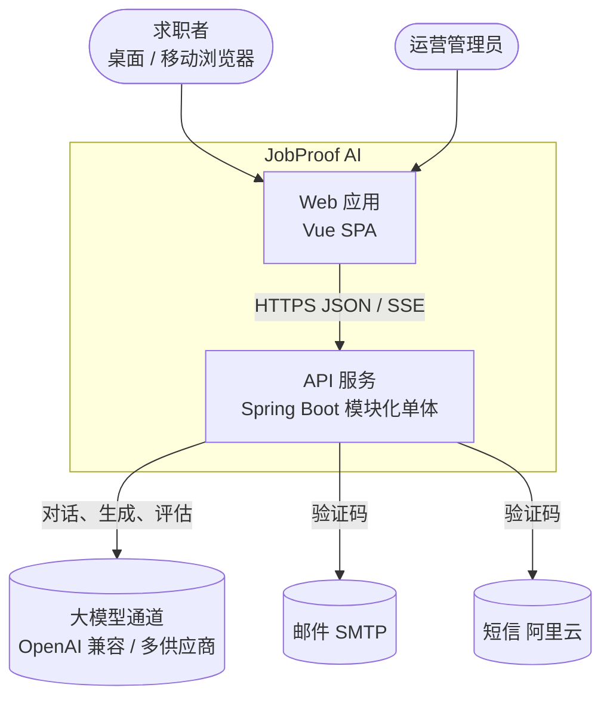
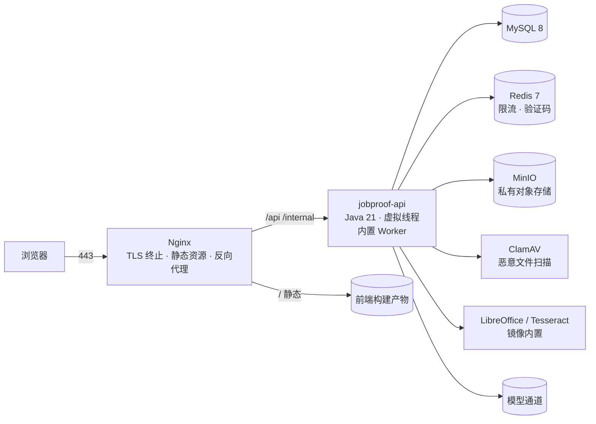
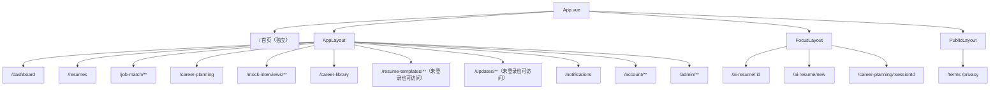
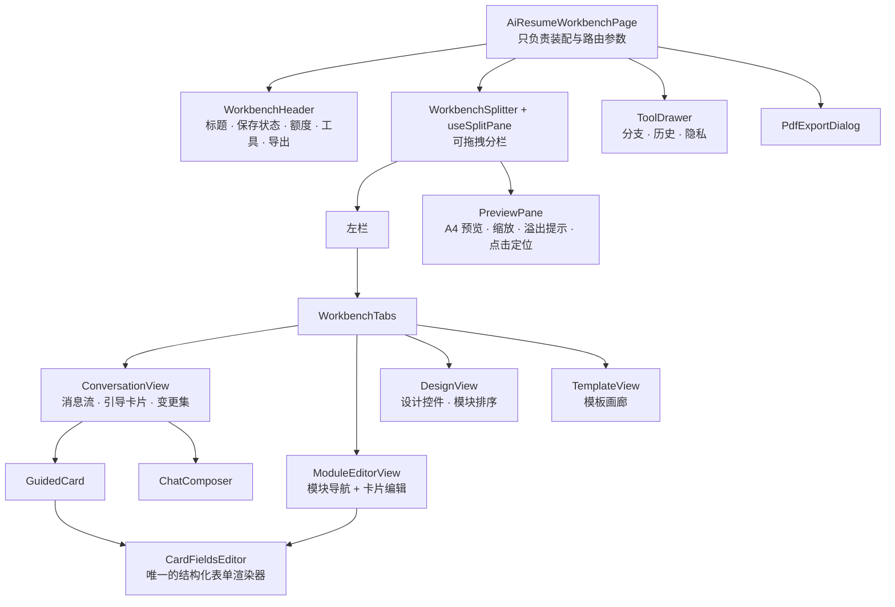
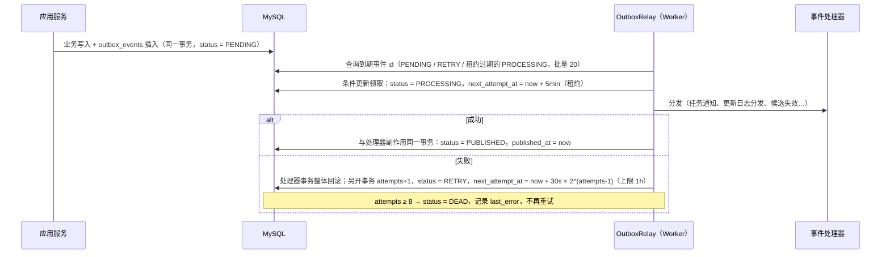
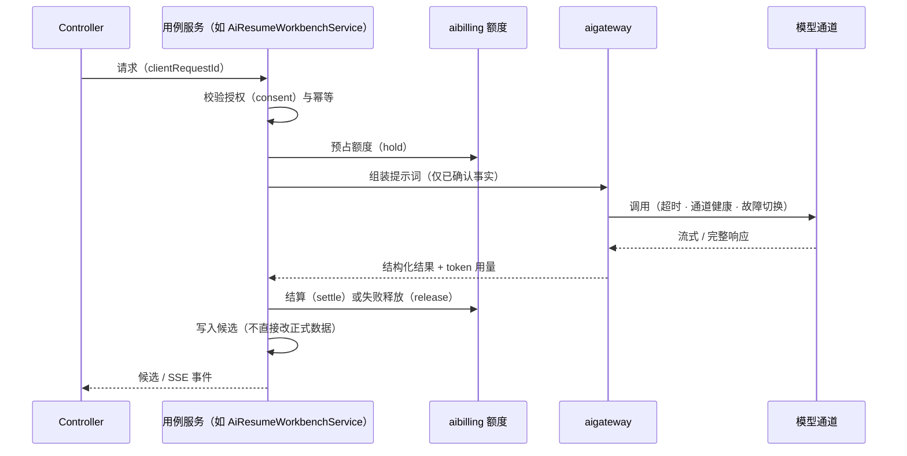

# JobProof AI 架构设计

| 项 | 内容 |
| --- | --- |
| 文档版本 | v2.0（重写版） |
| 日期 | 2026-10-06 |
| 状态 | 生效，替代 `docs/archive/v0-开发文档/JobProof-AI-系统架构设计文档-v0.7.md` |
| 协同文档 | [需求规格说明书](01-需求规格说明书.md) · [技术选型](02-技术选型.md) · [UI/UX 设计规范](04-UIUX设计规范.md) |

---

## 1. 旧架构问题诊断

| # | 层 | 问题 | 证据 | 本版对策 |
| --- | --- | --- | --- | --- |
| A1 | 前端 | **外壳随页面重复挂载** | 29 个页面各自在模板最外层包一层 `<AppChrome>`；每次导航侧边栏、顶栏、未读数全部销毁重建 | 改为路由级嵌套布局：`AppLayout` / `FocusLayout` / `PublicLayout` 常驻，只替换内容区（§4.3） |
| A2 | 前端 | **超大单文件组件** | `AiResumeWorkbenchPage.vue` 2796 行；引导卡片与模块编辑两套表单模板几乎相同；`JobMatchSimilarJobsPage.vue` 模板压缩成一行 | 工作台按职责拆为 12 个组件 + 6 个组合式函数；表单统一由 `CardFieldsEditor` 渲染（§4.7） |
| A3 | 前端 | **无服务端状态层** | 每页 `onMounted` 手动请求，切页重载、无缓存、无去重 | TanStack Query + 模块级 query key 工厂（§4.4） |
| A4 | 前端 | **样式无令牌** | 2000+ 行页面 CSS，硬编码色值，无法主题化 | 设计令牌 + 语义层 + 组件 scoped 样式（§4.6） |
| A5 | 前端 | **请求层缺少超时与追踪** | `fetch` 无超时、无取消、无请求 ID | HTTP 客户端增加超时、AbortSignal、`X-Request-Id`、GET 退避重试（§4.5） |
| B1 | 后端 | **所有定时任务共用单线程调度器** | 12 个 `@Scheduled` 方法（导出、删除、Outbox、简历渲染、模板预览、匹配分析、规划异步、资料文件处理、简历导入、3 个 SSE 心跳）未配置调度线程池，Spring 默认只有 1 个线程 | 一次耗时 30 秒的 PDF 渲染会阻塞所有 SSE 心跳与其他任务。改用虚拟线程调度器，每个任务独立执行（§5.7） |
| B2 | 后端 | **Outbox 消费失败即丢弃** | `InProcessWorker.consume` 捕获异常仅记日志，事件照样标记已发布；`publishOutbox` 上的 `@Transactional` 因同类自调用不生效 | 增加尝试次数、指数退避、死信状态；拆出独立 `OutboxRelay` Bean 使事务生效（§5.6） |
| B3 | 后端 | **巨型应用服务** | `CareerPlanningService` 2183 行、`CareerPlanningExecutionService` 1812 行、`AiResumeWorkbenchService` 1557 行 | 按用例拆分（§5.10 演进计划），ArchUnit 限制新增依赖 |
| B4 | 后端 | **模块边界无自动约束** | 跨模块直接引用对方 `infra` / 实体的情况无法被发现 | ArchUnit 规则 + 冻结违规清单（§5.3） |
| B5 | 后端 | **错误响应信息不足** | 参数校验统一返回“请求参数不正确”，不说明哪个字段错；无请求 ID | `ApiError` 增加 `requestId` 与 `fields`（§6.2） |
| B6 | 后端 | **无请求追踪与结构化日志** | 日志纯文本，无法关联同一请求 | `RequestIdFilter` + MDC + ECS 结构化日志（§5.8） |
| C1 | 工程 | **项目嵌套在中文目录** | 交付包两层嵌套，POSIX 区域设置下 Maven 直接崩溃 | 已迁移到仓库根目录（`frontend/ backend/ deploy/ docs/ design/ assets/`） |

---

## 2. 系统上下文



## 3. 部署容器视图



- 单机 2 核 2G 为基线（见 `docs/ops/deployment-capacity-2c2g.md`）。所有组件以 Docker Compose 编排，内存上限在 compose 中显式声明。
- Worker 默认与 API 同进程（`jobproof.worker.in-process=true`）；独立 Worker 进程保留骨架，未来负载升高时再启用。

---

## 4. 前端架构

### 4.1 分层

```text
┌─────────────────────────────────────────────────────────┐
│ pages        路由页面：组装功能组件，处理路由参数        │
├─────────────────────────────────────────────────────────┤
│ features     领域组件 · 组合式函数 · queries · api · types│
├─────────────────────────────────────────────────────────┤
│ shared/ui    Ui* 设计系统组件（基于 Reka UI 原语）        │
│ shared/composables · shared/lib · shared/api              │
├─────────────────────────────────────────────────────────┤
│ design       令牌 · 基础样式 · 布局原语 · 动效            │
└─────────────────────────────────────────────────────────┘
依赖方向只能自上而下；features 之间禁止互相引用 pages，
共享逻辑下沉到 shared 或通过公开的 index.ts 暴露。
```

### 4.2 目录结构

```text
frontend/src/
├── main.ts                  # 入口：创建 app、安装 pinia / query / router
├── app/
│   ├── App.vue              # 根：RouterView + 全局宿主（Toaster、命令面板、确认框）
│   ├── queryClient.ts       # TanStack Query 默认配置
│   ├── router/
│   │   ├── index.ts         # createRouter、守卫、视图过渡
│   │   └── routes.ts        # 路由表（按布局分组）
│   └── layouts/
│       ├── AppLayout.vue    # 登录后外壳：侧边栏 + 顶栏 + 内容区；未登录时退化为公开顶栏
│       ├── FocusLayout.vue  # 专注布局：AI 简历工作台、能力画布
│       ├── PublicLayout.vue # 公开页面（协议、隐私）
│       └── parts/           # AppSidebar、AppTopbar、UserMenu、NavLink …
├── design/
│   ├── tokens.css           # 基础令牌 + 语义令牌（浅色 / 深色）
│   ├── base.css             # reset、排版、焦点、滚动条、选区
│   ├── layout.css           # 页面容器、stack / cluster / grid 原语
│   ├── motion.css           # 关键帧、过渡类、减少动效
│   └── index.css
├── stores/
│   ├── session.ts           # 当前账号、登录 / 退出、会话过期
│   ├── preferences.ts       # 主题、侧边栏折叠、减少动效（持久化到 localStorage）
│   └── commandPalette.ts    # 命令面板开关与最近使用
├── shared/
│   ├── api/                 # http 客户端、SSE、下载、错误模型、任务轮询
│   ├── ui/                  # UiButton、UiDialog、UiSelect … （见 UI/UX 规范 §6）
│   ├── composables/         # useSplitPane、useScrollSurface、useSortableList …
│   ├── lib/                 # 日期、格式化、拼音匹配、校验
│   └── assets/              # 插画（WebP）、品牌资源
└── features/
    ├── dashboard/           # 工作台首页（新）
    ├── identity/            # 登录、注册、找回、账号设置、协议
    ├── ai-resume/           # AI 简历工作台（核心）
    ├── resume/              # 简历列表、手动编辑、版本、模板中心
    ├── job-match/ career-planning/ mock-interview/ career-library/
    ├── notification/ updates/ datarights/ ai/ template-admin/ landing/
    └── command/             # 命令面板（新）
```

### 4.3 路由与布局



- 布局组件常驻；页面切换只替换 `<RouterView>` 内容，配合 View Transitions 做交叉淡入。
- 路由 `meta` 声明：`requiresAuth`、`adminOnly`、`title`（顶栏标题与 `document.title`）、`nav`（高亮的导航项）。
- 登录后默认落地页从“求职资料库”改为 `/dashboard`。
- 守卫顺序：会话水合 → 认证 → 管理员 → 放行。未登录访问受保护页面时跳转首页并打开登录弹层，携带 `next`。
- 所有页面组件懒加载；侧边栏导航项在 `pointerenter` 时预取对应 chunk（`router.resolve` + 动态 import）。

### 4.4 状态分层

| 状态类型 | 存放位置 | 例子 |
| --- | --- | --- |
| 服务器数据 | **TanStack Query** 缓存 | 简历列表、匹配报告、通知、工作台概览 |
| 全局客户端状态 | **Pinia** | 当前账号、主题、侧边栏折叠、命令面板开关 |
| 可分享的视图状态 | **URL query** | 模板筛选条件、列表分段与搜索词、工作台当前视图 |
| 页面 / 组件局部状态 | `ref` / `reactive` | 表单输入、弹层开关 |
| 编辑草稿 | 组合式函数 + **保存队列** + `localStorage` 恢复副本 | AI 简历卡片、设计设置、面试作答 |

**Query 约定**

```ts
// features/resume/queries.ts
export const resumeKeys = {
  all: ['resumes'] as const,
  list: (filter: ResumeFilter) => [...resumeKeys.all, 'list', filter] as const,
  detail: (id: string) => [...resumeKeys.all, 'detail', id] as const,
}
export function useResumeList(filter: MaybeRef<ResumeFilter>) {
  return useQuery({ queryKey: computed(() => resumeKeys.list(unref(filter))), queryFn: () => listResumes(unref(filter)) })
}
```

- 变更成功后按 key 前缀失效（`queryClient.invalidateQueries({ queryKey: resumeKeys.all })`）。
- 列表的乐观更新（如归档）必须提供回滚，并配合“撤销”提示。

### 4.5 API 客户端

统一信封：

```json
{ "ok": true,  "data": { … } }
{ "ok": false, "error": { "category": "CONFLICT", "reason": "VERSION_CONFLICT", "message": "…", "requestId": "…", "fields": { "title": "不能为空" } } }
```

`shared/api/client.ts` 职责：

| 能力 | 规则 |
| --- | --- |
| 超时 | 默认 20s（上传、导出 60s，SSE 无超时但支持取消）；超时抛出 `ApiClientError(reason=TIMEOUT)` |
| 取消 | 接受 `AbortSignal`；Query 在组件卸载或 key 变化时自动取消 |
| 请求 ID | 每个请求生成 `X-Request-Id`（UUID v4），错误提示中可复制，便于反馈 |
| 重试 | 仅 GET 且网络错误 / 5xx / 429 时由 Query 重试 2 次，指数退避；写请求绝不自动重试（由幂等键保护的除外） |
| 401 | 触发会话过期处理：清空会话 store、保留当前地址、弹出登录层；编辑草稿保留 |
| 错误归一 | 无法解析的响应按 HTTP 状态映射为可读中文提示 |
| SSE | `apiSse` 解析 `id / event / data`，支持 `Last-Event-ID` 断线续传 |
| 下载 | `apiDownload` 拒绝重定向与 HTML 响应，校验非空 |

### 4.6 设计系统与主题

- 令牌分基础（色板、尺寸）与语义（`--color-primary`、`--surface-1`、`--text-secondary` 等）两层，组件只用语义令牌。
- 主题通过 `<html data-theme="light|dark">` 切换；`preferences` store 负责读取用户选择或系统偏好，并在启动脚本中**首帧前**写入属性，避免闪烁。
- “减少动效”通过 `<html data-motion="reduce">` 与 `prefers-reduced-motion` 双通道生效，令牌中的时长统一归零。
- 详细数值见 [UI/UX 设计规范](04-UIUX设计规范.md)。

### 4.7 AI 简历工作台组件化

保留“对话 / 编辑 / 设计 / 模板 + 分栏 + 实时 A4”交互模型，内部重构如下：



代码位于 `frontend/src/features/ai-resume/workbench/`：页面 `AiResumeWorkbenchPage.vue` 只做装配（约 230 行，原 2 797 行），`createWorkbench()` 组合下列组合式函数后通过 `provideWorkbench()` 注入，组件用 `useWorkbench()` 读取，不再层层传参。

| 组合式函数 | 职责 |
| --- | --- |
| `useWorkbenchSession(id)` | 加载会话与 12 款模板；按版本号合并服务器响应（旧响应不回滚新卡片/版式/设计）；SSE 只作"有变化"信号并防抖重载；toast 反馈；`onApply` 钩子供其它组合式函数订阅 |
| `useCardDrafts(session, hooks)` | 卡片草稿与**按卡片独立**的保存队列（§4.8 不变量）；确认/跳过前先排空草稿；记录增删改与排序；`flushAll()` |
| `useDescriptionAssist(session, access)` | 逐条经历"AI 帮写"：指纹校验、取消、过期失效；与对话生成互斥 |
| `useDesignDraft(session)` | 模板切换与按模板记忆的设计设置；基于 `createDraftSaveQueue` 串行保存 + localStorage 恢复副本；模块排序/显隐 |
| `useConversation(session, assist)` | 乐观消息、流式回复、取消、变更集更新 |
| `useGuidedFlow(session)` | 引导卡片顺序（`suggestGuidedCard`）、"再添加一段"追问、编辑视图选中项 |
| `usePdfExport(session, deps)` | 导出前风险（阻断/提示分级）、先 flush 设计再冻结导出、任务轮询与私有下载 |
| `useWorkbenchTools(session)` | 分支 / 版本历史 / AI 隐私抽屉 |
| `shared/composables/useSplitPane` | 分栏比例、拖拽、键盘（←/→/Home/End/Enter）、按 key 持久化到偏好 |
| `shared/composables/useScrollSurface` | 滚动边缘提示、"回到最新"、阅读时暂停自动跟随 |
| `shared/composables/useSortableList` | 拖拽排序（SortableJS 指针模式）：还原 DOM 后只上报 `(from, to)`，Vue 仍是唯一 DOM 写入者 |

**卡片字段配置化**：`workbench/cardConfig.ts` 的 `RECORD_FIELDS` 描述每种记录卡片的字段（键、标签、控件、栅格宽度、自动聚焦），`CardFieldsEditor` → `RecordList` / `RecordFields` / `ContactFields` 是唯一的字段渲染器，引导卡片与编辑视图共用。新增字段只改配置。

**预览联动**：点击 A4 预览中的模块 → 切换到编辑视图并聚焦该模块首个字段（`locateSection` + `focusPending`，兼容视图过渡后才挂载的编辑器）；确认卡片后预览中对应模块短暂高亮"落版"。

**快捷键**：⌘/Ctrl+Enter 确认当前卡片 · ⌘/Ctrl+S 立即保存 · ⌘/Ctrl+E 导出 · ⌘/Ctrl+/ 或 / 聚焦对话框 · Alt+1…4 切换视图。离开页面前（路由守卫 + `beforeunload`）先尝试排空所有保存队列。

### 4.8 保存队列（核心健壮性模式）

所有“边输入边保存”的场景都遵守下列不变量。设计设置使用 `shared/lib/draftSaveQueue.ts`（`createDraftSaveQueue`）；卡片草稿在 `useCardDrafts` 中按卡片各维护一条队列（在途请求 Map + 本地修订号）。

```ts
const saver = createDraftSaveQueue({ identity, snapshot, save, accept, recovery, onState, onError })
saver.changed(500)        // 输入时调用：写恢复副本并防抖
await saver.flush()       // 导出 / 切换模板 / 离开前调用
saver.dirty               // 是否有未确认的本地修订
```

不变量：
1. 同一对象同时最多一个在途请求；在途期间的新修改合并为“下一次待保存”。
2. 每次保存携带发出时的**本地修订号**；响应返回时若本地修订号已前进，只更新服务器版本号，不覆盖本地内容。
3. 失败时保留本地内容：设计设置另有 `localStorage` 恢复副本（重新进入工作台自动恢复）；卡片遇到 409 时重新读取会话，未保存草稿保持不动，下一次输入或点“重试”按最新版本号再保存。
4. `flush()` 等待队列排空后才允许导出 PDF、确认卡片、提交作答。
5. 页面卸载时若有未保存内容，触发 `beforeunload` 提示并立即尝试保存；应用内路由离开前最多等待 4 秒排空所有队列。

### 4.9 性能策略

- 路由级代码分割；工作台、能力画布、命令面板拼音库单独成块。
- 首页去除 Three.js，主视觉改为多张透明 WebP 插画拼合 + CSS 动效。
- 插画统一 WebP，提供 1x / 2x，`loading="lazy"` + 明确宽高避免布局偏移。
- Query 缓存让返回上一页时立即呈现；骨架屏只在首次无缓存时出现。
- 长列表（模板库 2000+）分页加载，筛选防抖 250ms 并同步 URL。

### 4.10 测试策略

| 层级 | 工具 | 覆盖重点 |
| --- | --- | --- |
| 纯逻辑 | Node test runner | 分页算法、卡片字段配置、拼音匹配、下一步建议规则、保存队列状态机 |
| 组件 | Vitest + VTU | Ui 组件键盘与 ARIA、工作台保存时序（迟到响应、模板切换不丢输入）、命令面板 |
| 端到端 | Playwright | 登录 → 工作台 → 新建简历 → 确认卡片 → 预览更新；深色模式截图；移动端无横向溢出 |

---

## 5. 后端架构

### 5.1 模块地图

| 模块 | 职责 | 主要表 |
| --- | --- | --- |
| `identity` | 账号、会话、验证码注册、找回密码、登录限速 | accounts, sessions, contact_verification_challenges, password_reset_challenges |
| `career` | 求职资料库：主档、结构化记录、私有文件与预览 | career_library_* |
| `resume` | 简历主档、分支、修订、冻结版本、智能模板与渲染、Word 模板库 | resume_*, resume_template_* |
| `resumeimport` | PDF / DOCX / 文本简历解析为候选 | resume_import_sessions |
| `airesume` | AI 简历工作台：会话、卡片、消息、变更集、推荐、流式 | ai_resume_* |
| `jobmatch` | 岗位匹配任务、证据授权、分析、澄清、报告与导出 | job_match_*, jobs, job_versions, jd_snapshots |
| `careerplanning` | 规划会话、推荐、能力画布、学习计划、能力验证、版本 | career_planning_*, career_*, canvas_* |
| `mockinterview` | 文字 / 语音模拟面试、草稿、转写、反馈、报告 | mock_interview_* |
| `aigateway` | 模型协议适配、通道选择、调用安全 | — |
| `aiconfig` | 通道、模型、价格、健康、能力测试 | ai_channel*, ai_model* |
| `aibilling` | 额度账户、预占 / 结算 / 释放、用量记录 | ai_quota_*, wallet_*, ai_usage_record |
| `notification` | 站内通知与去重 | notifications |
| `task` | 异步任务五态、进度 | async_tasks |
| `datarights` | 导出、删除编排、只读分享 | export_requests, deletion_*, share_grants |
| `storage` | 本地 / MinIO 对象存储、文件策略、鉴权下载 | private_files |
| `audit` | 安全与数据权利审计（不含原文） | audit_events |
| `changelog` | 更新日志编辑、发布、已读回执 | changelog_* |
| `taxonomy` | 标准岗位分类树 | job_taxonomy_* |
| `workspace`（新） | 工作台概览聚合（只读） | — |

### 5.2 模块内分层

```text
modules/<name>/
├── web/           Controller、请求 / 响应 DTO（校验注解）
├── application/   用例服务（事务边界）、对外公开的查询接口
├── domain/        实体、值对象、领域规则（状态流转、评分算法）
└── infra/         JPA Repository、JDBC 查询、外部适配器
```

规则：
- `web` → `application` → `domain`；`infra` 实现 `domain` / `application` 定义的端口。
- 事务只在 `application` 层声明；`web` 层不写业务逻辑。
- 写操作必须做**对象级鉴权**（`account_id` 条件）与**版本条件更新**。

### 5.3 模块边界（由 ArchUnit 强制）

| 规则 | 说明 |
| --- | --- |
| R1 | `..modules.X.web..` 不得访问 `..modules.*.infra..` |
| R2 | 模块 X 不得访问模块 Y 的 `infra` 与 `web` 包 |
| R3 | `..infrastructure..` 与 `..shared..` 不得依赖任何 `..modules..` |
| R4 | `@RestController` 只能出现在 `web` 包，类名以 `Controller` 结尾 |
| R5 | `domain` 包不得依赖 Spring Web |

规则位于 `backend/src/test/java/com/jobproof/architecture/ArchitectureRulesTest.java`，以 `FreezingArchRule` 运行：既有违规冻结在 `src/test/resources/archunit-store`（随代码提交），新增违规使构建失败；修复后的条目自动从清单移除，清单只减不增。

| 规则 | 冻结时违规数 | 说明 |
| --- | --- | --- |
| R1、R4、R5 | 0 | 已完全满足 |
| R2 | 370 | 主要是跨模块直接使用对方 `infra` 的 JPA Repository / 实体（如 `datarights → identity.infra`、`airesume → resume.infra`），按 §5.10 拆分时逐步改为调用对方 `application` 查询接口 |
| R3 | 3 | 仅 `SessionAuthFilter → identity.application.IdentityService`；`AiGatewayConfiguration` 已移入 `modules.aigateway.config`，数据权利 Worker 与任务通知已移回各自模块 |

### 5.4 横切处理链

```text
请求 → TrustedProxyFilter（仅信任配置的代理，解析真实 IP 与协议）
     → RequestIdFilter（新：生成 / 透传 X-Request-Id，写入 MDC 与响应头，记录慢请求）
     → SessionAuthFilter（Cookie 会话 → CurrentAccount）
     → Spring Security（路径授权、CSRF）
     → Controller（Jakarta Validation）
     → Application Service（事务、鉴权、版本条件）
     → GlobalExceptionHandler（统一信封 + requestId + 字段错误）
```

### 5.5 数据一致性

| 机制 | 规则 |
| --- | --- |
| 乐观并发 | 可编辑对象带 `version`；更新语句 `WHERE id=? AND account_id=? AND version=?`，影响行数为 0 时抛出 `CONFLICT/VERSION_CONFLICT`。禁止“先查版本再无条件更新”。 |
| 幂等 | 创建类与 AI 调用接口接受客户端请求 ID，写入 `idempotency_records`，重复请求返回首次结果。 |
| 不可变修订 | 简历确认产生 `resume_revisions` 新行（带内容哈希），恢复历史即创建新修订。 |
| 归档优先 | 业务对象归档而非删除；物理删除只由 `datarights` 删除编排执行，按模块注册的 `DeletionModuleHandler` 清理。 |
| 时间 | 统一 `ClockPort`，测试可注入；存储为 `Asia/Shanghai` 时区的 TIMESTAMP。 |

### 5.6 事件与 Outbox



- 处理器必须幂等（通知以 `去重键` 唯一）；处理器失败必须抛出异常，不得自行吞掉。
- `OutboxRelay`（`infrastructure.queue`）为独立 Bean，用 `TransactionTemplate(REQUIRES_NEW)` 为每个事件开独立事务，单个事件失败不影响同批其他事件；`InProcessWorker` 只负责按 `jobproof.worker.poll-ms` 调用它。
- 领取是一条带条件的 `UPDATE`（`status in (…) AND (next_attempt_at IS NULL OR next_attempt_at <= now)`），影响行数为 1 才算领到，多实例不会重复投递；进程在投递中途退出时，租约到期后由下一轮重新投递。
- 处理器通过实现 `shared.event.OutboxEventHandler` 注册在各自模块（如 `notification.TaskStatusNotificationHandler`），基础设施层不依赖任何模块（R3）。
- 迁移 `V67__outbox_retry.sql` 新增 `status / attempts / next_attempt_at / last_error` 与索引 `idx_outbox_due(status, next_attempt_at, created_at)`，历史已发布事件回填为 `PUBLISHED`。

### 5.7 异步任务与调度

- 长任务统一使用 `async_tasks` 五态：`QUEUED → RUNNING → SUCCEEDED / FAILED / CANCELLED`，带进度与检查点。
- 各模块 Worker 以 `@Scheduled(fixedDelay)` 轮询自己的到期任务（如 `datarights.DataRightsWorker`、`resume.ResumeWorker`）。`async_tasks` 通过 `PESSIMISTIC_WRITE`（`SELECT … FOR UPDATE`）行锁领取，并在同一事务内改为 `RUNNING`（并发取消与领取的交错由 `TaskStateConcurrencyIT` 覆盖）；Outbox 使用条件更新领取（§5.6）。暂未使用 `SKIP LOCKED`：当前为单机部署，不需要；多实例部署前应改为 `SKIP LOCKED` 或条件更新领取，避免领取者在同一行锁上排队。
- **调度器**：开启 `spring.threads.virtual.enabled=true` 后，Spring Boot 使用基于虚拟线程的 `SimpleAsyncTaskScheduler`，每次调度在独立虚拟线程执行，慢任务不再阻塞其他任务与 SSE 心跳。关闭虚拟线程时回退为大小 6 的平台线程池（`spring.task.scheduling.pool.size=6`）。

### 5.8 可观测性

- `RequestIdFilter`：接受合法的入站 `X-Request-Id`（`[A-Za-z0-9-]{8,64}`），否则生成；写入 MDC `requestId`；响应头回写；请求耗时超过 1s 记录 `WARN slow request`。
- 日志：生产 `logging.structured.format.console=ecs`，开发保持文本格式并在模式中输出 `requestId`。
- 指标：Actuator `health`、`info` 公开；`prometheus` 仅允许内网访问（Nginx 不转发）。

### 5.9 AI 调用链



- 提示词版本化（`ai_prompt_versions`），结果记录模型、token、提示词版本，便于复现。
- 通道密钥使用主密钥加密存储（`JOBPROOF_AI_MASTER_KEY`），界面只显示掩码。

### 5.10 巨型服务拆分计划

| 服务 | 现状 | 目标拆分 |
| --- | --- | --- |
| `CareerPlanningService`（2183 行） | 会话、访谈、推荐、画布、提案混合 | `PlanningSessionService`、`PlanningInterviewService`、`CareerRecommendationService`、`CanvasCommandService`、`CanvasProposalService` |
| `CareerPlanningExecutionService`（1812 行） | 学习计划、任务、验证、周回顾 | `LearningPlanService`、`AbilityValidationService`、`WeeklyReviewService` |
| `AiResumeWorkbenchService`（1557 行） | 会话、卡片、消息流、设计 | `WorkbenchQueryService`、`CardDraftService`、`ConversationStreamService`、`WorkbenchDesignService` |

拆分方式：先补齐覆盖该服务的集成测试 → 按用例搬移方法（保持签名）→ 原服务暂时作为门面委托 → 控制器逐步改为直接依赖新服务 → 删除门面。每一步都要求全量测试通过。

---

## 6. API 约定

### 6.1 资源与路径

- 前缀 `/api/v1`；资源名用复数短横线形式（`/job-matches`、`/career-library`）。
- 列表：`GET /resources?page=1&size=20&q=&sort=updatedAt,desc`，返回 `{ items, page, size, total }`。
- 动作：`POST /resources/{id}:action` 风格写作 `POST /resources/{id}/archive`。
- 版本：可编辑对象的更新请求体携带 `version`（或 `expectedVersion`）。
- 幂等：创建 / AI 请求体携带 `clientRequestId`。

### 6.2 错误模型

```json
{
  "ok": false,
  "error": {
    "category": "USER_CORRECTABLE",
    "reason": "VALIDATION_FAILED",
    "message": "请检查标红的字段",
    "requestId": "8b1f…",
    "fields": { "title": "不能为空", "jdText": "长度需在 80–20000 字之间" }
  }
}
```

| category | HTTP | 前端处理 |
| --- | --- | --- |
| USER_CORRECTABLE | 400 | 字段错误就地提示，否则 toast |
| UNAUTHENTICATED | 401 | 会话过期流程 |
| FORBIDDEN | 403 | 无权限状态页 / toast |
| CONFLICT | 409 | 冲突选择（保留我的 / 使用服务器的） |
| REQUIRES_HUMAN | 422 | 引导用户确认 |
| RATE_LIMITED | 429 | 显示等待时间 |
| DEPENDENCY_FAILED | 502 / 503 | “服务暂时不可用，稍后重试” + 重试按钮 |
| SYSTEM_FAILURE | 500 | 通用错误 + 可复制的 requestId |

### 6.3 SSE

- 事件格式：`id: <sequence>`、`event: <type>`、`data: <json>`；客户端用 `afterSequence` 或 `Last-Event-ID` 续传。
- 服务端每 15 秒发送 `heartbeat`；连接断开后客户端指数退避重连（1s、2s、4s … 上限 30s）。

### 6.4 新增接口：工作台概览

`GET /api/v1/workspace/overview`

```json
{
  "profile": { "completeness": 62, "missing": ["phone", "targetCity"] },
  "resumes": { "total": 3, "exportable": 1, "recent": [{ "id": "…", "title": "…", "updatedAt": "…", "conversationId": "…", "templateName": "…", "confirmedModules": 6, "totalModules": 11 }] },
  "jobMatches": { "total": 2, "completed": 1, "recent": [{ "id": "…", "title": "…", "company": "…", "status": "COMPLETED", "score": 78, "updatedAt": "…" }] },
  "mockInterviews": { "total": 1, "completed": 0, "resumable": { "id": "…", "title": "…", "answeredCount": 2, "questionCount": 6 } },
  "careerCanvases": { "total": 0 },
  "unreadNotifications": 4
}
```

每个区块独立容错：某模块查询失败时该字段为 `null` 并在 `degraded` 数组中列出模块名，其他区块照常返回。

---

## 7. 安全架构

| 层面 | 措施 |
| --- | --- |
| 传输 | 全站 HTTPS（`docker-compose.https.yml` + certbot 自动续期）；HSTS |
| 会话 | 服务端会话表 + `HttpOnly; Secure; SameSite=Lax` Cookie；改密撤销全部会话；14 天过期 |
| 认证防护 | 登录按账号 / 可信 IP 双维度限速；验证码按地址与 IP 限额；错误提示不暴露账号是否存在 |
| 授权 | 路径级（管理员接口）+ 对象级（所有查询带 `account_id`） |
| 输入 | Jakarta Validation；上传文件类型白名单、大小限制、ClamAV 扫描，失败按不可信处理 |
| 输出 | 前端不使用 `v-html` 渲染用户内容（更新日志富文本经白名单清洗） |
| 密钥 | 生产密钥只来自环境变量；AI 通道密钥加密存储；CI 秘密扫描（Trivy） |
| 隐私 | 敏感属性不采集；照片不发送给模型；审计日志不含正文；数据导出与删除可追踪 |
| 依赖 | `npm audit`、Trivy 镜像与 JAR 漏洞扫描、许可证清单 |

---

## 8. 质量门禁（CI）

| 阶段 | 检查 |
| --- | --- |
| 源码安全 | 秘密扫描、关键规则 lint（含禁止硬编码色值、禁止业务代码直接引用 Reka） |
| 前端 | `npm ci` → 逻辑测试 → 组件测试 → `vue-tsc` → 构建 → `npm audit --audit-level=high` |
| 后端 | `mvn -B verify`（含 ArchUnit 架构测试、集成测试）→ JAR 秘密扫描 → 漏洞与许可证清单 |
| 镜像 | 第三方镜像 CVE 与许可证扫描 |

---

## 9. 演进路线

| 阶段 | 内容 |
| --- | --- |
| M1（本次） | 根目录结构；前端嵌套布局、设计系统、Query / Pinia、工作台组件化与保存队列统一；后端 Java 21 + 虚拟线程调度、RequestId、结构化日志、错误字段、Outbox 重试、ArchUnit、工作台概览接口 |
| M2 | 巨型服务按 §5.10 拆分；通知 SSE 推送；简历缩略图服务端渲染与缓存 |
| M3 | 独立 Worker 进程（按队列负载切换）；读写分离评估 |
