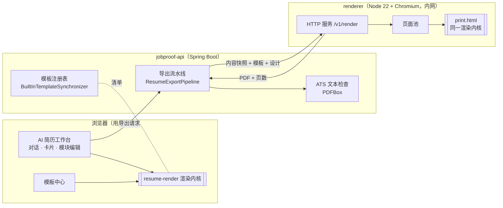
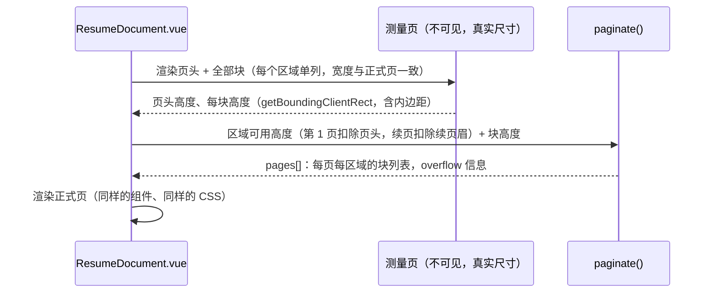
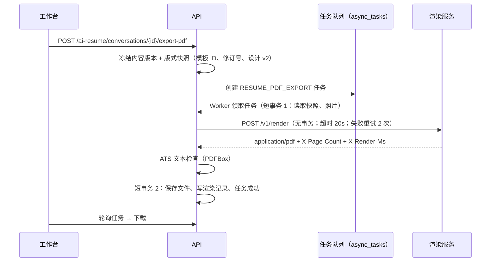

# 二期架构设计：统一简历渲染引擎与产品化升级

| 项 | 内容 |
| --- | --- |
| 文档版本 | v1.0 |
| 日期 | 2026-10-06 |
| 协同文档 | [重构方案](00-重构方案.md) · [需求](01-需求文档.md) · [技术选型](02-技术选型.md) · [UI/UX 设计](04-UIUX设计.md) |
| 前置文档 | 一期 [架构设计](../03-架构设计.md)：模块边界 R1–R5、Outbox、请求追踪、保存队列等继续有效 |

---

## 1. 目标

1. **一套渲染，三处输出**：工作台预览、模板中心缩略图、导出 PDF 使用同一段渲染代码、同一份 CSS、同一套字体。
2. **真实分页**：页数与溢出由实际排版测量得出，不再估算。
3. **模板有个性**：模板是可以自由设计的版式组件，而不是参数组合。
4. **导出可验证**：每份 PDF 都记录渲染器版本、页数、ATS 文本检查结果。
5. **编辑模式不变**：AI 对话、引导卡片、模块编辑、保存队列保持一期行为，只替换预览与设计能力。

---

## 2. 总体结构



### 2.1 代码位置

```text
frontend/src/resume-render/        渲染内核（纯前端代码，不依赖路由、Pinia、接口层）
├── model/        normalize.ts（内容 → RenderDocument）、richText.ts、dates.ts、labels.ts
├── theme/        palettes.ts、fonts.ts、contrast.ts、tokens.ts（设计设置 → CSS 变量）
├── layout/       blocks.ts（文档 → 区域 → 内容块）、paginate.ts（纯函数装箱）、measure.ts（DOM 测量）
├── components/   ResumeDocument.vue（根）、ResumePage.vue、ResumeScaler.vue、primitives/*
├── templates/    <id>/index.ts（清单 + 版式组件）、<id>/<Id>Layout.vue、<id>/style.css
├── assets/       textures/*.webp、ornaments/*.svg
├── fonts/        sans.css、serif.css、mono.css（按组合按需导入）
└── registry.ts   模板 ID → 异步模块
frontend/print.html + src/print/main.ts    打印入口（只由渲染服务加载）
renderer/                                   渲染服务
├── src/server.ts  src/pool.ts  src/render.ts  src/config.ts  src/log.ts
├── test/*.test.ts（node --test）
└── Dockerfile
backend/…/modules/resume/
├── application/port/ResumeRenderPort.java      渲染端口
├── application/ResumeExportPipeline.java       准备 → 渲染 → 保存（三段事务）
├── application/AtsTextCheck.java               文本层检查
├── application/BuiltInTemplateSynchronizer.java 内置模板清单同步
├── domain/ResumeDesignV2.java                  设计设置 v2 校验与旧版转换
└── infra/HttpResumeRenderClient.java           HTTP 客户端（超时、重试、请求 ID 透传）
```

渲染内核放在 `frontend/src/resume-render/`，一期规则继续适用：业务代码不得直接引用 Reka（渲染内核本身不用 Reka），样式只用渲染内核自己的令牌（简历纸面不跟随应用深浅主题）。

---

## 3. 渲染内核

### 3.1 数据模型

```ts
interface RenderPayload {
  templateId: string            // 'meridian'
  templateRevision: number      // 清单修订号，写入导出记录
  design: ResumeDesignV2        // §6.2
  content: ResumeContent        // 与工作台 conversation.content 同构（basics、intentions、summary、education[]…）
  photo?: string                // data:image/jpeg;base64,…（仅导出时由后端注入；预览用对象 URL）
  locale: 'zh-CN' | 'en'
  mode: 'preview' | 'print' | 'thumbnail'
}

interface RenderDocument {        // normalize(content, design, locale) 的结果，模板只读它
  header: { name; title; email; phone; location; links: Link[]; photo?: string }
  sections: RenderSection[]      // 按 design.sectionOrder 排序、去掉隐藏与空板块
}
type RenderSection =
  | { kind: 'text'; key: 'summary'; title: string; body: RichText }
  | { kind: 'timeline'; key: 'education' | 'experience' | 'projects' | 'organizations'; title: string; items: TimelineItem[] }
  | { kind: 'skills'; key: 'skills'; title: string; groups: SkillGroup[] }
  | { kind: 'list'; key: 'certificates' | 'honors' | 'languages'; title: string; items: ListItem[] }
```

- `RichText`：只支持段落、`**加粗**` 与换行三种标记，解析为节点树后由组件渲染，**不使用 `v-html`**。
- 链接只接受 `http(s):`、`mailto:`、`tel:`；PDF 中保留为可点击链接。
- 日期按 `design.dateFormat` 格式化；“至今 / Present”按语言切换。
- 板块标题：`design.sectionTitles[key]` > 模板默认标题（按语言）> 系统默认标题。

### 3.2 内容块与区域

模板清单声明区域（region）：

```ts
regions: [
  { id: 'side', width: '64mm', sections: ['skills', 'languages', 'certificates', 'honors'], background: 'var(--r-side-bg)' },
  { id: 'main', width: 'auto', sections: ['summary', 'experience', 'projects', 'education', 'organizations'] },
]
```

- 用户可在设计面板把板块拖到另一个区域（`design.regionAssignments`），双栏模板生效。
- `blocks.ts` 把每个板块拆成块：**板块标题 + 第一个条目**绑定为一块（避免标题孤立在页底）；其余条目各为一块；条目要点超过 4 条时允许在要点之间拆分，续块带“（续）”标识样式。
- DOM 顺序 = 阅读顺序：页头 → 主区域 → 侧区域。侧栏在视觉上可以在左边，但文字层先读主区域，ATS 提取顺序正确。

### 3.3 测量与分页



- 块之间的间距用块内 `padding` 实现，不用 `margin`，避免外边距折叠导致测量值与实际不符。
- `paginate()` 是纯函数（输入：可用高度、块高度、绑定关系；输出：分页结果），单元测试覆盖：刚好装满、单块超过一页、绑定块跨页、双栏不等高、续页侧栏为空。
- 内容变化后 120ms 去抖再测量；只有块高度变化才重新分页。
- **页数上限**：模板 `maxPages`（多数为 2）与用户的“目标页数”（自动 / 1 页 / 2 页）取较小值；超出时 `overflow = { pages, overflowMm, firstOverflowSection }`，预览显示提示，并提供“一键紧凑”（依次尝试缩小段落间距 → 行距 → 字号一档 → 页边距一档，最多 4 步，每步重新测量）。

### 3.4 缩放与三种模式

| 模式 | 用途 | 行为 |
| --- | --- | --- |
| `preview` | 工作台、简历详情 | 真实尺寸排版，`ResumeScaler` 按容器宽度 `transform: scale()`；板块可点击定位到编辑器 |
| `thumbnail` | 模板中心、模板选择 | 只渲染第一页；使用示例内容；`IntersectionObserver` 进入视口才渲染 |
| `print` | 渲染服务 | 页面按 `@page { size: A4; margin: 0 }` 输出，每页 `break-after: page`；渲染完成后在 `window` 上返回页数与溢出 |

### 3.5 主题令牌

设计设置经 `theme/tokens.ts` 转为页面根节点上的 CSS 变量，模板 CSS 只引用变量：

| 变量 | 来源 |
| --- | --- |
| `--r-accent`、`--r-accent-soft`、`--r-ink`、`--r-muted`、`--r-rule`、`--r-paper` | 配色（或自定义强调色经对比度校正后派生） |
| `--r-font-body`、`--r-font-heading`、`--r-font-mono` | 字体组合 |
| `--r-size`（正文字号 pt）、`--r-leading`（行高）、`--r-gap`（段落间距） | 字号、行距、间距档位 |
| `--r-margin-x`、`--r-margin-y` | 页边距档位（mm） |

自定义强调色：若与纸色对比度 < 4.5:1，自动在 OKLCH 空间降低亮度直到达标，并在设计面板提示“已为可读性调整”。

---

## 4. 模板组织

### 4.1 模板模块

```ts
export default defineTemplate({
  manifest: {
    id: 'meridian', revision: 1, name: { 'zh-CN': '子午', en: 'Meridian' },
    category: 'modern', tags: ['两栏', '照片'], maxPages: 2, paper: ['A4'],
    fontPairings: ['sans', 'mixed'], palettes: [...], headerVariants: ['stacked', 'inline'],
    photo: 'optional', regions: [...], defaults: {...}, atsLevel: 'standard',
  },
  Layout: MeridianLayout,          // 负责页头、区域背景、装饰
  Section: MeridianSection,        // 可选：覆盖默认板块渲染
})
```

- 公共原语：`SectionHeading`、`TimelineItem`、`SkillGroups`（标签 / 分组行 / 熟练度点）、`ContactList`（图标可开关）、`ResumePhoto`（圆形 / 圆角 / 方形）、`RichTextView`。
- 模板 CSS 以 `[data-template="meridian"]` 为作用域；装饰素材通过 `new URL('../assets/…', import.meta.url)` 引用，打包进前端与打印入口。
- 每个模板的清单由 `npm run templates:manifest` 导出到 `backend/src/main/resources/templates/builtin-manifest.json`；前端单测比对导出结果与仓库文件，防止两边不一致。

### 4.2 后端模板注册表

继续使用 `resume_layout_templates` / `resume_layout_template_versions`：

| 字段 | v4 内置模板的取值 |
| --- | --- |
| `renderer_protocol` | `resume-render-v4` |
| `definition_json` | 清单 JSON（配色、字体组合、区域、能力、页数上限） |
| `status` | `PUBLISHED`（运营可下架为 `ARCHIVED`） |
| `render_verified` / `ats_verified` | 1：由 CI 渲染回归保证（§9），证据来源记为 `BUILTIN_CI` |
| `word_verified` / `wps_verified` | 0：v4 模板不提供版式一致的 Word 文件 |

`BuiltInTemplateSynchronizer` 在启动时读取清单文件：新模板插入；清单哈希变化则新增一个修订并发布；不存在于清单的内置模板标记 `ARCHIVED`（已有简历仍可继续使用到用户切换）。运营后台对内置模板只能上下架、调整排序与“推荐”标记，不能改版式。

旧的 12 套 `resume-layout-v3` 模板标记为 `ARCHIVED`，不再出现在模板中心；`jobproof.templates.demo-enabled` 对智能模板不再起作用。

---

## 5. 导出流水线

### 5.1 时序



- 渲染在事务之外进行（修复一期遗留的“事务内渲染”）。
- 页数超过模板上限或用户目标页数：任务失败，原因 `RESUME_PAGE_LIMIT_EXCEEDED`，提示“导出结果为 3 页，超出目标 2 页”，并给出第一处溢出的板块。
- 渲染服务不可用：任务失败，原因 `RENDERER_UNAVAILABLE`，提示可重试；**不回退旧渲染器**。
- `resume_render_artifacts.validation_json` 记录：`rendererVersion`、`templateId`、`templateRevision`、`pageCount`、`renderMs`、`ats`（每项检查结果）、`chromium` 版本。

### 5.2 历史版本

已冻结的 `resume-layout-v3` 版本按快照中的 `rendererProtocol` 走原 PDFBox 渲染路径，保证历史导出可复现；该路径只读，不再迭代。

### 5.3 渲染服务接口

| 方法 | 路径 | 说明 |
| --- | --- | --- |
| `POST` | `/v1/render` | 请求体 `{ format: 'pdf' \| 'png', payload: RenderPayload, options: { pageLimit?, pngScale?, firstPageOnly? } }`；成功返回文件流与 `X-Page-Count`、`X-Overflow`、`X-Render-Ms` 头 |
| `GET` | `/healthz` | `{ ok, rendererVersion, chromium, pool: { size, busy, queued }, renders, failures }` |
| `GET` | `/readyz` | 浏览器已启动且打印页加载完成才返回 200 |

错误响应：`400 INVALID_PAYLOAD` / `401 UNAUTHORIZED` / `413 PAYLOAD_TOO_LARGE` / `422 TEMPLATE_UNKNOWN` / `503 BUSY`（排队超时）/ `500 RENDER_FAILED`。

### 5.4 渲染服务内部

- 启动：拉起 Chromium，创建 `RENDERER_POOL_SIZE` 个页面，每个页面加载一次 `print.html` 并等待字体与渲染内核就绪。
- 每次请求：取空闲页面 → `window.__JP_RENDER__(payload)` → 等待返回 `{ pageCount, overflow }` → `page.pdf({ preferCSSPageSize, printBackground, tagged, outline })` → 归还页面。
- 隔离：`page.route('**/*')` 只放行打印入口自身的 `file://` 资源与 `data:`；其他请求一律中止。每次渲染前清空上一次的 DOM 状态。
- 自愈：页面崩溃即重建；浏览器断开或连续 3 次失败则重启浏览器；排队超过 20 秒返回 503。
- 日志：JSON 一行一条，带后端透传的 `X-Request-Id`。

---

## 6. 数据与接口变化

### 6.1 迁移

| 迁移 | 内容 |
| --- | --- |
| V68 | 旧 v3 智能模板 `ARCHIVED`；新增 `resume_layout_template_versions.verification_source`；可编辑版式实例按映射表切换到对应 v4 模板 |
| 运行时 | `BuiltInTemplateSynchronizer` 写入 / 更新 v4 内置模板 |
| 惰性转换 | `resume_layout_preferences` 中的 `resume-design-v1` 在读取时转换为 v2，下次保存写回 v2 |

旧 → 新模板映射：

| 旧模板 | 新模板 |
| --- | --- |
| ATS 极简单栏 | 清晰 `clarity` |
| English One Page | Harvard `harvard` |
| 中文标准表格、咨询精英 | 经典 `classic` |
| 产品运营 | 分栏 `ledger` |
| 技术项目单页、技术经历双页、测试与数据 | 工程师 `engineer` |
| 教育研究 | 学术 `academic` |
| 校园新锐 | 校园 `campus` |
| 职场专业 | 子午 `meridian` |
| 金融财务 | 投行 `banker` |

### 6.2 设计设置 v2

```json
{
  "schemaVersion": "resume-design-v2",
  "paletteId": "fog-blue",
  "customAccent": null,
  "fontPairing": "sans",
  "fontSize": "M",
  "lineHeight": "NORMAL",
  "spacing": "NORMAL",
  "pageMargin": "STANDARD",
  "headerVariant": "stacked",
  "photo": { "mode": "AUTO", "shape": "CIRCLE" },
  "contactIcons": true,
  "dateFormat": "YYYY.MM",
  "pageTarget": "AUTO",
  "paperSize": "A4",
  "decorations": true,
  "sectionOrder": ["summary", "experience", "projects", "education", "skills"],
  "hiddenSections": [],
  "sectionTitles": { "projects": "代表项目" },
  "regionAssignments": { "skills": "side" }
}
```

后端 `ResumeDesignV2.validate(manifest, json)`：每个枚举值必须在该模板清单允许的范围内；`customAccent` 只接受 `#RRGGBB`；`sectionTitles` 每项 ≤ 16 字、去除控制字符；未知字段拒绝。v1 → v2 转换规则写在同一个类中并有单测。

### 6.3 接口

| 接口 | 变化 |
| --- | --- |
| `GET /api/v1/resume-templates` | 返回 v4 清单字段（分类、配色、字体组合、页数上限、推荐）；只返回 `PUBLISHED` |
| `PUT /api/v1/ai-resume/conversations/{id}/design/{templateId}` | 接受 v2 设置；按清单校验 |
| `POST …/export-pdf` | 不再以服务端估算的溢出拦截；返回任务 |
| `GET /api/v1/admin/resume-templates` | 内置模板标注 `builtIn`、`verificationSource`；支持上下架与排序 |

---

## 7. 安全

| 风险 | 措施 |
| --- | --- |
| 用户内容注入脚本 | 渲染内核不使用 `v-html`；富文本只解析三种标记；打印页 CSP `default-src 'self' data:` |
| SSRF（内容中的图片 / 链接被渲染服务访问） | 打印页拦截全部外部请求；照片由后端读取私有存储后以 data URL 注入 |
| 渲染服务被滥用 | 仅内网；共享令牌；请求体 2MB 上限；模板 ID 白名单；并发与排队上限 |
| 资源耗尽 | 单次渲染 20 秒超时；页面池固定；容器内存上限 512MB |

---

## 8. 部署

```text
docker compose
├── nginx（公网）
├── api（JOBPROOF_RENDERER_URL=http://renderer:3100，JOBPROOF_RENDERER_TOKEN）
├── renderer（内网，mem_limit 512m，RENDERER_POOL_SIZE=2）
├── mysql · redis · minio · clamav
```

- 渲染服务镜像：`node:22-bookworm-slim` + 发行版 Chromium + 打包好的前端打印入口（构建时从 `frontend/dist` 复制）。
- 健康检查：`/readyz`；api 的健康检查不依赖渲染服务（渲染服务故障只影响导出）。
- 开发环境：`renderer` 可直接 `node renderer/src/server.ts` 运行，读取 `frontend/dist`，使用本机 Chromium。

---

## 9. 质量保障

| 层 | 内容 |
| --- | --- |
| 渲染内核单测（Vitest） | `normalize`（各板块字段、空值、富文本、链接白名单）、`paginate`（装箱规则）、`contrast`（自定义色校正）、清单完整性（每个模板的区域覆盖全部板块、配色对比度达标） |
| 组件测试 | `ResumeDocument` 在测量值注入下的分页结果；点击板块定位 |
| 渲染服务测试（node --test） | 鉴权、请求体上限、外部请求被拦截、页面崩溃自愈、PDF 页数头 |
| 渲染回归（CI） | 每个模板 × 每个配色 × 4 份示例内容：页数不超上限、文字层包含全部字段且顺序正确、首页 PNG 与基线差异 ≤ 0.5% |
| 后端测试 | 导出流水线三段事务、渲染服务不可用与超时、页数超限、ATS 检查、设计 v2 校验与 v1 转换、模板同步器幂等 |
| E2E | 工作台编辑 → 预览更新 → 切换模板 / 配色 → 导出 PDF → 下载文件页数与预览一致 |
